最近接触了 Verilog-A。记录一下 Cadence AMS-Designer 数模混合的仿真过程。需要用到的软件有 Cadence IC617, INCISIVE152。

<!--more-->

> INCISIVE152 的安装可以参考 https://blog.csdn.net/yy345730585/article/details/90407408

# 初始化设置

在打开 cadence 的文件夹下面需要新建一个‘*hdl.var*’文件，内容如下：

~~~bash
softinclude $INCISIVDIR/tools/inca/files/hdl.var
define ams
define NCVLOGOPTS -linedebug
define VIEW_MAP ($VIEW_MAP, .vs => shell)
~~~

其中 *$INCISIVDIR* 是 **Cadence INCISIV** 的安装路径。

需要在文件‘*cds.lib*’中加入一行：

~~~bash
SOFTINCLUDE $INCISIVDIR/tools/inca/files/cds.lib
~~~

# Verilog-A 设计 — 以理想 DAC 为例

## *ieadl_dac (verilogA cellview)*

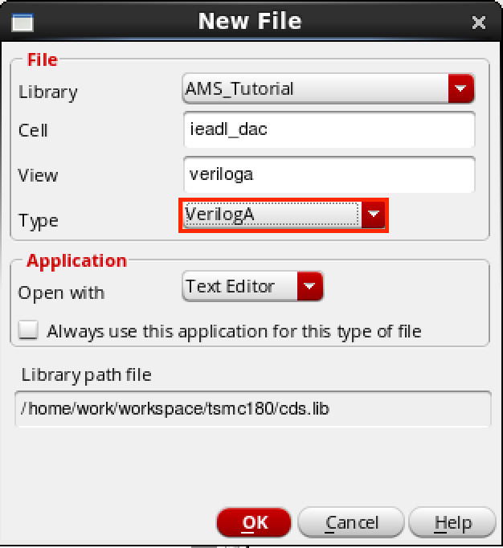

首先创建一个新的 Library 叫做 ‘*AMS_Tutorial*’。然后创建一个 **verilogA** cellview 叫做 ‘*ieadl_dac*’。文件内容如下：

~~~verilog
// VerilogA for AMS_Tutorial, ideal_dac, veriloga

`include "constants.vams"
`include "disciplines.vams"

module ideal_dac(in, agnd, out);

input [10:0] in;
input agnd;
output out;
electrical [10:0] in;
electrical agnd;
electrical out;

parameter real logic_thresh = 2.5;
parameter real full_scale = 1.0;
parameter real trise = 1n from [0:inf);
parameter real tfall = 1n from [0:inf);

real code, delta;
real pow2[11:0];
integer i;

analog begin
    @(initial_step) begin
        pow2[0] = 1.0;
        for (i = 1; i <= 11; i = i+1) begin
            pow2[i] = 2.0 * pow2[i-1];
        end 
    end

    code = 0.0;
    generate j (10,0) begin
        if (V(in[j]) < logic_thresh) begin
            delta = 0.0;
        end else begin 
            delta = pow2[j];
        end
        code = code + delta;
    end

    if (V(in[10]) > logic_thresh) begin
        code = code - pow2[11];
    end

    code = full_scale * code / pow2[10];
    V(out) <+ V(agnd) + transition(code, 0 , trise, tfall);
end

endmodule
~~~

保存后如果没有错误会自动弹出一个创建 symbol 的窗口，确保 symbol 正确创建了。

## *dac_driver (verilog cellview)*

然后创建一个 **verilog** cellview 叫做 ‘*dac_driver*’。文件内容如下：

~~~verilog
//Verilog HDL for "AMS_Tutorial", "dac_driver" "functional"

module dac_driver (word_out);

    output [10:0] word_out;
    reg [10:0] word_out;

    initial begin
        word_out = 12'h000;
        #20480 $finish;
    end

    always #5 word_out = word_out + 1'b1;

endmodule
~~~

保存后如果没有错误会自动弹出一个创建 symbol 的窗口，确保 symbol 正确创建了。

## interconnect elements

由于 *dac_driver* 是一个 Verilog 的 cellview，其输出是数字量，而 *ieadl_dac* 是一个 verilogA 的 cellview，其输入是模拟量，因此需要 interconnect elements 来进行数字量和模拟量之间的转换。AMS-Designer 可以自动创建 interconnect elements，不过自己来实现这个连接器，连接器应该有两种形式，分别是数字量到模拟量的转换和模拟量到数字量的转换。

### *a_d (VerilogAMS cellview)*

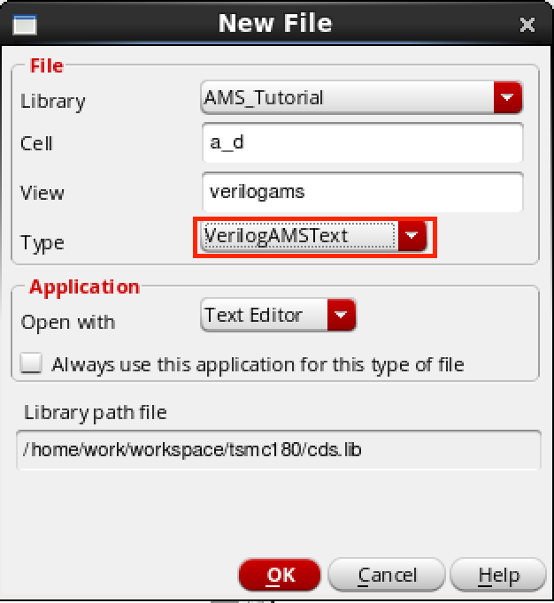

创建一个 **VerilogAMS** cellview 叫做 ‘a_d’。文件内容如下：

~~~verilog
//Verilog-AMS HDL for "AMS_Tutorial", "a_d" "verilogams"

`timescale 1ns / 1ps
`include "constants.vams"
`include "disciplines.vams"

connectmodule a_d (A, D);
    parameter real vh = 4; // minimum voltage of a logic 1 (V) 
    parameter real vl = 1; // maximum voltage of a logic 0 (V) 
    parameter real c = 20f; // input capacitance (F) 
    parameter real dt = 1m; // time in x region before x is produced (s) 
    parameter real dv = 0.5; // voltage between threshold and x region (V)
    input A; 
    output D; 
    electrical A; 
    reg D; 
    logic D; 
    parameter real vlx = vl + dv; 
    parameter real vhx = vh - dv; 
    reg inXregion;

    always @(above(V(A) - vh)) begin
        D = 1'b0;
        inXregion = 0;
    end

    always @(above(vl - V(A))) begin
        D = 1'b0;
        inXregion = 0;
    end

    always @(above(vhx - V(A))) inXregion = 1; 
    always @(above(V(A) - vlx)) inXregion = 1;

    always @(posedge inXregion) begin : XRegionDelay 
        #(dt/1.0n) // calculate how many time units are equal to the dt time
        D = 1'bx;
        inXregion = 0;
    end

    always @(negedge inXregion) disable XRegionDelay;

    analog I(A) <+ c*ddt(V(A));

endmodule
~~~

保存后如果没有错误会自动弹出一个创建 symbol 的窗口，确保 symbol 正确创建了。

### *d_a (VerilogAMS cellview)*

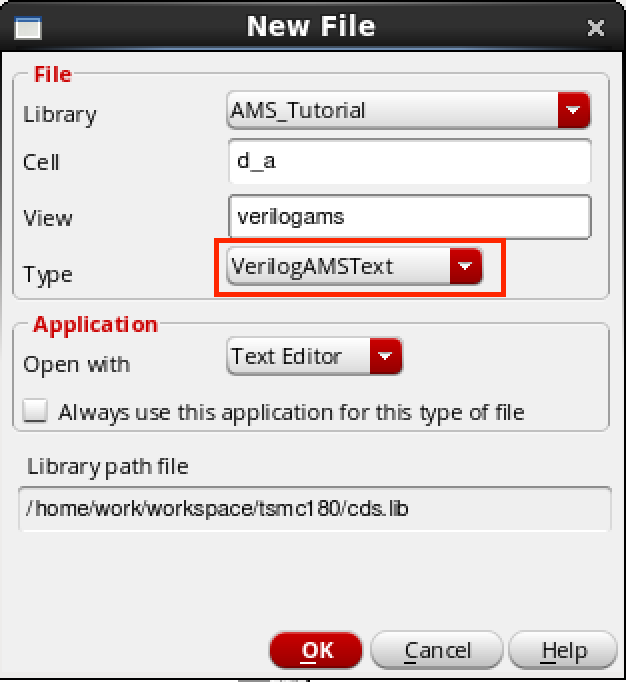

创建一个 **VerilogAMS** cellview 叫做 ‘d_a’。文件内容如下：

~~~verilog
//Verilog-AMS HDL for "AMS_Tutorial", "d_a" "verilogams"

`timescale 1ns / 1ps
`include "constants.vams"
`include "disciplines.vams"

connectmodule d_a (D, A);

    parameter real v0 = 0.0;                // output voltage for a logic 0 (V) 
    parameter real v1 = 5.0;                // output voltage for a logic 1 (V) 
    parameter real vx = 2.5;               // output voltage for a logic x (V) 
    parameter real vz = 5.0;                // output voltage for a logic z (V) 
    parameter real r0 = 1k from (0:inf);    // output resistance for a logic 0 (Ohms) 
    parameter real r1 = 1k from (0:inf);    // output resistance for a logic 1 (Ohms) 
    parameter real rx = 100 from (0:inf);   // output resistance for a logic x (Ohms) 
    parameter real rz = 1M from (0:inf);    // output resistance for a logic z (Ohms) 
    parameter real tr=1n from [0:inf);      // rise time (s) 
    parameter real tf=1n from [0:inf);      // fall time (s)

    input D; 
    output A; 
    logic D; 
    electrical A; 
    real v, r;

    assign D = D;

    initial begin
        case (D)
            1'b0: begin v = v0; r = r0; end
            1'b1: begin v = v1; r = r1; end
            1'bx: begin v = vx; r = rx; end
            1'bz: begin v = vz; r = rz; end
        endcase 
    end

    always @(D) begin
        case (D)
            1'b0: begin v = v0; r = r0; end
            1'b1: begin v = v1; r = r1; end
            1'bx: begin v = vx; r = rx; end
            1'bz: begin v = vz; r = rz; end
        endcase 
    end

    analog begin
       V(A) <+ transition(v, 0, tr, tf) + transition(r, 0, tr, tf)*I(A); 
    end

endmodule
~~~

保存后如果没有错误会自动弹出一个创建 symbol 的窗口，确保 symbol 正确创建了。

## *ideal_DAC_test （schematic cellview）*

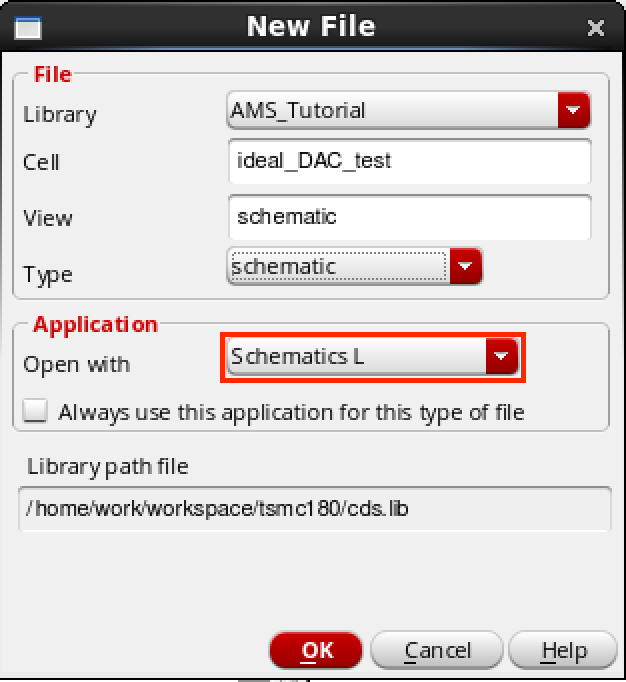

创建一个 **schematic** cellview 叫做 ‘ideal_DAC_test’。将器件按照下图进行连接。

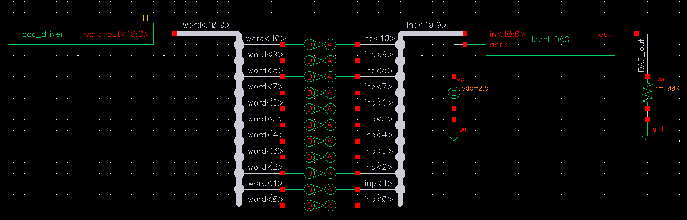

# 仿真

## *config (config cellview)*

### 创建

为 *ideal_DAC_test* 创建一个 **config cellview**，如下图所示。

创建完成后，配置窗口会自动弹出，如下图所示，首先选择 ‘Use Template…’，在弹出来的窗口中选择 ‘AMS’。剩下的信息按照下图配置。

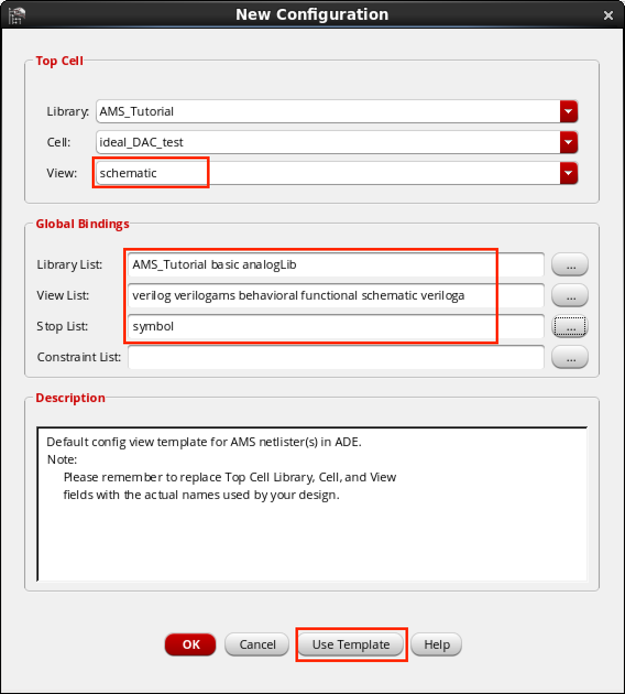

创建完成后，把 config(Hierarchy Editor) 和 Schematic 窗口**都关闭**。

### 配置 *View To Use*

然后**再次打开 config 窗口**，这时会弹出一个窗口，两项都选 ‘yes’，如下图所示。

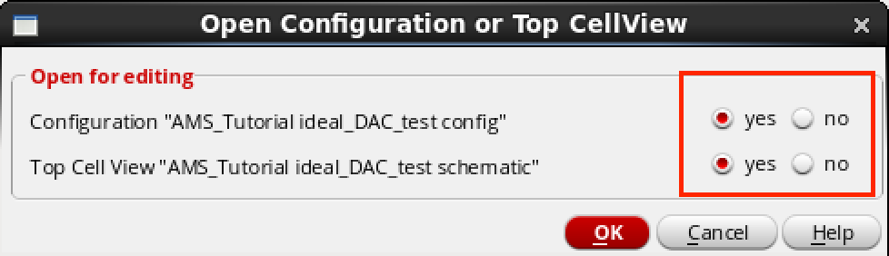

点击 ‘OK’ 之后会看到 config 和 schematic 窗口都一起打开了。在 Hierarchy Editor 窗口中，右击 *View To Use* 上右击，选择 *Select View*，配置成如下图所示。

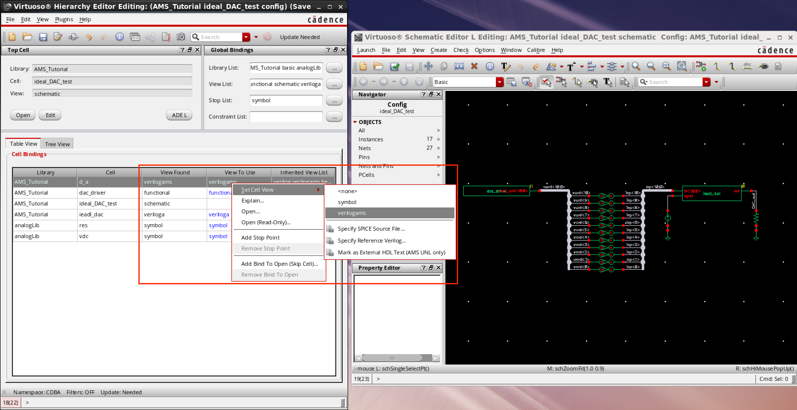

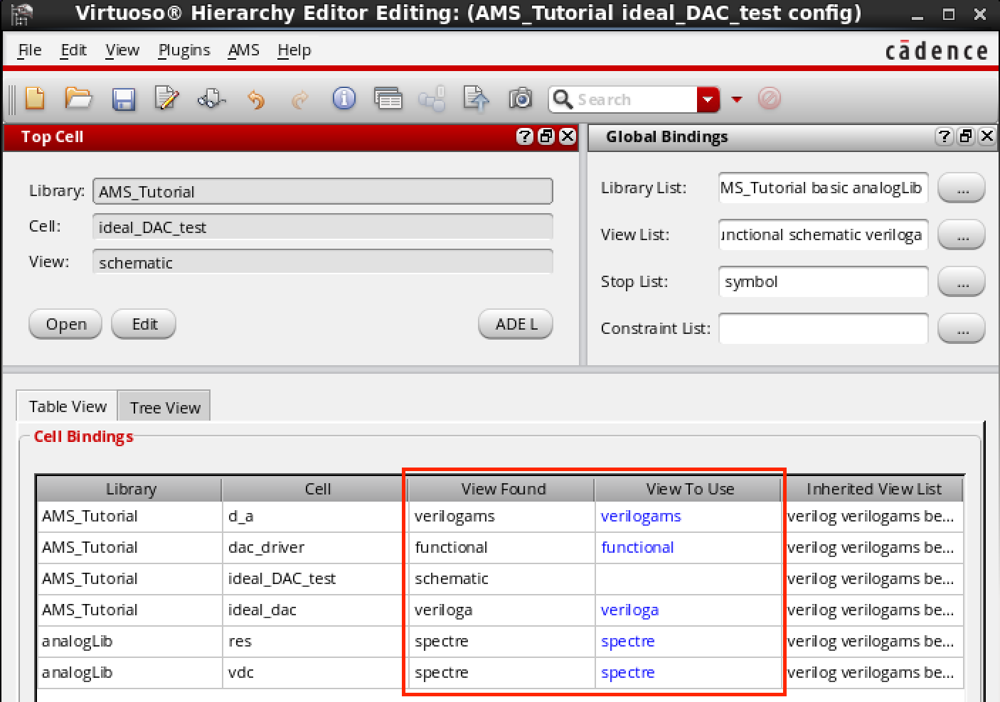

### 配置 AMS

点击 Plugins -> AMS，然后 AMS 选项就会出现在 Hierarchy Editor 窗口中了。

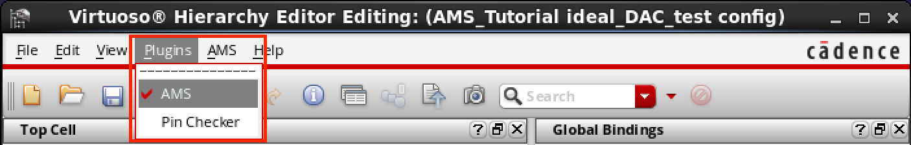

然后点击 AMS -> Initialize，配置 *Run Directory*，并且在 *Always use this run directory …* 后面打钩。

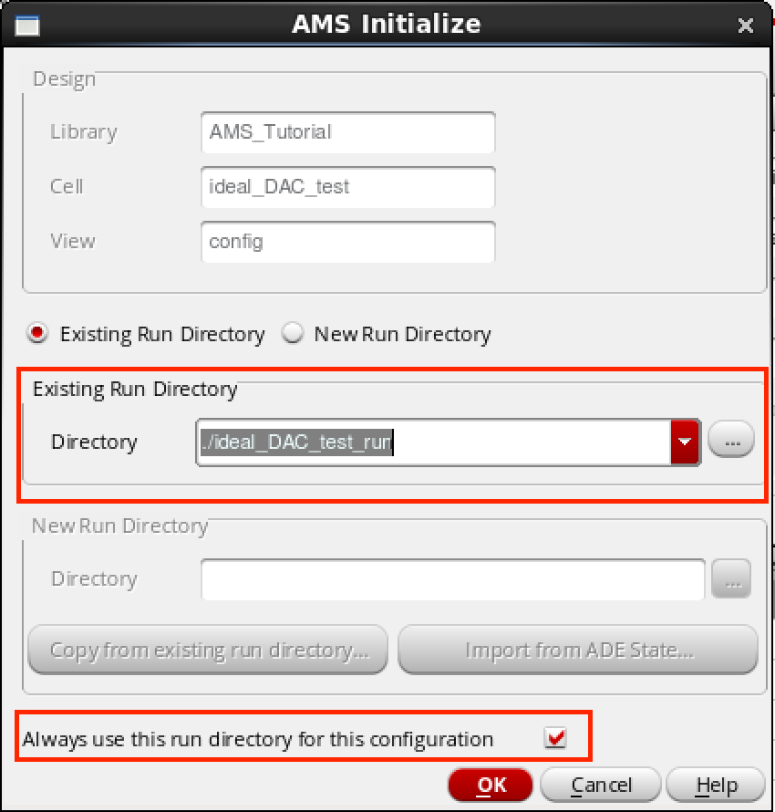

在 AMS -> Quick Setup 中，配置 *hdl.var* 为之前[初始化设置](#初始化设置)中创建的 *hdl.var* 文件。

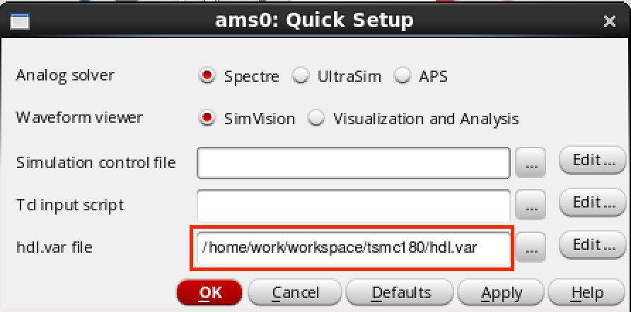

在 AMS -> Detalied Setup -> Analyses 中设置仿真结束时间，这里设置的是 *20e-6*。

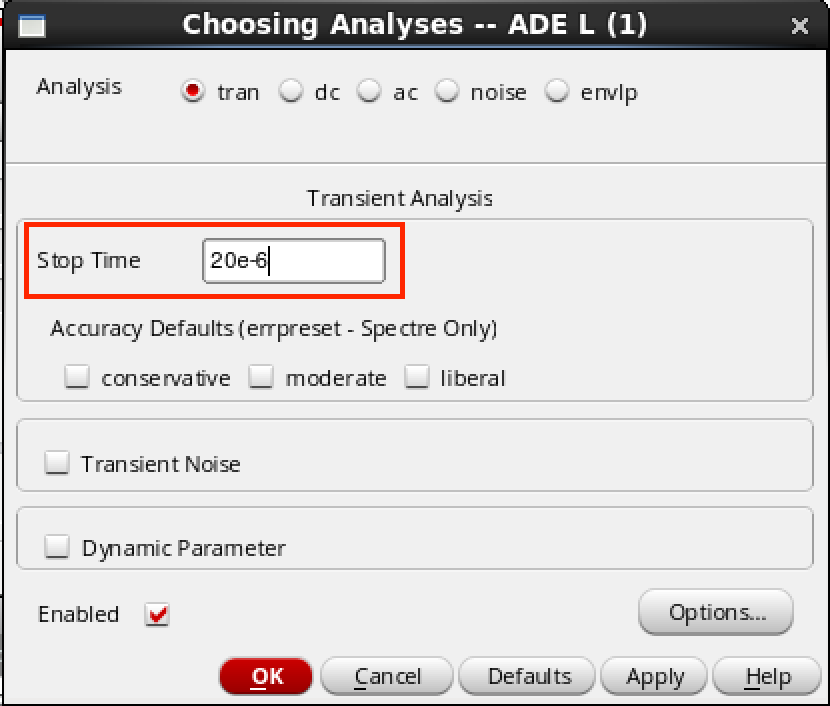

上面几步做完了记得保存一下。

## 运行仿真

点击 AMS -> NetList and Run，打开一个 config 窗口，这里也可以设置仿真时间。需要注意的是 *Save/Plot…* 这个选项，该选项可以将需要观察的信号添加进来，不过不建议在这里添加，而是 Netlist 之后再添加，更加方便。

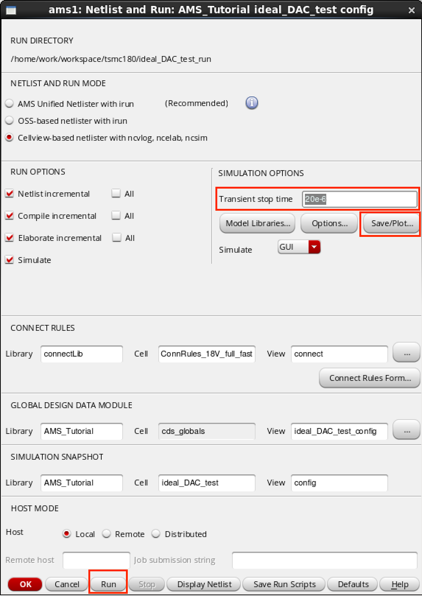

在上面的窗口中点击 *Run*，如果没有错误会弹出 SimVision 窗口。

在 *Design Browser* 窗口中想要观察的信号上右击 -> **Send to Waveform Window**，然后再点击 SimVision Console 窗口中的 **Run** 按钮，仿真就开始运行了。

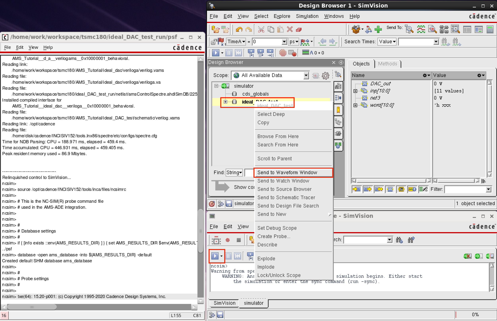

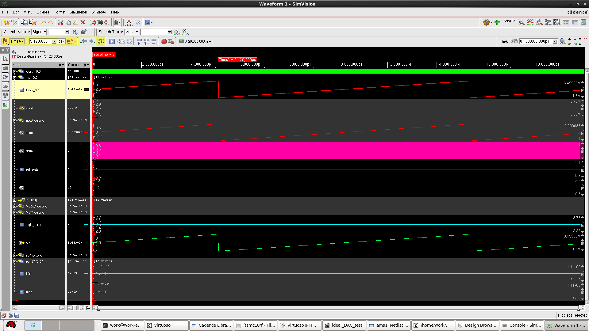

> PS：如果模拟量信号观察不到，但可以看到数值，可能需要设置一下 View -> Zoom -> Full Y.

---

# Reference

- [Tufts University Cadence AMS-Designer Tutorial](https://wenku.baidu.com/view/cbd263c8192e45361166f5e5.html)

- https://blog.csdn.net/YYP_8020/article/details/107332430

- Cadence Verilog-AMS Language Reference

  $INSTALL_DIR/doc/verilogamsref/verilogamsref.pdf

- Virtuoso AMS Simulator User Guide

  $INSTALL_DIR/doc/amssimug/amssimug.pdf

- Cadence NC-Verilog Simulator Tutorial with SimVision

  $INSTALL_DIR/doc/ncvlogtut/ncvlogtut.pdf

- https://designers-guide.org/index.html