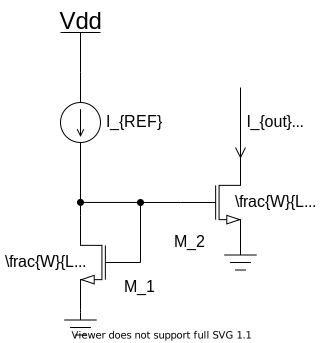
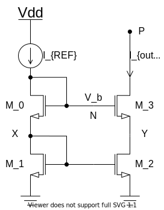
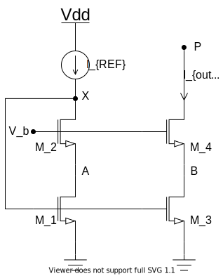

在模拟电路中，电流源的设计是基于对基准电流的“复制”，其前提是存在一个**精确**的电流源可以利用。这里讨论电流复制的过程。

<!--more-->

# 基本电流镜

两个都工作在饱和区且具有相同栅源电压 ($V_{GS}$) 的相同 MOS 管传输相同的电流 (忽略沟道长度调制，即 $\lambda = 0$)。

基本电流镜结构如上图所示，当 M1、M2 都工作在饱和区时，根据公式：
$$
I_{D} = \frac{1}{2} \mu _n C_{ox} \frac{W}{L} (V_{GS} - V_{TH}) ^2 (1 + \lambda V_{DS})
$$
忽略沟道长度调制，流过两个 MOS 管的电流分别是：
$$
I_{REF} = \frac{1}{2} \mu _n C_{ox} (\frac{W}{L})_1 (V_{GS} - V_{TH}) ^2 \\
I_{out} = \frac{1}{2} \mu _n C_{ox} (\frac{W}{L})_2 (V_{GS} - V_{TH}) ^2
$$
得出：
$$
I_{out} = \frac{(W/L)_1}{(W/L)_2} I_{REF}
$$
**特性**：可以精确地复制电流而不受工艺和温度的影响。

电流镜中所有的晶体管都采用**相同的栅长**，及减小由于**源漏区边缘扩散** (`$I_D$`) 所产生的误差。因为 `$L_{drawn}$` 加倍，但有效沟道长度 `$L_{eff} = L_{drawn} - 2L_D$` 并未加倍。**因此电流值之比只能通过调节晶体管的宽度来实现。**

# 共源共栅电流镜 (Cascode Current Mirror)

在基本电流镜的讨论部分，忽略了沟道长度调制，实际当使用最小长度的晶体管以便通过减小宽度来减小电流源的输出电容时，沟道长度调制会使镜像电流产生较大误差。

当考虑沟道长度调制后，基本电流镜的公式为：
$$
\frac{I_{D2}}{I_{D1}} = \frac{(W/L)_1}{(W/L)_2} \frac{1 + \lambda V_{DS2}}{1 + \lambda V_{DS1}}
$$
为了抑制沟道长度调制的影响，可以使用共源共栅电流源。

## 基本电路

**共源共栅电流镜**如上图所示，可知：
$$
V_{GS0} + V_X = V_{GS3} + V_Y
$$
为了抑制沟道长度调制的影响，需要保持 `$V_{DS1} = V_{DS2}$`，即 `$V_X = V_Y$`，如果：
$$
\frac{(W/L)_3}{(W/L)_0} = \frac{(W/L)_2}{(W/L)_1}
$$
则 `$V_{GS0} = V_{GS3}$`，`$V_X = V_Y$`。

> 1. $L_1 = L_2$，$L_3$ 不需要等于 $L_1$ 和 $L_2$；
> 2. 即使 $M_0$ 和 $M_3$ 存在衬偏效应，该结果任然成立；

该结构的电路虽然有很高的输出阻抗和精确的值，但却消耗了很大的电压余度。

假设所有的晶体管相同且忽略衬偏效应，为了保证所有晶体管工作在饱和状态，则 P 点允许的最小电压 (M2 与 M3 的过驱动电压之和) 为：
$$
\begin{split}
V_N - V_{TH} = {} & V_{GS0} + V_{GS1} - V_{TH} \\
= {} & (V_{GS0} - V_{TH}) + (V_{GS1} - V_{TH}) + V_{TH}
\end{split}
$$
相当于两个过驱动电压加上一个阈值电压。

## 低电压共源共栅结构

上图电路中，所有晶体管都处在饱和区且选择了合适的尺寸以保证 `$V_{GS2} = V_{GS4}$`。如果 `$V_b = V_{GS2} + (V_{GS1} - V_{TH1}) = V_{GS4} + (V_{GS3} - V_{TH3})$`，则当 M1 与和 M3 保持相等的漏源电压时，共源共栅电流源 M3-M4 消耗的电压余度最小，且可以精确地镜像 `$I_{REF}$`，其称为“低电压共源共栅结构”。

