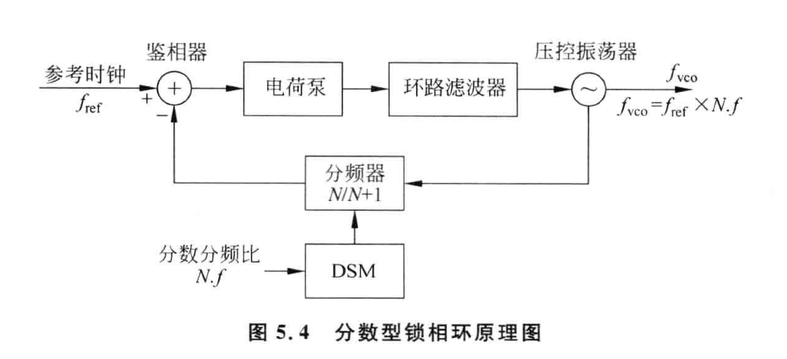
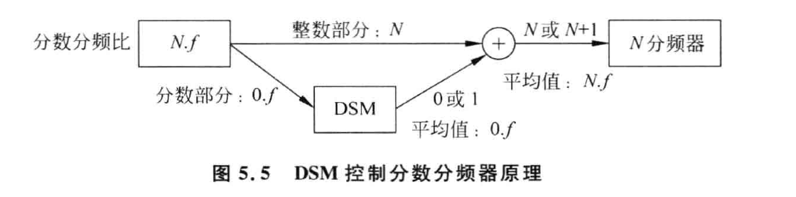
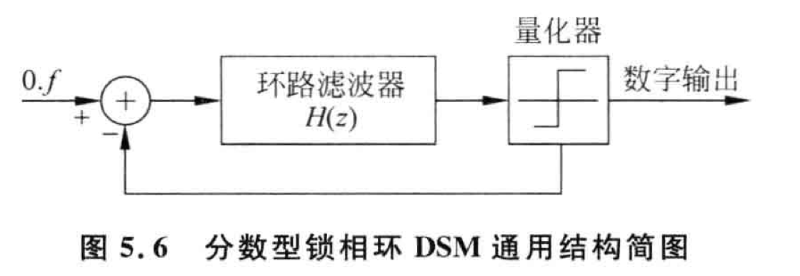
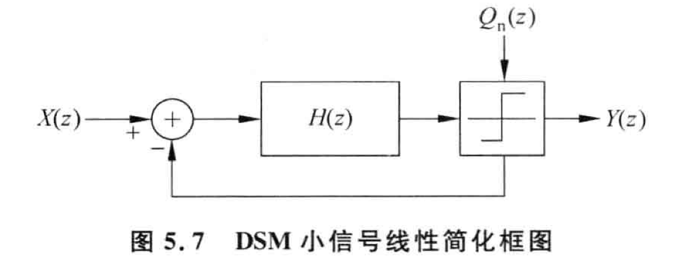
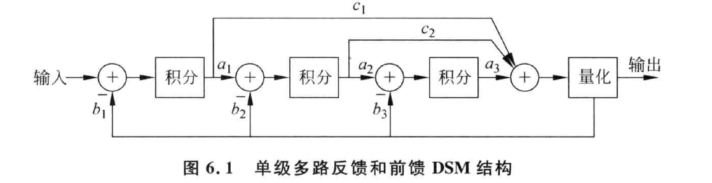
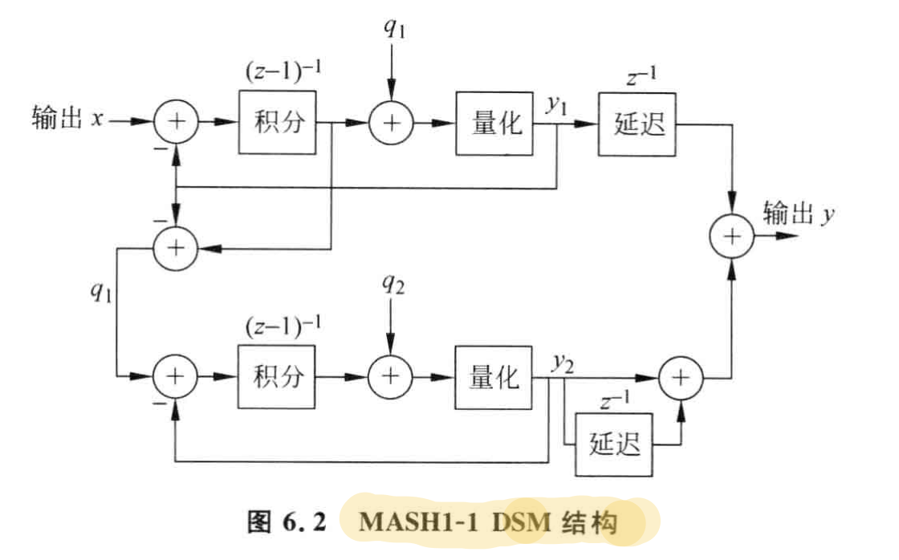
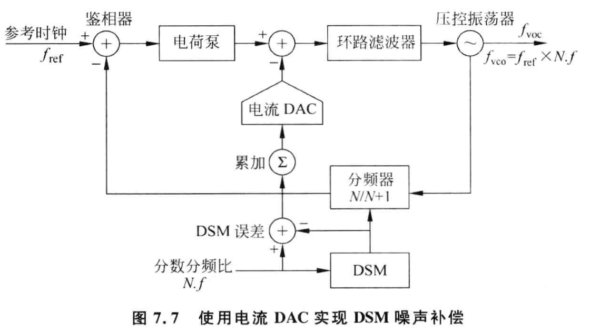
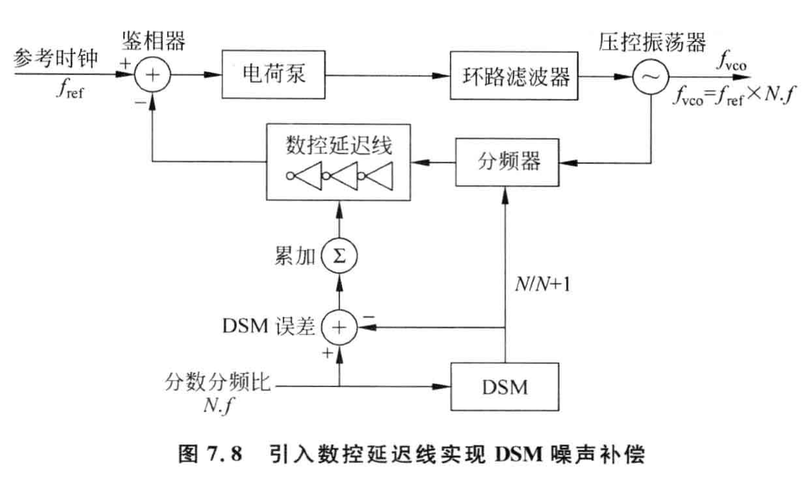

整数分频锁相环中，生成频率的最小分辨率为参考频率，为了提高分辨率就要降低参考时钟的频率；而锁相环的带宽通常要小于参考频率的 $1/10$, 因此整数分频锁相环的带宽受分辨率的限制只能很窄。

目前主流的有两种方案解决整数分频锁相环中分辨率和带宽矛盾的问题：**欠采样整数型锁相环**和**分数型锁相环**。

<!--more-->

# 分数型锁相环

整数分频锁相环中的分频器只能进行整数分频，而分数型锁相环载气基础上加入了**差分积分调制器 (delta-sigma modulator, DSM)**，控制分频比在不同参考时钟周期采用不同的整数值，这样其“**平均**”分频比就是一个非整数值。

分数型锁相环的结构如上图所示，其中 DSM 的作用是产生具有指定平均值的一系列整数值。

# 差分积分调制器原理

差分积分调制器的工作原理如上图所示，其中 $N.f$ 表示需要的分数分频比。DSM 的输入为分频比中的小数部分 $.f$，输出为一位数字输出，DSM 输出一系列的 0 或 1，其平均值为 $.f$。

# 差分积分调制器噪声整形

由于 DSM 的调制，小数型锁相环分频器输出频率和参考时钟频率瞬时相位差始终不为零。该瞬时相位差就是 DSM 引入噪声的表现，称为 DSM 噪声。小数型锁相环的输入相位差始终在一个有限的范围内变化，该**相位差值范围**是一个重要的 DSM 设计指标。

DSM 的噪声首先通过积分器成为瞬时相位噪声，然后注入锁相环鉴频鉴相器的输入，从 DSM 输出到锁相环输出端的噪声传递函数为：
$$
H_{DSM}(s) = \frac{\frac{I_{cp}K_v}{2\pi CN} \cdot \frac{RCs+1}{s}}{s^2 + \frac{I_{cp}RK_v}{2\pi N}s + \frac{I_{cp}K_v}{2\pi CN}}
$$
可以看到该传递函数为低通函数，即 DSM 噪声的高频部分会被锁相环的低通特性所抑制。DSM 的一个主要功能就是将 DSM 噪声转移到高频。

DSM 是一个反馈系统，由环路滤波器和量化器构成。由于量化器的存在，DSM 为非线性系统。其输入是一个长字长的数字信号，输出是短字长的数字信号，反馈是里离散取值的长字长数字信号。

DSM 的小信号模型如上图所示，当输入为固定值，输出将是平均分频比和叠加在上面的输出量化噪声。如果 DSM 的前向环路滤波器的传递函数为 $H(z)$，则量化噪声到输出噪声的传递函数为：
$$
NTF(z) = \frac{1}{1+H(z)}
$$
因此量化噪声的传递函数与 $H(z)$ 相反，因此如果 $H(z)$ 为低通函数，那么量化噪声的传递函数为高通函数。通常采用**含有积分器的低通函数**作为环路滤波器的传递函数。

输入信号到输出信号的闭环传递函数为：
$$
STF(S) = \frac{H(z)}{1+H(z)}
$$
因此如果 $H(z)$ 采用低通函数就可以输出量化噪声推到高频同时保留输入信号。

# 差分积分调制器的主要结构类型

DSM 本质上是一个数字滤波器，对于同一个 DSM 传递函数可以用多种方法实现。

## 单级多路反馈和前馈 DSM (single stage multi-feedback-feedforward DSM)

上图是一个三阶单级 DSM 的例子，多路反馈和多路前馈可以分别实现所需要的环路极点和零点。

**优点**：该结构在一级中实现多阶反馈和前馈，其随机性非常高，有干净的输出频谱和优良的杂散性能。是**高性能射频应用**中的首选 DSM 结构。

**缺点**：对于二阶以上的 DSM 只是有条件稳定，当输入信号大于一定值，该结构容易进入不稳定状态。需要选取合适的滤波器系数保证在最大输入范围内保证其稳定性。其设计较为复杂。

## MASH 结构

多级噪声整形结构 (multi-stage noise shaping, MASH) 如上图所示，其将多个低阶 DSM 串联起来，实现高阶 DSM 噪声整形。如果每一级使用一阶 DSM，由于一阶 DSM 是无条件稳定的，所以串联起来的高阶 DSM 也是稳定的。

**优点**：稳定性好。

如上图所示，由两级一阶 DSM 串联构成二阶 DSM，通常称为 MASH1-1 结构。MASH 将前一级的量化噪声作为下一级的输入，然后结合两级的输出，将前一级的量化噪声抵消得到最终输出。

第一级的输出：
$$
y_1 = z^{-1} x + (1-z^{-1})q_1
$$
第二级的输出：
$$
y_2 = z^{-1} q_1 + (1-z^{-1})q_2
$$
最终输出：
$$
y = z^{-1} y_1 + (1-z^{-1})y_2 = z^{-2}x+(1-z^{-1})^2 q_2
$$
MASH 结构要求串联各级系数之间严格匹配，锁相环电路中的 DSM 使用全数字实现，可以做到各级系数的完全匹配。

常用的 MASH 结构包括：MASH1-1-1，即三个一阶 DSM 串联实现三阶 DSM；MASH1-2，即一个一阶 DSM 和一个二阶 DSM 串联实现三阶 DSM。

**缺点**：随机性较低。由于缺少跨级间的反馈通路，而低阶 DSM 随机性较差，因此整体上 MASH 结构的 DSM 随机性较低，锁相环输出含有较多的分数杂散。由于其数字输出位数通常较多，在 PFD 的输入端产生的相位差较大，对锁相环分频器和电荷泵的线性度要求较高。

# DSM 的性能指标和选择

1. DSM 的阶数
2. DSM 的结构
3. DSM 的数字输出比特数
4. DSM 的稳定输入范围
5. 噪声整形性能与环路稳定性的考量

# DSM 噪声补偿

当锁相环的带宽较宽时，DSM 的噪声就不能很好的被环路滤波器消除，就需要低通滤波之外的消除 DSM 噪声的方案。

DSM 的输入和输出都是数字的，因此在每个参考周期内，在数字信号范畴，DSM 的误差都是已知的。如果用此数字信号来补偿噪声，需要一个分辨率更高的 DAC。

## 通过电荷输出的 DAC 实现噪声补偿

如上图所示，通过一个电流 DAC，将量化误差以电流的形式注入到电荷泵之后的环路滤波器中。在该方案中，电流 DAC 的增益必须是已知的并且可以精确控制。通常需要自动校数模转换器的增益，通常用**最小二乘法**校准。

## 相位补偿

如上图所示，在分频器的输出端加一个**数控延迟线**来补偿相位误差。该方法也需要预先知道数控延迟线的增益，一般通过**最小二乘**的方式进行校准。

> 关于噪声补偿的一点点思考
>
> Q1: 在电流补偿结构中，能不能取消 DSM，直接用分频比的小数部分作为电流 DAC 的输入，对电荷泵的输出电流进行补偿？
>
> Q2: 在相位补偿结构中，能不能取消 DSM，直接用分频比的小数部分控制 TDC 进行相位补偿？
>
> A: 似乎有点类似早期的模拟相位内插补偿法了，这种方法要求很高的精度 (**?**)，设计难度较大。
>
> 

## 减小 DSM 量化步长

同时使用 VCO 的上升沿和下降沿信息分频器可以实现 0.5 倍步长分频比，从而将 DSM 的量化步长下降一倍，DSM 的噪声下降 6dB。在以环形振荡器为 VCO 的 PLL 中，环形振荡器可以提供多个相位，DSM 的量化步长可以进一步降低，从而大大降低 DSM 噪声。

该方法主要的缺点是会使分频器的线性度下降，从而带来额外的噪声和杂散。

# 最小二乘法

最小二乘法 (least mean square algorithm) 在自适应滤波器 (adaptive filter) 设计中有着重要的应用。

# 参考文章

[1]张刚. CMOS集成锁相环电路设计[M]. 清华大学出版社, 2013.

[2]周晖. 小数N频率综合器中Sigma-Delta调制器的研究与设计[D].西安电子科技大学,2014.

