PLL 中的 DSM 可以用全数字的方法实现，因此可以用 Simulink 工具建模，进行功能仿真和功率谱仿真，再用 Verilog 实现。

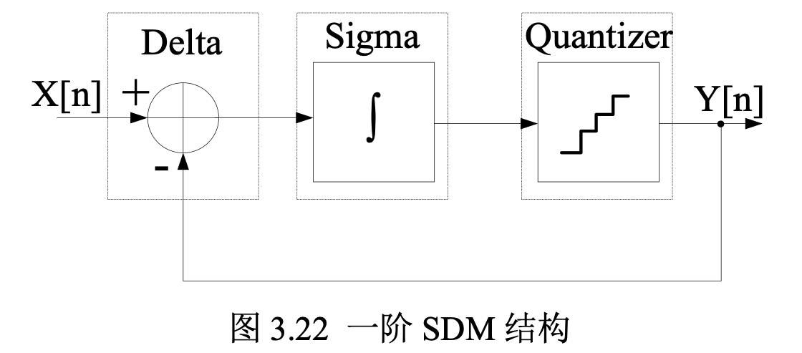

<!--more-->

# 一阶 DSM 传递函数计算

如上图所示，一阶 DSM 由一个 Delta 调制器，一个积分器以及一个量化器组成。

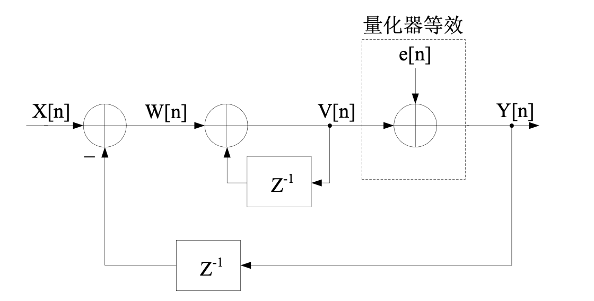

一阶 DSM 等效的 Z 域模型如上图所示，其中量化器等效为一个噪声的叠加，可以得到：
$$
W[z] = X[z] - z^{-1}Y[z] \\
V[z] = W[z] + z^{-1}V[z] \\
Y[z] = E[z] + V[z]
$$
可以推导出传递函数为：
$$
H[z] = \frac{1}{1-z^{-1}} \\
Y[z] = X[z] + (1-z^{-1})E[z]
$$
以及：
$$
STF = \frac{Y[z]}{X[z]} = \frac{H[z]}{1-z^{-1}H[z]} = 1\\
NFT = \frac{Y[z]}{E[z]} = \frac{1}{1+z^{-1}H[z]} = 1-z^{-1}
$$
可以看到，一阶 DSM 对输入信号起到传递作用，增益为 1，而对噪声起到了高通滤波作用，因此实现了对噪声的整形，将噪声推向高频。

由上式还可以推出：
$$
V[z] = X[z] + (V[z] - Y[z])z^{-1}
$$
由此可以得到该 DSM 的另一种 Z 域模型：

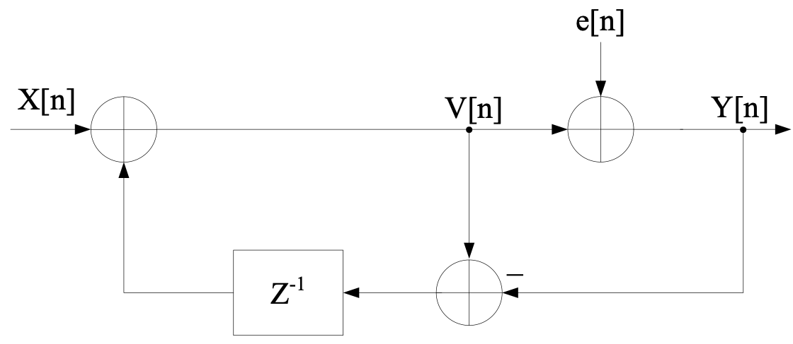

可以看到该一阶 DSM 本质上就是一个累加器，因此其在电路中信号流图可以描述如下：

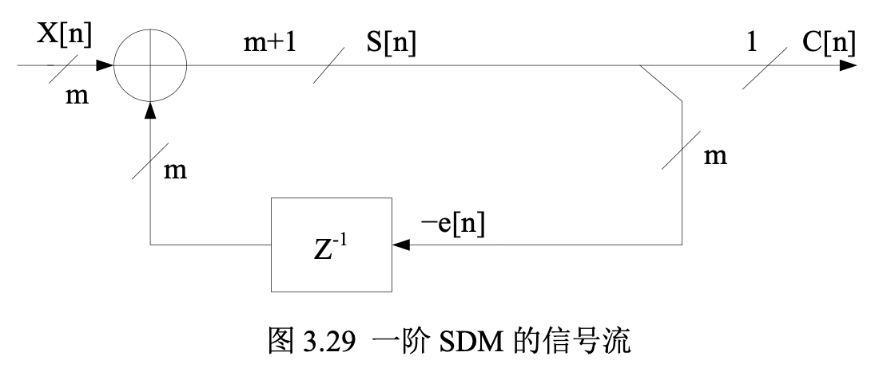

其中累加器为两个 m 位输入，m+1 位输出，输入 $X[n]$ 为缩放到 $2^m$ 的小数部分，例如，当 m = 24 时，$X[n] = 6291456$ 表示输入为 0.375 ($6291456/2^{24} = 0.375$)。$C[n]$ 为累加器输出结果的最高位，是累加的**进位**，相当于量化器的量化输出结果。累加器输出的低 m 位相当于量化误差。上面的结构可以用如下电路来实现：

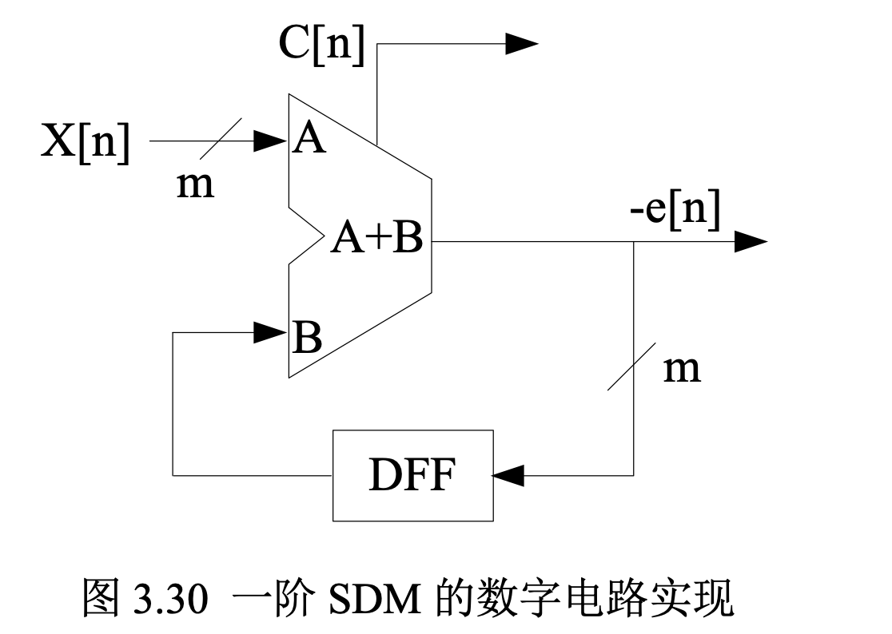

其中 DFF 为 D 触发器，实现了延迟的功能。

# 一阶 DSM Simulink 仿真

根据上面的分析，可以在 Simulink 中对一阶 DSM 进行仿真。Simulink 中的结构如下图所示：

累加器进位使用一个大于等于的比较运算实现，累加器的低位输出使用取余运算实现。

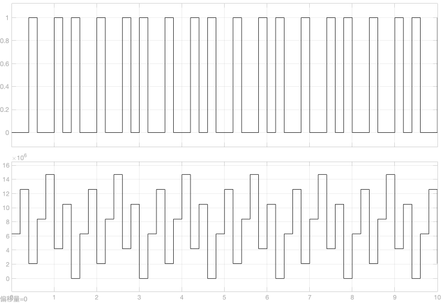

一阶 DSM 仿真结果如上图所示，第一个图是量化输出 C，第二个图是误差输出 e，输入设置为 6291456，累加器设置为 24 位，可以看到量化输出 C 每 8 个周期中会有 3 个高电平。

# MASH1-1-1

一阶的 DSM 输出周期性很明显，对噪声的整形效果不好。可以将其级联起来组成 MASH1-1-1 结构，如下图所示：

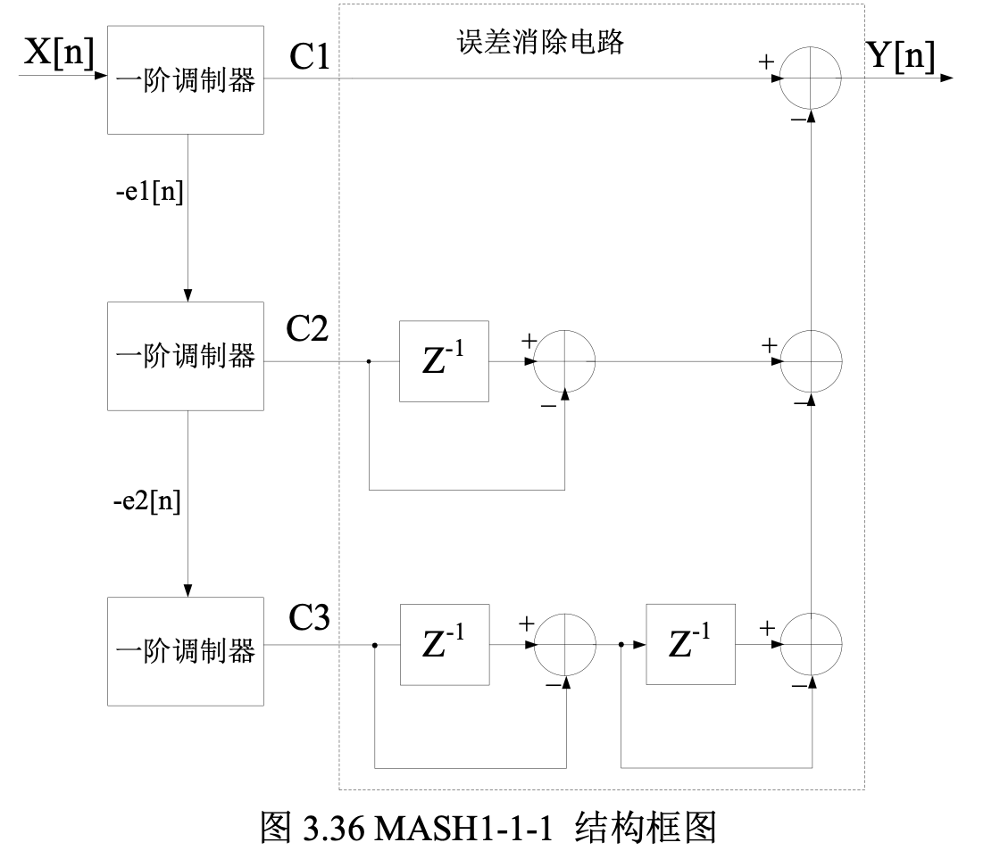

前一级的一阶 DSM 误差作为下一级的一阶 DSM 输入，每一级的输出通过延迟相加得到最终输出，传递函数推导如下：
$$
C_1 = e_1[n]*(1-z^{-1}) + X[n] \\
C_2 = e_2[n]*(1-z^{-1}) - e_1[n] \\
C_3 = e_3[n]*(1-z^{-1}) - e_2[n] \\
Y[n] = C_1 + C_2(1-z^{-1}) + C_3(1-z^{-1})^2
$$
可以得到：
$$
Y[n] = X[n] + e_3[n]*(1-z^{-1})^3
$$
可以看到最终输出的噪声只和第三级的噪声有关，并且对第三级噪声做了高阶整形。

# MASH1-1-1 Simulink 仿真

Simulink 中的结构如下图所示：

当输入为 0.375 ($6291456/2^{24} = 0.375$)，输出如下：

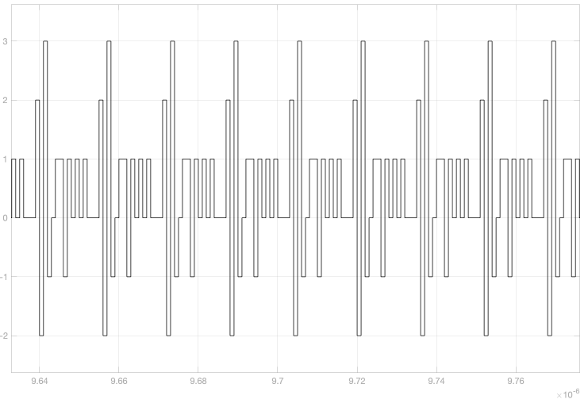

当输入为 0.1 ($1677721/2^{24} = 0.1$)，输出如下：

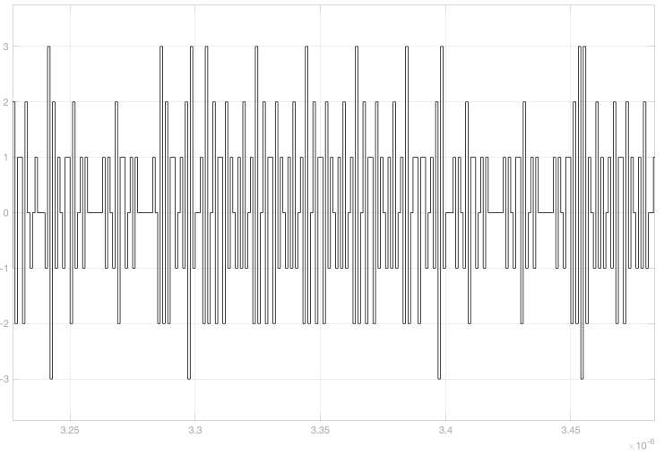

当输入为 0.9 ($15099494/2^{24} = 0.9$)，输出如下：

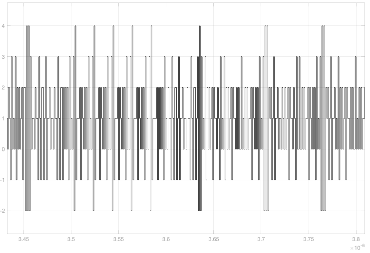

输出信号的功率谱密度：

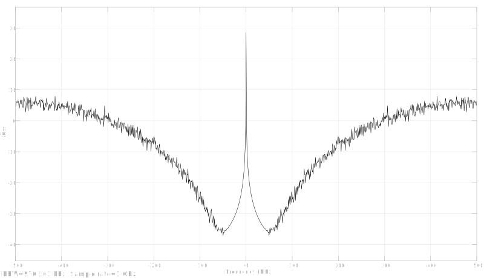

**结果分析**：

从上面仿真的结果可以看到 MASH1-1-1 结构的 DSM 可以实现对噪声的高阶整形，将噪声推向高频。

MASH1-1-1 结构的 DSM 理论上输出范围是 [-3,4]，但实际上输入不同的值，输出范围也是不同的，某些输入值对应的输出周期性还是比较明显的，例如输入为 0.375 的时候。看论文上说要在低位加 dither，可以改善这种情况，让输出的随机性更高。

# 参考文献

[1]Y. Wu, M. Shahmohammadi, Y. Chen, P. Lu and R. B. Staszewski, "A 3.5–6.8-GHz Wide-Bandwidth DTC-Assisted Fractional-N All-Digital PLL With a MASH $\Delta \Sigma $ -TDC for Low In-Band Phase Noise," in *IEEE Journal of Solid-State Circuits*, vol. 52, no. 7, pp. 1885-1903, July 2017, doi: 10.1109/JSSC.2017.2682841.

[2]周晖. 小数N频率综合器中Sigma-Delta调制器的研究与设计[D].西安电子科技大学,2014.