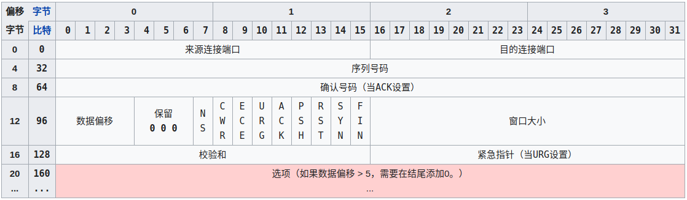
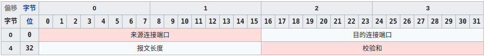

在用 FPGA 进行图像处理时，通常的作法是接一个显示器，查看输出结果，不过这也太不方便了，手上的这块 [PYNQ-Z2](http://www.tul.com.tw/ProductsPYNQ-Z2.html) 带有千兆以太网口，就想着用以太网传输视频，这样就可以抛弃笨重的显示器了。由于 Lei 同学已经完成了裸机的方案（见[千兆以太网视频传输](http://leiblog.wang/Ethernet-Video/)）,并且之前已经在 ZYNQ 上移植了 Linux 系统，那就做一个运行在 Linux 系统上的以太网图像传输吧。其实这样做起来更简单，网上可以参考的也一大堆。

***GitHub Repository :*** https://github.com/Starrynightzyq/streaming-udp-video

这个工程是用 C++ 写的，UDP 传输，依赖 OpenCV2，在 Mac 与 Linux 以及 ZYNQ 上都测试通过了。

<!---more-->

由于是为了验证图像算法的正确性，需要对输出的图像进行一些分析，因此我想得到的是原始的图像数据而不是压缩后的数据，稍微计算了一下，$ 640 \times 480 \times 24bit $ 大小，30fps 的帧率的视频码率是 27.648MBps，用千兆网传输足够了。

## TODO

- [ ] 优化数据包结构，做物理包和逻辑包的区分，便于传输不同大小和格式的图像。目前包结构为 4 字节的 id 加上 1200 字节的图像数据，对图像大小和格式有很强的依赖性；
- [ ] 增加原始图像传输和压缩图像传输的切换功能，在不需要原始图像的时候传输压缩后的图像，减小网络压力；
- [ ] 使用 TCP 传输图像的大小和格式等配置信息，这样接收端就不需要手动设置这些数据了，实现接收端的自动化；
- [ ] 根据网络环境动态调整数据包大小；
- [ ] 加密，接收端目前接收任意数据；

**由于之前没有系统地学习过计算机网络的知识，这次补了一下。**

# UDP or TCP

[TCP/IP 协议族](https://en.wikipedia.org/wiki/Internet_protocol_suite)映射到 OSI 模型中分为 4 层，从下往上分别是：网络访问(链接)层(Network Access(link) layer)、网络互连层(internet layer)、传输层(transport layer)、应用层(application layer)。TCP 和 UDP 工作在传输层。

# TCP

TCP(Transmission Control Protocol) 是一种面向连接的、可靠的、基于字节流的传输层通信协议。TCP协议的运行可划分为三个阶段：连接创建(*connection establishment*)、数据传送（*data transfer*）和连接终止（*connection termination*）。

## 连接创建

TCP用三次握手（或称三路握手，three-way handshake）过程创建一个连接:

1. 客户端通过向服务器端发送一个[SYN](https://zh.wikipedia.org/wiki/传输控制协议#建立通路)来创建一个主动打开，作为三次[握手](https://zh.wikipedia.org/wiki/握手_(技术))的一部分。客户端把这段连接的序号设定为随机数**A**。
2. 服务器端应当为一个合法的SYN回送一个SYN/ACK。ACK的确认码应为**A+1**，SYN/ACK包本身又有一个随机产生的序号**B**。
3. 最后，客户端再发送一个[ACK](https://zh.wikipedia.org/wiki/確認訊息)。此时包的序号被设定为**A+1**，而ACK的确认码则为**B+1**。当服务端收到这个ACK的时候，就完成了三次握手，并进入了连接创建状态。

如果服务器端接到了客户端发的SYN后回了SYN-ACK后客户端掉线了，服务器端没有收到客户端回来的ACK，那么，这个连接处于一个中间状态，既没成功，也没失败。于是，服务器端如果在一定时间内没有收到的TCP会重发SYN-ACK。在Linux下，默认重试次数为5次，重试的间隔时间从1s开始每次都翻倍，5次的重试时间间隔为1s, 2s, 4s, 8s, 16s，总共31s，第5次发出后还要等32s才知道第5次也超时了，所以，总共需要 1s + 2s + 4s+ 8s+ 16s + 32s = 63s，TCP才会断开这个连接。使用三个TCP参数来调整行为：tcp_synack_retries 减少重试次数；tcp_max_syn_backlog，增大SYN连接数；tcp_abort_on_overflow决定超出能力时的行为。

## 数据传输

在TCP的数据传送状态，很多重要的机制保证了TCP的可靠性和强壮性。它们包括：使用序号，对收到的TCP报文段进行排序以及检测重复的数据；使用校验和检测报文段的错误，即无错传输；使用确认和计时器来检测和纠正丢包或延时；流控制（Flow control）；拥塞控制（Congestion control）；丢失包的重传。

## 连接终止

连接终止使用了四路握手过程（或称四次握手，four-way handshake），在这个过程中连接的每一侧都独立地被终止。当一个端点要停止它这一侧的连接，就向对侧发送FIN，对侧回复ACK表示确认。因此，拆掉一侧的连接过程需要一对FIN和ACK，分别由两侧端点发出。

## TCP 包头结构

源端口 16位；目标端口 16位；序列号 32位；回应序号 32位；TCP头长度 4位；reserved 3位；控制代码 9位；窗口大小 16位；偏移量 16位；校验和 16位；选项 32位(可选)；

这样我们得出了TCP包头的最小长度，为20字节。

# UDP

UDP 是一个简单的面向数据报的通信协议。UDP 只提供数据的不可靠传递，它一旦把应用程序发给网络层的数据发送出去，就不保留数据备份（所以 UDP 有时候也被认为是不可靠的数据报协议）。UDP 在 IP 数据报的头部仅仅加入了复用和数据校验字段。

UDP 适用于不需要或在程序中执行错误检查和纠正的应用，它避免了协议栈中此类处理的开销。对时间有较高要求的应用程序通常使用 UDP，因为丢弃数据包比等待或重传导致延迟更可取。

## UDP 的分组结构

UDP 头部包含了以下几个数据：

- 两个十六位的端口号，分别为源端口（可选字段）和目标端口；
- 整个数据报文的长度；
- 整个数据报文的检验和（IPv4 可选 字段），该字段用于发现头部信息和数据中的错误；

因此 UDP 的头部开销小，只有 8 字节，相比 TCP 的至少 20 字节要少得多，在传输数据报文时是很高效的。

## UDP数据分包大小的原则与一些思考

编写程序时不可避免遇到一个疑惑，一次发多大的数据包为宜？理论上IP数据报最大长度是65535字节，这是由IP首部16比特总长度字段所限制，去除20字节的IP首部和8个字节的UDP首部，UDP数据报中用户数据的最长长度为65507字节，但是，大多数实现所提供的长度比这个最大值小。

以太网 IP 层的最大传输单元 (Maximum Transmission Unit,MTU) 为 1500 字节。如果以分包大小应该使在 IP 层不再进行分包为宜作为原则，那么因为 UDP 数据报的首部 8 字节，IP 首部 20 字节，所以 UDP 数据报的数据区最大长度为 1472 字节。如果说 IP 数据报大于 1500 字节,大于 MTU，这个时候发送方 IP 层就需要分片，把数据报分成若干片,使每一片都小于 MTU，而接收方 IP 层则需要进行数据报的重组，这样就会多做许多事情。而更严重的是，由于 UDP 的特性，当某一片数据传送中丢失时，接收方便无法重组数据报，将导致丢弃整个 UDP 数据报。因此，在普通的局域网环境下，建议将 UDP 的数据控制在 1472 字节以下为好，以降低丢包率。
进行 Internet 编程时则不同，因为 Internet 上的路由器可能会将 MTU 设为不同的值，鉴于 Internet 上的标准 MTU 值为 576 字节，建议在进行 Internet 的 UDP 编程时，最好将 UDP 的数据长度控件在 548 字节 (576-8-20) 以内。

# TCP与UDP区别总结：
1. TCP 面向连接（如打电话要先拨号建立连接）；UDP 是无连接的，即发送数据之前不需要建立连接；
2. TCP 提供可靠的服务。也就是说，通过TCP连接传送的数据，无差错，不丢失，不重复，且按序到达；UDP尽最大努力交付，即不保证可靠交付；
3. TCP 面向字节流，实际上是 TCP 把数据看成一连串无结构的字节流；UDP 是面向报文的；UDP没有拥塞控制，因此网络出现拥塞不会使源主机的发送速率降低（对实时应用很有用，如 IP 电话，实时视频会议等）；
4. 每一条 TCP 连接只能是点到点的；UDP 支持一对一，一对多，多对一和多对多的交互通信；
5. TCP 首部开销 20 字节；UDP 的首部开销小，只有 8 个字节；
6. TCP 的逻辑通信信道是全双工的可靠信道，UDP则是不可靠信道；

# Reference

- https://en.wikipedia.org/wiki/Internet_protocol_suite
- https://en.wikipedia.org/wiki/Transmission_Control_Protocol
- https://en.wikipedia.org/wiki/User_Datagram_Protocol
- https://blog.fundebug.com/2019/03/22/differences-of-tcp-and-udp/
- https://www.cnblogs.com/skyfsm/p/6287787.html

