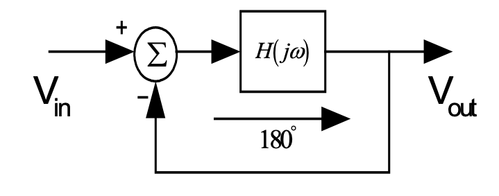
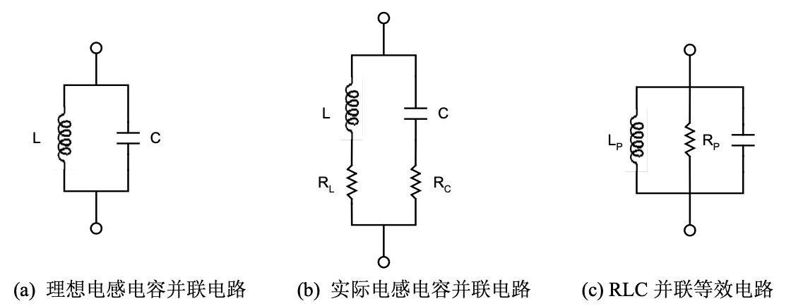
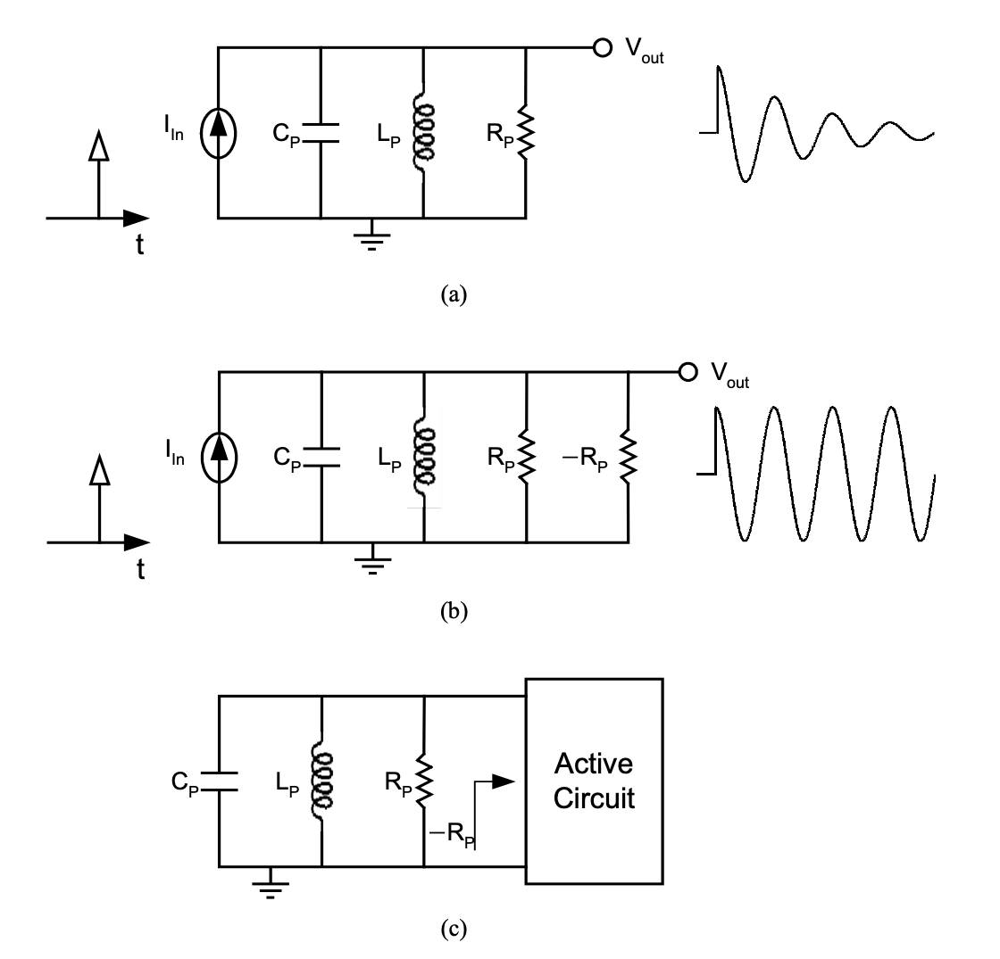
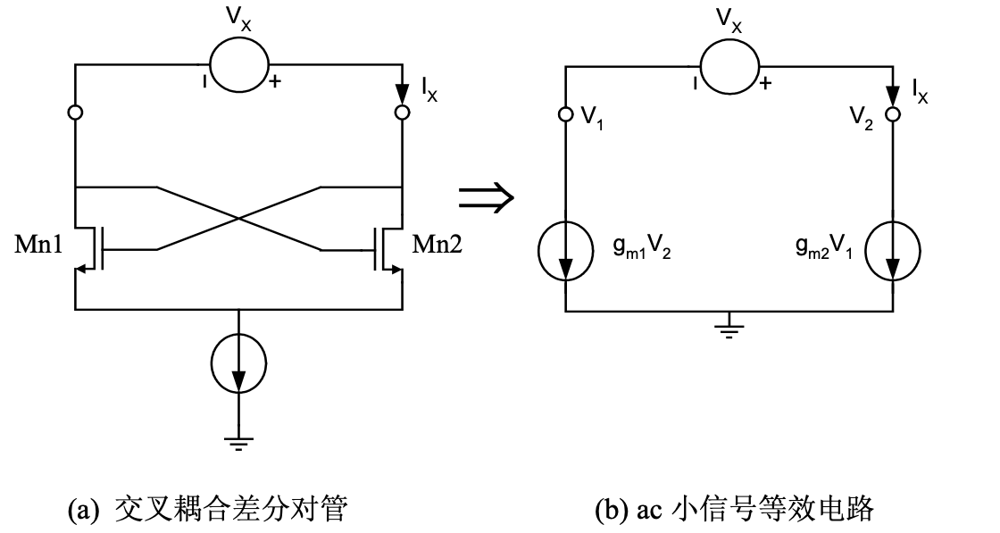
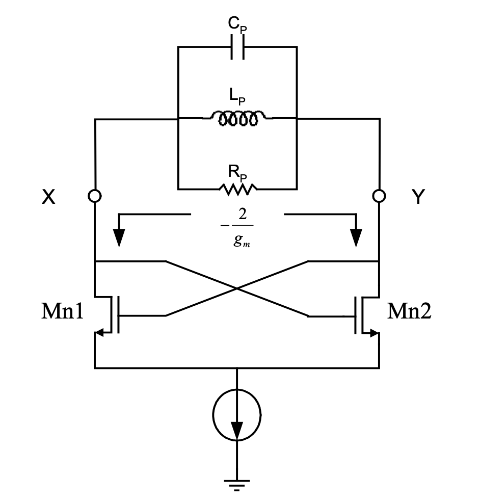
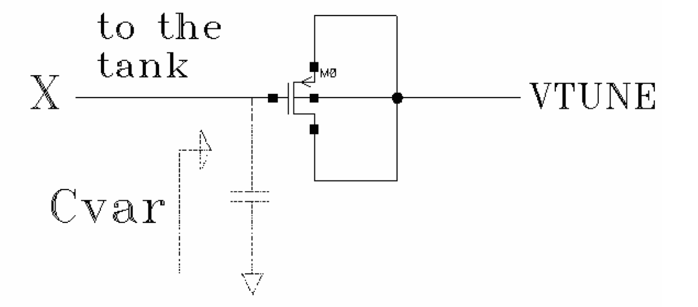
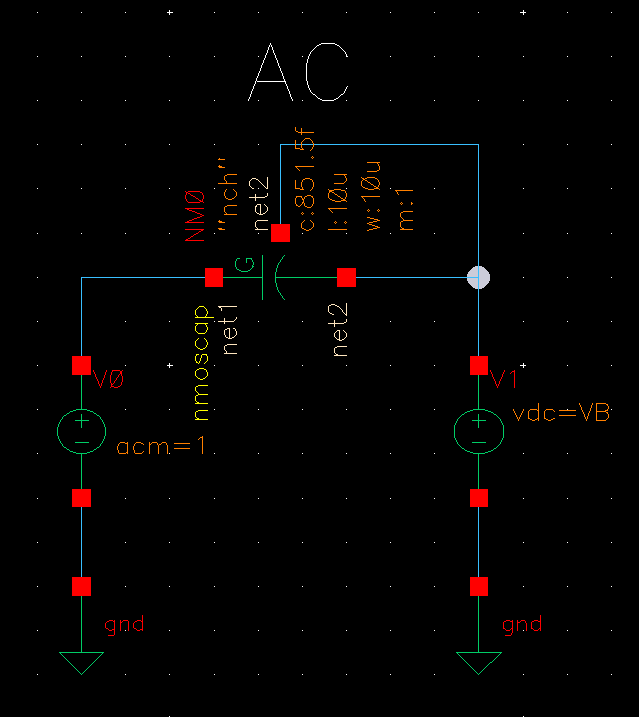
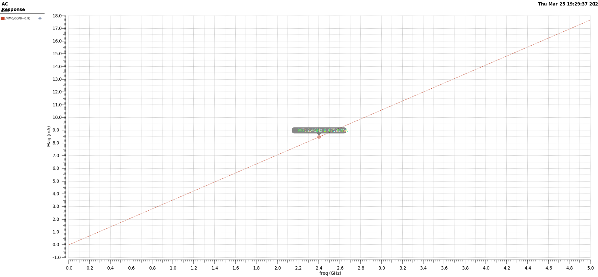
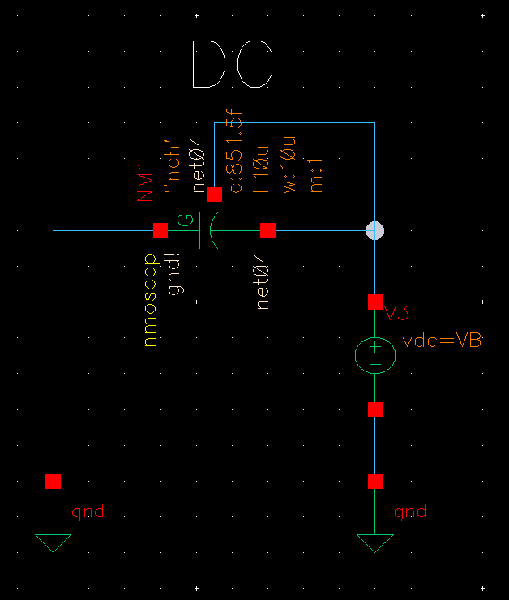
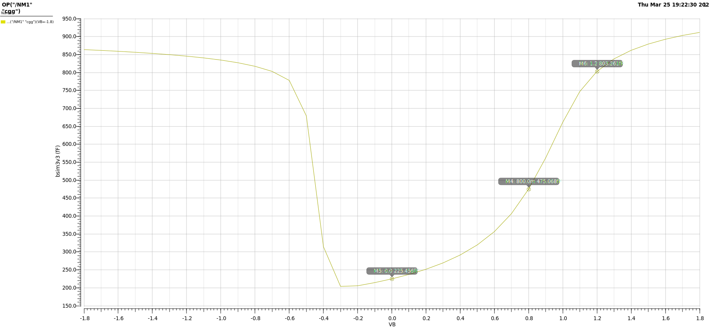

# LC-VCO 原理

## LC 振荡器

振荡器的本质是一个非线性反馈系统，如上图所示，该系统的开环传递函数为 $H(s)$，则其闭环传递函数可以表示为：
$$
\frac{V_{out}}{V_{in}}=\frac{H(s)}{1+H(s)}
$$
当 $H(s)=-1$ 时，负反馈系统的输出为无穷大，这样系统中的任何节点上有一个小的抖动或者噪声都能够使得系统发生振荡，这时候负反馈系统变成正反馈。

一个负反馈系统必须满足以下两个 Barkhausen 振荡原则，电路才能够在频率点 $\omega _0(s=j\omega _0)$ 上发生振荡：

- 振荡器开环增益 $|H(j\omega _0)|\geq1$；
- 振荡器的开环相移为 180°。

在实际电路设计中，振荡器的开环增益往往是计算值的 2-3 倍。这主要是为了克服工艺和温度的偏差，以及由于电路非线性造成的开环增益的下降。

如上图(a)所示，一个理想的电感电容谐振电路，在频率 $\omega_{res}=1/\sqrt{LC}$ 处谐振，在此频率下，电感的阻抗 $jL\omega_{res}$ 和电容的阻抗 $1/(jC\omega_{res})$ 幅值相等而方向相反，因此产生了无穷大的阻抗，回路的品质因数Q 为无穷大。实际的片上电感和电容都存在串联电阻，如图(b)所示，可以将其等效为电路(c)，电路(b)和电路(c)阻抗相等，有如下的关系：
$$
Ls+R_L=\frac{R_{P,L}\cdot L_Ps}{R_{P,L}+L_Ps}
$$
只考虑稳态，假设 $s=j\omega$，上式可以写成：
$$
(L\cdot R_{P,L}+L_P\cdot R_L)j\omega+R_{L}\cdot R_{P,L}-L\cdot L_P \cdot \omega^2=R_{P,L}\cdot L_P\cdot j\omega
$$
要求对所有的 $\omega$ 值都成立，则：
$$
L\cdot R_{P,L}+L_P\cdot R_L =R_{P,L}\cdot L_P
$$

$$
R_{L}\cdot R_{P,L}-L\cdot L_P \cdot \omega^2 = 0
$$

则有：
$$
L_P= L(1+\frac{1}{Q_L^2})\quad , \quad Q_L= \frac{L\omega}{R_L}
$$

$$
R_{P,L}=(1+Q_L)^2R_L
$$

同样的可以推导出：
$$
C_P= \frac{C}{1+\frac{1}{Q_C^2}}\quad,\quad Q_C = \frac{1}{\omega C R_C}
$$

$$
R_{P,C} =(1+Q_C)^2R_C
$$

$$
R_P =R_{P,L}+ R_{P,C}=(1+Q_L)^2+(1+Q_C)^2R_C
$$

RLC 并联谐振回路的品质因数 $Q_{tank} = {R_P}/{\omega L_P}=\omega C_P R_P$，谐振频率为 $\omega _{res} = 1/\sqrt{L_PC_P}$，在谐振频率处，RLC 并联等效电路的输出阻抗为 $R_P$。

上图画出振荡回路的阻抗和频率的关系。

## 交叉耦合振荡器

## 从"负电阻"角度理解

如上图(a)所示，当有一个电流脉冲刺激 RLC 并联电路时，RLC 电路将发生振荡，由于电阻 $R_P$ 的存在，振荡将慢慢衰减为零。如果将一负阻 $-R_P$ 与该电路并联，如图(b)所示，RLC 电路的并联电阻为 0，这样振荡将永远维持下去。因此如果单端口电路有一负电阻与振荡回路并联，如图(c)所示，电路就会永远振荡。

上图为采用 MOS 管实现的负阻电路和其交流小信号等效电路。忽略 MOS 管 Mn1 和Mn2 的衬底效应和沟道调制效应，可以得到：
$$
V_x = V_2-V_1,\quad I_x = g_{m2}V_1=-g_{m1}V_2
$$
则：
$$
V_x = V_2-V_1=-\frac{-I_x}{g_{m2}}-\frac{-I_x}{g_{m1}} = -I_x\left( \frac{1}{g_{m1}}+ \frac{1}{g_{m2}} \right)
$$
如果 Mn1 和 Mn2 相同，则：
$$
\frac{V_x}{I_x}= -\frac{2}{g_m}
$$
当加在负阻的两端的电压增加时，负阻将对外输出电流。如果将上图中的交叉耦合差分对管与 RLC 回路相并联，如下图所示，并且保证 $R_P\leq 2/g_m$ 时，负阻就能够为 RLC 回路中的并联电阻 $R_P$ 消耗的能量进行源源不断的补偿。节点 X 和 Y 将产生差分振荡信号，**振荡波形与尾电流偏置大小有关。**

# 谐振振荡器内在振荡机制

## 振荡器谐振幅度

# VCO 压控振荡器

## 指标

## LC-VCO 的调节

LC 振荡器的振荡频率等于 $f_{osc}=1/(2\pi \sqrt{LC})$，因为改变单片电感的值很困难，我们可以调节电容值来调节振荡器。电容值与电压值有关的电容被称为“可变电容器” (varactor)。

如上图所示，变容二极管可以使用 MOS 管构成。

## VCO 的数学模型

# LC-VCO 的设计

## 电路结构

## **Varactor 变容二极管仿真

### AC

AC 仿真使用的电路如上图所示。**为了减小栅电阻，使用多指结构；为了减小沟道电阻，使用最小的沟道长度。**

仿真结果 imaginary 和频率的关系如上图所示。$imag=2\pi fC_{var}$。

### DC

DC 仿真使用的电路如上图所示。同时使用 "DC" 和 "parametric analysis"，扫描控制电压 VB。

使用 "calculator" 中的 "op" 选项 (operating point)，获取变容二极管的 "cgg" 参数，画出其与控制电压的关系。可以看到，当控制电压在 0-1.2 V 之间时，cgg 和 VB 近似可以看成一个线性的关系。当要在相同的控制电压下获得其他值的电容，只需要按比例缩放变容二极管的 W 和 L。

## Inductor 电感仿真

> 待完成

## 电路参数确定

> 待完成

## 整体仿真

> 待完成

# References

[] [L100-VCOs-2UP(9_1_03) by P.E.Allen]()

[] [唐长文博士论文_PhD_Thesis]()

[] [RFIC Design Tutorial Voltage Controlled Oscillators Prepared By: Burak Catli]()

