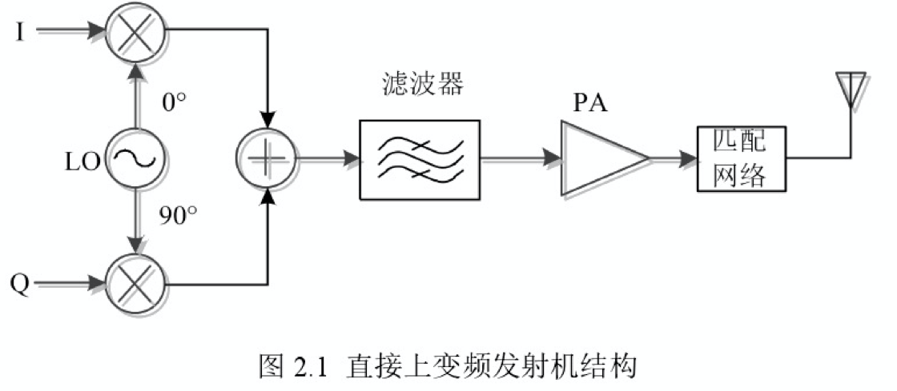
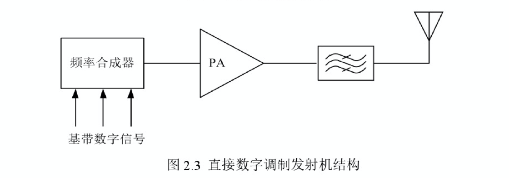

# 无线发射机结构

无线发射机按结构类型主要分为三种：直接上变频、超外插和直接数字调制。

上图为**直接上变频**结构，通过一次变频将 I、Q 两路基带信号变为射频信号。

- 优点：
  - 结构简单；
  - 能较好得抑制镜像的产生；
- 缺点：
  - 工作在射频上的两个混频器需要消耗很大电流；
  - 当振荡器和输出处于同一频率时，高频载波馈通和注入锁定 (Injection) 是两个可能出现的问题；

上图为**超外差**结构，其将数字调制上变频产生的信号再与射频前端的本振进行一次上变频，最后送入功放。

- 优点：
  - 该发射机在本振和功放之间加入一个滤波器，具有良好的隔离度；
- 缺点：
  - 与直接上变频相比，由于采用了两次上变频，复杂度较高；

上图为**直接数字调制**结构，直接将频率合成器的输出送入到功放。

# 功率放大器的主要技术指标

## 输出功率

## 功率附加效率

## 线性度

# 功率放大器的分类

功率放大器按晶体管的工作特性可以分为**线性功率放大器**和**开关功率放大器**。

# 线性化技术

目前针对高功率功放提高线性度的方法主要有：功率回退法 (Power Back-off)、前馈法 (Feedforward)、负反馈技术 (Feedback)、预失真技术 (Predistortion)、包络消除与恢复 (Envelope Elimination and Restoration)等。

# 匹配补偿技术

# 功率合成技术

