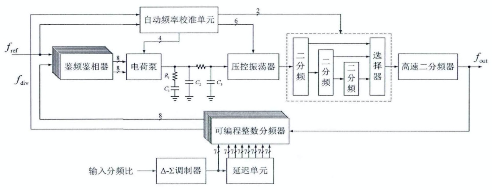

前一篇文章 [PLL(Phase-locked loop, 锁相环)](https://zhouyuqian.com/2020/09/11/PLL/) 介绍了 PLL(锁相环) 的基本原理，这篇文章介绍一个 0.4~8GHz 电流泵锁相环型小数频率综合器的实现原理。

<!--more-->

> Reference: [多模CMOS频率综合器关键模块设计及其整体优化-孙天慧-东南大学](https://kns.cnki.net/kcms/detail/detail.aspx?dbcode=CMFD&dbname=CMFD201801&filename=1017116544.nh&v=grmqatzl4t6TEe1aXvu9C473CDx8comY%25mmd2BdcIonuXqHPUF4bV%25mmd2FqpS36DKm%25mmd2BC1Vdyt)

# 频率综合器概述

## 频率综合器分类

- 直接模拟频率综合器 (**DAS**, Direct Analog Synthesizer)

  原理：DAS 基于一个或多个高稳定度的参考源，通过倍频、分频及混频等方式直接产生多个目标频率信号。

  **优点**：较好的相位噪声和频率稳定度；频率切换速度快；

  **缺点**：结构复杂、成本高、调试难度大；输出杂散大且难以抑制；

  应用：小规模地应用于雷达信号产生。

- 直接数字频率综合器 (**DDS**, Direct Digital Synthesizer)

  原理：DDS 从相位的概念出发，采用数字采样存储技术，通过数模转换器将存储在片上存储器中的波形输出。

  **缺点**：DDS 本质上是一个采样系统，其输出信号频率不能超过采样频率的一半。

  应用：DDS 多用于低频系统中，难以满足射频系统的需求。

- 锁相环频率综合器 (**PLL-FS**, Phase-Locked Loop Frequency Synthesizer)

  原理：间接频率综合器，利用相位反馈原理产生稳定的输出频率。通过闭环跟踪特性将压控振荡器 VCO 产生的频率锁定在某一频率上。

  优点：PLL-FS 作为一个误差控制系统，能够实现很好的输出频率控制，同时具有较好的频率纯净度和频率稳定度。

  应用：在现代通信系统中广泛应用。

- 延迟锁相环频率综合器 (**DLL-FS**, Delay-Locked Loop Frequency Synthesizer)

  原理：同 PLL-FS，主要实现时钟同步。

## 多模 CMOS 锁相环频率综合器分类

- 多个模拟锁相环组合

  功耗大、面积大；

- 全数字锁相环

  很宽的频率覆盖范围、较小的带外相位噪声、较小的尺寸；

  需要利用复杂的技术来抑制量化噪声；

- 电荷泵锁相环小数频率综合器

# 小数频率综合器的基本原理

## 基本模块

如上图所示，一个典型的电荷泵锁相环型小数频率综合器包括鉴频鉴相器 (Phase Frequency Detector, PFD)、电荷泵 (Charge Pump, CP)、环路滤波器 (Loop Filter, LF)、压控振荡器 (Voltage Controlled Oscillator, VCO)、可编程整数分频器、$\Delta-\Sigma$ 调制器 (Delta-Sigma Modulator, DSM) 和自动频率校准单元 (Auto-Frequency Calibration, AFC)。

### 鉴频鉴相器和电荷泵

理想 PFD/CP 工作波形如上图所示。鉴频鉴相器 (PFD) 用以检测参考时钟 $f_{ref}$ 和分频器输出 $f_{div}$ 的频率差或者相位差，并输出与之形成正比的脉冲信号 UP 和 DN。电荷泵 (CP) 将 UP 和 DN 间的脉宽差值转换为电流脉冲，对环路滤波器进行充放电，产生压控振荡器的控制信号。

上图为边沿触发的 PFD/CP 结构图，包括两个带复位端的 D 触发器、一个两输入的与门和连接电荷泵开关的缓冲逻辑单元。由于电荷泵的开关分别采用了 PMOS 管和 NMOS 管，逻辑相反，所以需要在缓冲逻辑单元中对 UP 信号反向。为了使 UP 和 DN 信号到达 CP 开关的延迟保持一致，在缓冲单元中的传输门应尽量与非门保持相同的传输延迟。

PFD/CP 传输特性曲线如上图所示，在环路锁定的过程中，PFD/CP 可分为三个工作状态：鉴频鉴 (相位差$>2\pi$)、鉴相 (相位差$<2\pi$)、锁定相位 (相位差$=0$)。当 PFD 的两个输入信号相位差绝对值大于 $2\pi$ 时，PFD 工作在鉴频状态，输出极性不再随相位变化。当相位差绝对值不超过 $2\pi$ 时，PFD 工作在鉴相状态，即环路进入锁定过程。此时，PFD/CP 的输出信号 UP 与 DN 之间脉宽差值 $\Delta t$ 与两个输入信号的相位差 $\Delta \varphi$ 成正比，即：
$$
\Delta t = \frac{\Delta \varphi}{2\pi} \cdot T_{ref}
$$

则 PDF/CP 在一个周期内产生是平均静电流为：
$$
\overline{I_{out}} = \frac{I_{CP}\cdot\Delta t}{T_{ref}} = \frac{I_{CP}}{2\pi}\cdot \Delta \varphi
$$
则在相位域 PFD/CP 的增益为：
$$
K_{PFDCP} = \frac{\overline{I_{out}}}{\Delta \varphi} = \frac{I_{CP}}{2\pi}
$$
可得到 PFD/CP 的线性相位在 s 域的模型如下图所示：

### 环路滤波器

环路滤波器为低通滤波器，其作用是将 CP 输出的电流转换为 VCO 的控制电压，并滤除其高频分量，同时环路滤波器也可以抑制 $\Delta-\Sigma$ 调制器中的带外噪声。在环路滤波器的带宽小于参考时钟频率的 $1/10$ 时，整个环路在 s 域可近似为线性系统。

常见的环路滤波器可分为有源滤波器和无源滤波器。有源滤波器功耗大，并会产生有源噪声，因此在锁相环系统中通常会使用无源环路滤波器。一阶无源环路滤波器的电压纹波较大，实际应用中通常使用二阶和三阶无源环路滤波器。其结构如下图所示：

上图二阶无源环路滤波器的传递函数为：
$$
Z_{LF2}(s) = \frac{V_c}{I_{cp}} = \frac{1+sR_1C_1}{s(sR_1C_1C_2 + C_1 + C_2)}
$$
可知该无源二阶环路滤波器有一个零点和两个极点。
$$
Z_{LF3} = \frac{1}{s}\frac{1+sR_1C_1}{R_1R_3C_1C_2C_3s^2 + [R_1C_1(C_1+C_3)+R_3C_3(C_1+C_2)]s + (C_1+C_2+C_3)}
$$
可知该三阶无源环路滤波器有一个零点和三个极点。

环路滤波器的线性相位 s 域模型如下图所示：

### 压控振荡器

VCO 的输出频率随输入控制电压单调变化，理想 VCO 的输入输出关系为：
$$
\omega _{out}(t) = \omega _0 + K_{VCO} \cdot v_c(t)
$$
根据相位和频率在时域中的积分关系，可得 VCO 的输出相位为：
$$
\varphi _{out}(t) = \int \omega _{out} (t) \mathrm{dt} = K_{VCO} \int v_c(t) \mathrm{dt} + \omega _0 t + \varphi _0
$$
由于 $\omega _0 t $ 和 $ \varphi _0$ 都不受锁相环控制，这里只关心受电压 $v_c$ 控制的剩余相位：
$$
\varphi _{res}(t) = K_{VCO} \int v_c(t) \mathrm{dt}
$$
则 VCO 在 s 域的传递函数为：
$$
\frac{\varphi _{res}}{v_c} (s) = \frac{K_{VCO}}{s}
$$
VCO 的线性相位 s 域模型如下图所示：

### 可编程整数分频器

可编程整数分频器位于锁相环的反馈回路中，将 VCO 输出的振荡信号进行分频后，输出给 PFD 与参考时钟比较，而形成环路。可编程整数分频器工作在整个 PLL 的**最高频率**处。常用的电路结构有：基于双模预分频的 P/S 计数器结构和 2/3 分频器链结构。

基于双模预分频器的 P/S 计数器结构如上图所示，这种结构的分频器总分频比为：
$$
M = (N+1)\cdot S + N\cdot (P-S) = N\cdot P + S
$$

基于 2/3 分频器链的结构如上图所示，这种分频器只要第一级工作在最高频率，后级工资频率逐渐降低，可以降低电路功耗；整个链路中不存在长延时回路，所有反馈路径只存在于相邻的两个单元之间，可靠性好；链路中的每一级都由相同的模块组成，电路的可复用性好。

n 级 2/3 分频器链的总分频比为：
$$
M = 2^n + 2^{n-1} \cdot P_{n-1} + 2^{n-2} \cdot P_{n-2} + \dots + 2 \cdot P_{0}
$$
n 级 2/2 分频器链的分频比范围为 $2^n \sim 2^{n+1}-1$，此外可以通过组合逻辑电路拓展分频比范围。

可编程整数分频器的线性相位 s 域模型如下图所示：

### $\Delta - \Sigma$ 调制器

小数频率综合器中的小数分频器是通过“动态分频比”来实现的，在环路锁定时两个输入信号仍存在相位差。$\Delta - \Sigma$ 调制器可以将瞬时分频比随机化，在实现小数分频的同时，进行量化噪声的整形。

$\Delta - \Sigma$ 调制器的工作原理如上图所示，小数分频器的分频比分为整数部分 $N$ 和小数部分 $a$，小数部分通过 $\Delta - \Sigma$ 调制器进行量化后，与整数部分相加，得到瞬时分频比。$\Delta - \Sigma$ 调制器将带内噪声推向带外，实现噪声整形，而带外的量化噪声可以通过环路滤波器进行抑制，从而改善小数频率综合器的输出相位噪声。

$\Delta - \Sigma$ 调制器对环路的线性相位 s 域模型没有影响，但会引入量化噪声。

### 自动频率校准单元

在目标频率发生变化后，环路断开 AFC 开始工作，搜索到目标自频率后，AFC 停止工作且接通环路。因此 AFC 对环路的线性相位 s 域模型没有影响。

## 环路线性化模型和传递函数

根据上面对电荷泵锁相环中每个模块的分析，可得其在 s 域的线性化模型为：

根据上图可得锁相环系统的开环传递函数为：
$$
H_{OL}(s) = \frac{I_{CP}\cdot K_{VCO}}{2\pi \cdot N \cdot s} \cdot Z_{LF}(s)
$$
则其闭环传递函数为：
$$
H_{CL}(s) = \frac{H_{OL}/\frac{1}{N}}{1+H_{OL}} = \frac{N \cdot H_{OL}}{1+H_{OL}}
$$
因此闭环传递函数 $H_{CL}(s)$ 呈低通特性。

## 混合型 FIR 噪声滤除计数

# 电路设计

## 系统结构设计

小数频率综合器系统结构如上图所示，主要包括鉴频鉴相器 (PFD)、电荷泵 (CP)、环路滤波器 (LF)、压控振荡器 (VCO)、可编程整数分频器、$\Delta - \Sigma$ 调制器 (DSM) 和自动频率校准单元 (AFC)，同时采用混合型 FIR 滤波器来抑制 $\Delta - \Sigma$ 调制器的量化噪声。

## 小数分频器电路

由于 VCO 的输出端直接送到小数分频器的输入端，因此小数分频器工作在整个环路的最高频率处。因此小数分频器的高频部分采用全定制电路实现，而低频模块则采用半定制电路实现。

小数分频器的结构如上图所示，主要由高速二分频器、可编程整数分频器和 $\Delta - \Sigma$ 调制器组成，其中可编程整数分频器包括四分频器和 2/3 分频器链。

### 高速二分频器

高速二分频器的作用是对 VCO 输出的频率进行二分频，从而产生**四项正交的本振信号**。

> PS: I/Q 正交调制
>
> 假设载波为 cos(a)，信号为 cos(b)，传统调制方式直接用载波和信号相乘：
> $$
> cos(a)*cos(b) = \frac{1}{2} [cos(a+b) + cos(a-b)]
> $$
> 这样就在载波 a 的作用下产生了两个信号，然而实际中只需要一个信号，则需要通过滤波器滤除掉另一个信号，但实际上滤波器是不理想的，很难完全滤掉另外一个。
>
> 在实际应用中只希望得到单一的 a+b 或者 a-b 即可，将三角函数展开：
> $$
> cos(a-b) = cos(a)cos(b) + sin(a)sin(b)
> $$
> 在 I/Q 正交调制中，Q 路可以产生于 I 路相位相差 $\pi /2$ 的信号，就相当于 Q 路为 sin(a)，因此可以通过 I/Q 正交调制得到单一中心频率的信号：
> $$
> cos(a)cos(b) + sin(a)sin(b) = cos(a-b)
> $$

常用的高速分频器主要有**可再生分频器** (Regenerative Frequency Divider, RFD)、**注入锁定分频器** (Injection-Look Frequency Divider, ILFD) 和**源级耦合逻辑** (Source Coupled Logic, SCL) 触发器构成的分频器。

可再生分频器和注入锁定分频器都属于模拟分频器，可以达到很高的工作频率。然而可再生分频器在低频下会产生高次谐波分量，注入式分频器的工作频率比较窄。SLC 触发器构成的分频器属于数字分频器，其工作频率高、工作范围大、灵敏度高、可输出理想的正交信号。

如上图所示，将触发器的反相输出端 Qn 和数据输入端 D 相连就可以构成一个二分频器。

如上图所示，SCL 触发器实际上是由两个 SCL 结构的锁存器级联而成的。

### 缓冲电路

由于高速二分频器直接输出的信号幅度较小，且驱动力不足，直接与后级相连将无法正常工作，因此需要在高速二分频器和后级电路之间加上缓冲电路。对于缓冲电路的要求有：输入电容小、隔离度高以及驱动能力强，这样的缓冲电路不会影响前级电路的正常工作，还可以为后级电路提供较大摆幅的输出信号。

射频电路中常用的缓存电路有三种：**反相器**、**源级跟随器**和**共源放大器**。

反相器结构的缓冲电路输出摆幅较大，但其输入阻抗大，会给前级带来很大的负载（**？**），且反相器结构的缓冲电路工作频率较低。

源级跟随器结构的缓冲电路有输入阻抗大、输出阻抗小的特点，可以轻易实现阻抗变化。但其输出摆幅相较于输入信号，会有一个阈值电压的下降。

共源放大器结构的缓冲电路其偏置电流可调、工作频率高、反向隔离度好、并且可以抑制共模电流。

共源放大器结构的缓冲电路结构如上图所示，单端输出信号峰峰值 $V_{PP}$ 为 $I_{SS} \cdot R_{D}$。

### 四分频器

与高速二分频器的结构类似，两个完全相同的触发器就可以构成一个四分频器，其结构如上图所示。由于其工作频率范围为 $0.5 \sim 4.0GHz$，因此仍使用 SCL 结构的触发器电路结构来实现。

四分频器的缓冲电路结构如上图所示，四分频器的缓冲电路不仅要起到隔离和驱动的作用，还要实现模拟信号和数字逻辑信号的转换，因此缓冲电路分三级：

- 第一级是双转单输出型的共源差分放大器，将差分输入信号转化为单端输出信号，并做一定的放大；
- 第二级是**带电阻反馈的反相器**，将信号放大至全摆幅，其中的电阻反馈可以稳定输出，并将输出信号的直流工作点固定在翻转阈值附件；
- 第三级是驱动后级数字电路的反相器，为后级电路提供更大的驱动能力。

### 2/3 分频器

2/3 分频器链路结构如上图所示，n 级 2/3 分频器链路的分频比范围为 $2^n \sim 2^{n+1}-1$，采用逻辑组合电路可以进一步将分频比拓展至 $2^k \sim 2^{n+1}-1$，因此采用 5 级 2/3 分频器链路，可以实现 $4 \sim 63$ 分频比范围。

每一级的 2/3 分频器结构如上图所示，有四个锁存器和三个与门构成。其包含两部分，上半部分是预分频逻辑 (Prescaler Logic)，下半部分是周期终止逻辑 (End-of-Cycle Logic)。周期终止逻辑根据分频比控制输入端 P 和模式输入端 $\mathrm{mod}_\mathrm{in}$ 来决定预分频逻辑的分频比。其分频比关系如下：

|             输入控制端             | 分频比 |
| :--------------------------------: | :----: |
| P & $\mathrm{mod}_\mathrm{in}$ = 0 |   2    |
| P & $\mathrm{mod}_\mathrm{in}$ = 1 |   3    |

2/3 分频器链路的最高工作频率为 1GHz，可以采用真单相时钟 (True Single Phase Clocked, TSPC) 逻辑结构来实现，TSPC 逻辑有着结构简单、功耗小，并且只需要单相输入时钟的优点。TSPC 结构实现的 2/3 分频器电路结构如下图所示：

### $\Delta-\Sigma$ 调制器

## AFC

 