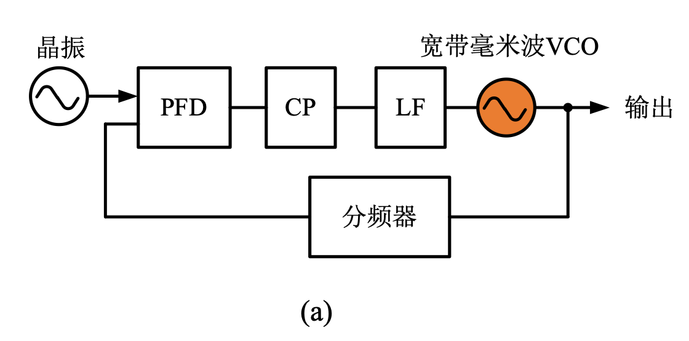
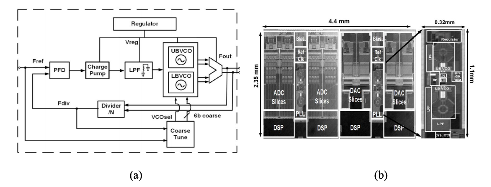
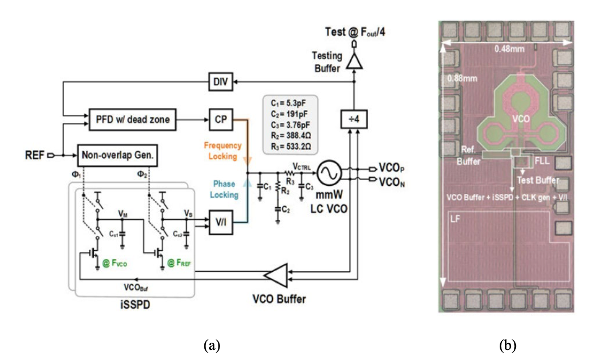
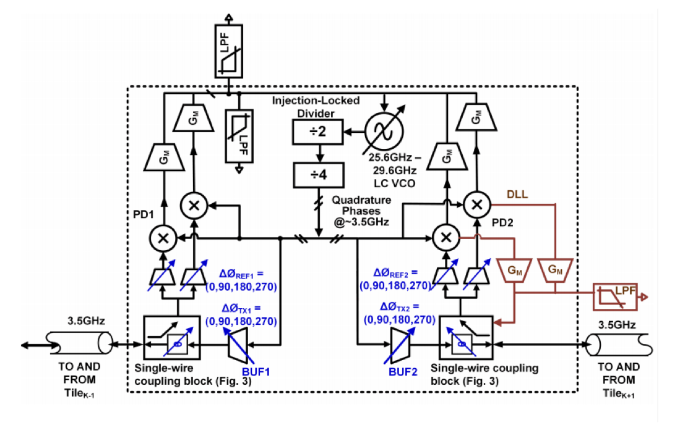
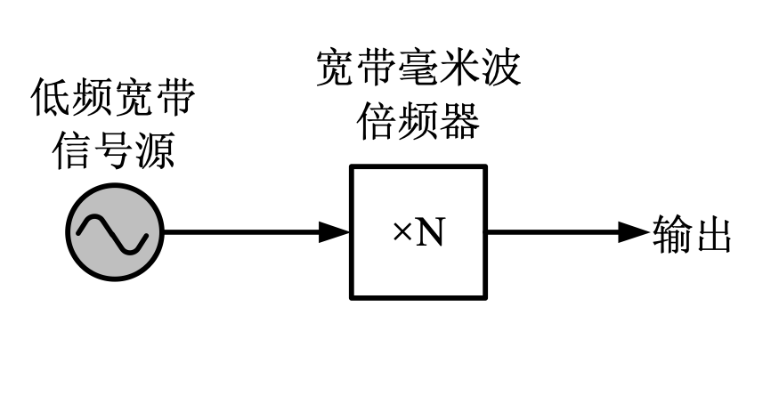
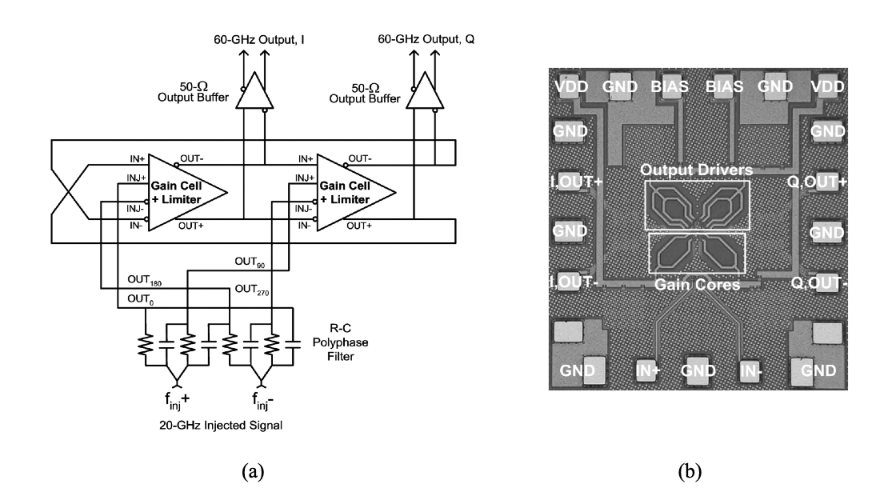
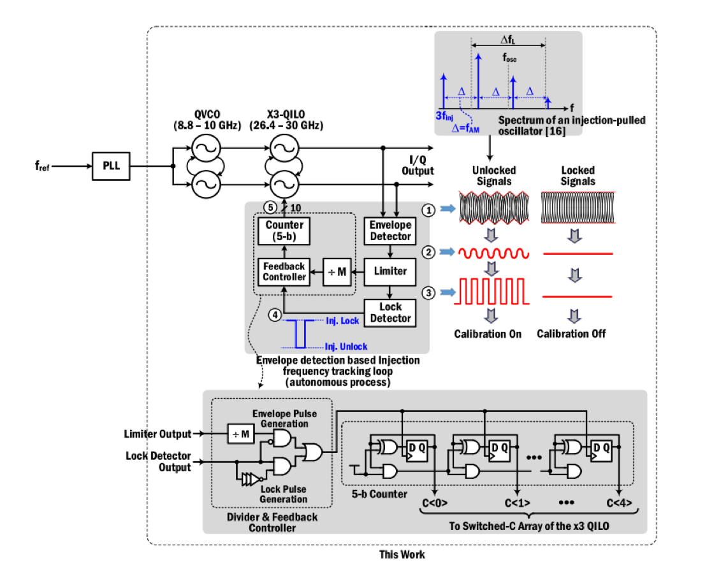
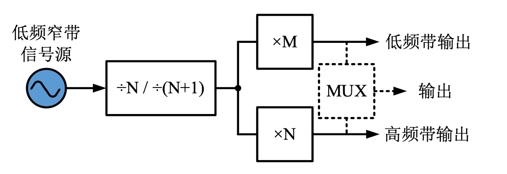
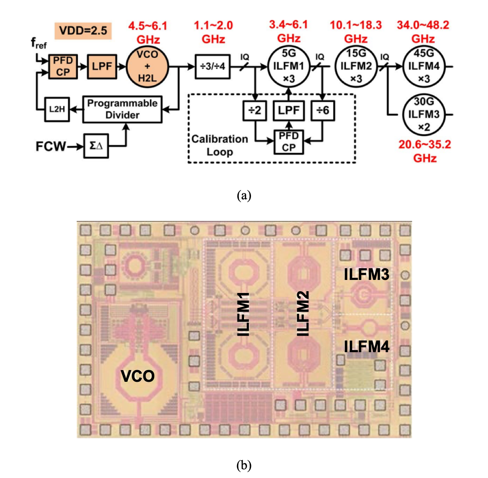

对频率源的研究可追溯上百年,而至今仍无完美解决频率、带宽、相位噪声三方面挑战的方案。随着现代无线电技术的发展，毫米波频段的无线射频系统越来有吸引力，毫米波频率源是目前制约无线射频系统的瓶颈所在。

高性能射频毫米波频率源三种主要解决方案：直接采用工作在毫米波频段的锁相环、低频信号源级联单个毫米波倍频器和采用多个倍频器共同协作的方式。

<!--more-->

> Reference:
>
> [高性能射频毫米波频率源集成电路研究-张净植-电子科技大学](https://kns.cnki.net/kcms/detail/detail.aspx?dbcode=CDFD&dbname=CDFDLAST2020&filename=1020716365.nh&v=9gG9zJPy1pyL%25mmd2BNFc3B4ib7qfNZGDrB9Q5%25mmd2FYZlVysxZvVCYIVvIJQd0gDPf71zaqg)

# 方案一：直接采用工作在毫米波频段的锁相环

## 优缺点分析

- 优点：

  由于锁相环的存在，其对 VCO 表现为高通特性，故而可以滤除 VCO 在锁相环带内的相位噪声；

- 缺点：

  然而，由于该 VCO 仍工作在毫米波频段，故而存在较高的无法被滤除的带外噪声；

  并且，为更好地优化总体噪声输出，锁相环的增益和带宽均需要设置为较高的数值，这对环路的稳定性带来了一定的挑战；

  除此之外，由于采用了较高的倍频比，锁相环环路所产生的噪声较高，继而恶化总体输出噪声；

  与此同时，所有采用此方案的频率源工作带宽均小于 30%，难以满足宽带要求(相对带宽大于 50%)。这是由于，该方案需要 VCO 工作在毫米波频段，难以实现较大的带宽。在工作频率和带宽的双重严格要求下，此 VCO 的设计难度极大，因而未有较好的相关成果发表。

## 相关研究成果

### 1. 双 VCO 方案

Xilinx 18 年发布了一款可覆盖 7.4-14 GHz 的宽带锁相环，采用 16-nm FinFET 工艺，实现了 54 $fs_{rms}$的时钟抖动。该方案为了实现宽带输出要求，在芯片中集成了两颗 VCO，一颗工作在高频段，另一颗工作在低频段，从而有效地扩展了总带宽。这个方案是一种对带宽和噪声很好的折衷方案，通过牺牲一定的芯片面积和系统复杂度，换取了不错的带宽和相位噪声特性。然而，也因为使用了两颗 VCO，使得该方案无法成为完美的解决方案。

### 2. Sub-sampling 锁相环方案

澳门大学于 2019 年发布了一款工作在 25.4-29.5 GHz 的锁相环，采用 Sub-sampling 锁相环方案，实现了 71 $fs_{rms}$的时钟抖动,同时仅消耗 10.2 mW 的功耗。Sub-sampling 锁相环是另一种比较好的解决方案，因为其去掉了环路中的分频器，相比于传统锁相环，该锁相环不产生分频器噪声，继而降低了环路总噪声。同时，该 Sub-sampling 鉴相器具有极高的增益，可以最大程度地抑制环路内电荷泵噪声。因此，Sub-sampling 锁相环有着极佳的带内噪声特性。

但该方案仍有一些明显不足。首先是其输出相对带宽较低。澳门大学的这款锁相环其相对带宽只有 14.9%；其次，Sub-sampling 锁相环固有的采样方式，使其仅能实现整数分频，进一步限制了该锁相环的应用空间。现有很多工作对该锁相环的小数分频方法进行了探索，取得了一定成果，但技术仍不成熟，分频精度和相位噪声均未达到理想结果。

### 3. 耦合锁相环方案

Oregon State University 在 2018 年发布了一款 28 GHz 耦合锁相环。这种锁相环主要目的是实现不同电路板上的本振信号同步，从而支持大规模相控阵应用。通过这种耦合，不仅能实现相位上的同步，其特殊的环路响应使得其具备相位噪声滤波效应。然后此方案主要针对特殊应用而设计的，固然通过耦合后相位噪声可以得到改善,但若使用在其他应用中,这种相位噪声的改善无法弥补其功耗和面积上的损失。

# 方案二：低频信号源级联单个毫米波倍频器

该方案使用低频率的频率源作为输入，并用倍频器将低频信号倍频值毫米波频段。

## 优缺点分析

- 优点：

  规避了高频 VCO 的需求。在 VCO 工作在低频时，可以获得较好的相位噪声特性，且倍频器的引入几乎不会恶化 VCO 的相位噪声特性，因而可以在毫米波频段获得较好的相位噪声特性。

- 缺点：

  该方案在带宽方面的表现不佳。

  首先，宽带毫米波倍频器在设计上存在巨大的挑战，在实现宽带的同时，还要保证低功耗和高的谐波抑制，存在着极大地挑战。

  其次，该低频信号源仍需具备较宽的带宽，即使频率降低，在保证相位噪声性能的同时扩展带宽同样具有非常大的挑战。

  因而，现阶段对于此方案的研究还主要局限在窄带毫米波频率源中。

## 相关研究成果

### 1. 注入锁定倍频器

Delft University of Technology 在 2008 年首先尝试了该方法实现了 60 GHz 注入锁定倍频器。在该设计中，作者使用了注入锁定的方式实现三倍频器的效果。由于需要正交输出, 作者首先设计了一个 R-C 多相滤波(Polyphase filter, PPF)，将输入的 20 GHz 差分信号转变成正交信号；然后，将生成的正交信号注入至耦合的正交注入锁定振荡器中。由于注入锁定振荡器工作在 60 GHz 频率附近，其输入信号在经过非线性变换后，产生的三次谐波用以锁定注入锁定振荡器，因此，此时的注入锁定振荡器将受迫振荡于输入信号的三次谐波处，从而实现了三倍频的效果。该芯片可工作在 56-65 GHz 的频率范围内，且具备良好的相位噪声跟踪特性，即倍频器本身几乎不引入额外的相位噪声。

### 2. 多级倍频器级联方案

LG 公司与 2017 年发布了的一款注入锁定倍频器，用于 5G 多通道相控阵系统，其采用两级注入锁定三倍频器级联，获得了九倍频特性，将 3.11 GHz 的输入信号 9 倍频至 28 GHz，取得了极佳的相位噪声特性。

同样，该方案在宽带方面具有先天性的不足，需要较多方法进行弥补。

### 3. 校准方案

注入锁定倍频器存在锁定带宽不足，容易失锁等问题。因此，近年来，学术界和工业界均投入大量的精力，对注入锁定倍频器的调谐和校准进行研究。

在诸多发表的用于校准的文章中，Virginia Tech 在 2016 年发布的一款工作在 28 GHz 的注入锁定三倍频器尤为突出，如上图所示。由于注入锁定倍频器在锁定时具有恒定输出包络，而当失锁时，其输出呈现为类调幅信号。因此，该工作通过对倍频器的输出进行包络检波，从而根据输出的包络情况判断注入锁定倍频器是否失锁。最后，通过数字控制电路调整注入锁定倍频器的调谐电压，从而建立反馈环路使倍频器保持锁定。虽然该电路具有较好的稳定性和相位噪声特性，但其工作带宽也仅为 11.4%。

# 方案三：采用多个倍频器共同协作的方式，产生毫米波宽带信号，实现了带宽展宽的效果

该方案采用多个倍频器共同协作的方式，产生毫米波宽带信号，实现了带宽展宽的效果。

## 优缺点分析

- 优势：

  输入信号不仅工作在低频处，其带宽同样较窄，因而可以设计出极低相位噪声的输入信号。

- 缺点：

  首先，由于其较为复杂的系统架构，该电路设计困难，容易失败，且因为倍频器数量较多，难以保证不引入额外的相位噪声；

  因为采用了此复杂的架构，芯片功耗较大。另一方面，芯片存在低频、高频两个输出端口，通常需要一个多路复用器将两路合并方能使用，而此多路复用器同样需要具备 80% 的带宽, 亦难以实现。

## 相关研究成果

### 香港科技大学 21-48 GHz 宽带注入锁定频率源

该方案由香港科技大学于 2014 年提出，工作原理如图所示。首先，使用一个 4.5-6.1 GHz 的低频小数分频锁相环产生输入信号；之后，对此信号进行除三除四双模分频，从而第一次展宽信号带宽，且产生正交输出；继而，将此信号注入一个三倍频器，该倍频器使用了一个锁相环来做校正，从而防止失锁；该倍频器的输出再次经过一个三倍频器，完成第二次倍频；最后，该倍频器的输出分别采用一个三倍频器和一个二倍频器对输入信号进行倍频，最终得到了覆盖 21-48 GHz 的毫米波宽带频率源。 

从该结构可以看出，整个系统共对输入信号进行了两次带宽展宽。第一次，通过除三除四双模分频器，将输入的 4.5-6.1 GHz 信号转变为 1.1- 2.0 GHz 的信号，带宽从 30.2% 变为 58.1%。第二次，采用输出的三倍频和二倍频，对输入信号进行了不同处理，此时，带宽从 57.7% 变为 80.2%。

# 各方案性能对比

| 文献              | Xilinx ISSCC’18              | Univ.Macau ISSCC’19      | Virgina Tech JSSC’19   | HKUST JSSC’14                                                |
| ----------------- | ---------------------------- | ------------------------ | ---------------------- | ------------------------------------------------------------ |
| 实现方式          | 高频锁相环                   | 高频锁相环               | 低频信号源+高频倍频器  | 低频信号源+多个倍频器                                        |
| 工作带宽 (GHz)    | 7.4-14                       | 25.4-29.5                | 26.5-29.7              | 21-48                                                        |
| 输入频率 (GHz)    | 无                           | 无                       | 8.8-9.9                | 4.5-6.1                                                      |
| 输入带宽          | 无                           | 无                       | 11.4                   | 30.2                                                         |
| RMS 时钟抖动      | 54                           | 71                       | 无                     | 1020                                                         |
| 功耗 (mW)         | 45                           | 10.2                     | 38.6                   | 148.3                                                        |
| 芯片面积 (mm$^2$) | 0.35                         | 0.24                     | 1                      | 2.1                                                          |
| 复杂度            | 双 VCO                       | 单 VCO                   | 单倍频器               | 多倍频器                                                     |
| 优点              | 1. 带宽宽；2. 噪声好；       | 1. 频率高；2. 功耗低；   | 1. 频率高；            | 1. 频率高；2. 带宽宽；3.输入带宽窄；                         |
| 问题              | 1. 工作频率低；2. 多个 VCO； | 1. 带宽窄；2. 噪声一般； | 1. 带宽窄；2. 功耗高； | 1. 结构复杂；2. 功耗大；3. 芯片面积大；4. 噪声差；5. 结构复杂； |

