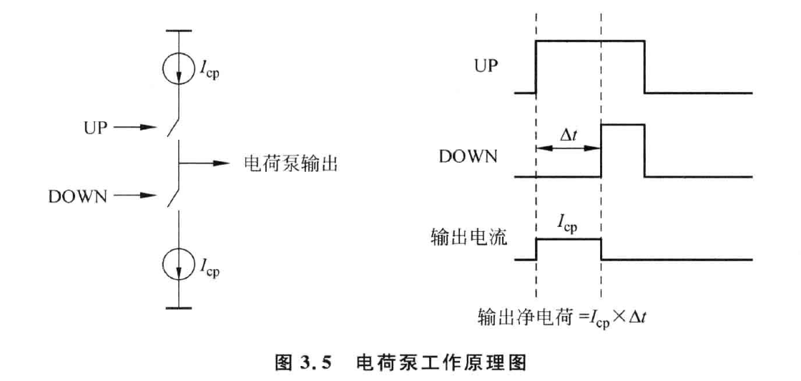
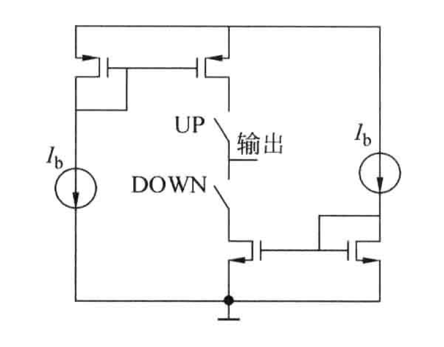
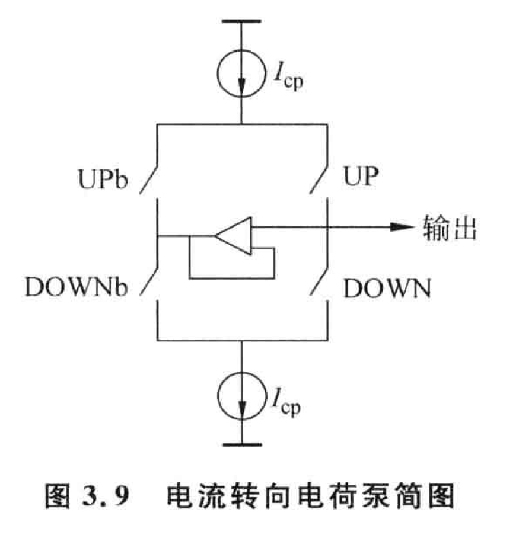
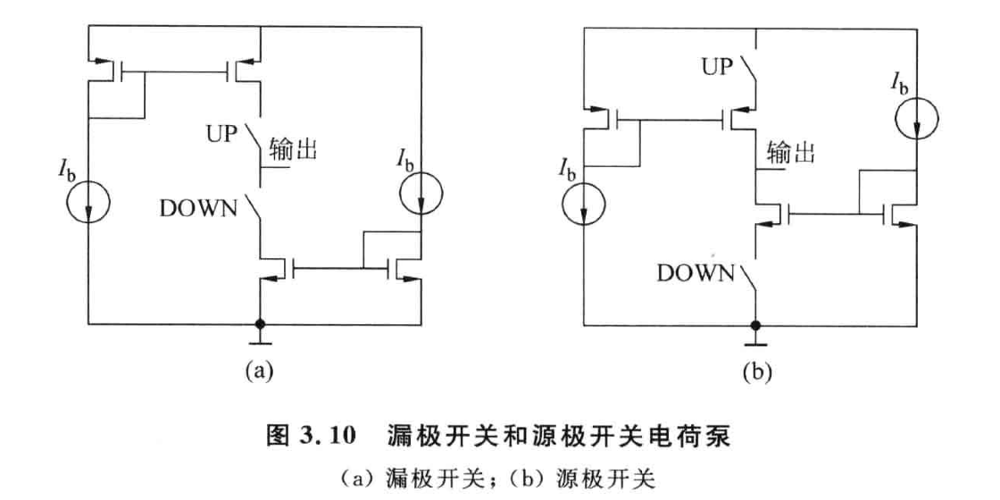
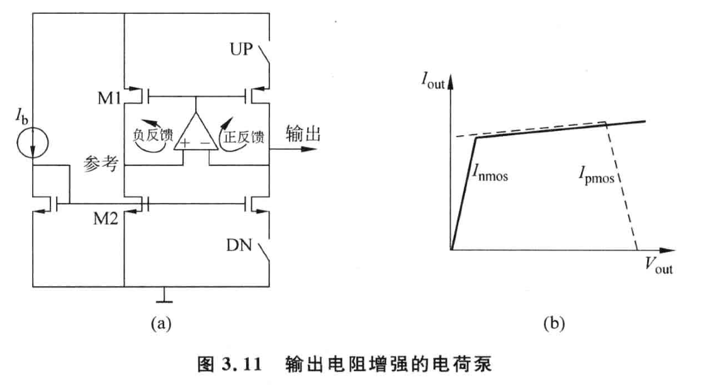

电荷泵是锁相环中重要的一个模块，其主要功能是将鉴频鉴相器 (PFD) 输出的时钟相位差值转化为电荷，将其传到环路滤波器，从而产生控制 VCO 的电压。下图是一个电荷泵的工作原理。

<!--more-->

# 工作原理

由两个开关控制的电流源组成电荷泵，这两个开关分别由 PFD 产生的 UP,DOWN 信号控制。电荷泵的平均等效输出电流为：
$$
\overline{I_{out}} = \frac{I_{cp}(\varphi_{ref} - \varphi_{div})}{2\pi}
$$
因此电荷泵的传输函数为：
$$
H_{cp} = \frac{I_{out}}{\Delta \varphi} = \frac{I_{cp}}{2\pi}
$$
即电荷泵的增益为：
$$
K_{cp} = \frac{I_{cp}}{2\pi}
$$

# 常用电荷泵设计

## 漏极开关电荷泵 (drain-switching charge pump)

最简单的一种 CP 结构如上图所示，其开关位于电流源 MOS 管的漏极，称为漏极开关电荷泵。不过该结构的电荷泵有很多问题：

1. 由于开关直接连接电荷泵的输出端，开关栅极的**时钟信号会通过漏极栅极电容串扰至输出**，注入电荷而造成电荷误差；
2. **电流源 MOS 管的漏极寄生电容会分流电荷信号**。当 DN 开关打开时，电流源 NMOS 管的漏极寄生电容放电直至为地电平；当 DN 开关闭合时，电流源 NMOS 管的漏极寄生电容充电直至为高电平。这个过程中对漏极电容的充放电会分流电荷信号，而造成电荷误差；
3. 由于**漏极电容充放电**的过程存在，使该结构的电荷泵工作速度交慢。

## 电流转向电荷泵 (current sterring charge pump)

该结构是在漏极开关电荷泵的基础上改进的，加入了一组**反相**信号控制的开光和一个**单位增益的缓冲器**。

优点：

1. 单位增益缓冲器的输出端跟踪电荷泵的输出端电位。因此不管开关打开还是闭合，两个电流源 MOS 管的漏极始终通过一组开关或者单位增益缓冲器与电荷泵的输出端相连。因此保持了与输出端一致的电压，这样就不存在开关 MOS 管源级到衬底的电容充放电问题，消除了电荷分流；
2. 由于电流源总可以通过一个开关保持电流的流通，因此电流源一直保持在开启状态，提高了电荷泵开关的速度。**该结构的电荷泵几乎是所有电荷泵结构中速度最快的一种**；
3. 流入电源和地的电流保持恒定，对电源的串扰少。

缺点：

1. 电流源一直保持在开启状态，存在静态电流，增加了功耗；
2. 开关在漏极，没有解决时钟信号的串扰。

## 源级开关电荷泵 (source-switching charge pump)

该结构将开关置于电流源的源级，称为源级开关电荷泵。

优点：

1. 开关管和输出端**隔离**，**没有数字信号对输出信号的串扰问题**；
2. 电流源 MOS 管的漏极始终和输出端连接，没有充放电问题，**避免了电荷分流**；
3. 电流源的漏极和栅极始终保持正常的偏置，且源级阻抗也比较低，因此该电荷泵具有**较高的速度**；
4. 与电流转向电荷泵相比，该结构**没有静态电流损耗**，降低了功耗。

因此，源级开关电荷泵是**应用最广泛的电荷泵**。

## 输出电阻增强电荷泵

以上电荷泵的共同问题是 PMOS 和 NMOS 电流源之间的失配，尤其在输出端的电压偏离中心点的时候。例如当输出电压接近地电位时，NMOS 电流源的电流会下降而 PMOS 电流源的电流会增加，而造成电流失配。

一种方法可以使用 Cascode 结构增加电流源输电阻，但由于 Cascode 结构需要较高的电源电压，会减小电荷泵的输出电压范围。另一种方法是通过运算放大器使 UP 和 DOWN 电流相互跟踪。

如上图所示，由于运放的负反馈作用，电荷泵的输出端和 M1,M2 的漏极电位相等。这样可以保证 UP 和 DOWN 的电流分别精确跟踪 M1,M2 的电流源。由于流过偏置管 M1,M2 的电流始终是相等的，所以 UP 和 DOWN 的电流也不受输出电压的影响。

该结构需要注意的是要保证电路中的负反馈大于正反馈。该电路中，电荷泵输出端有开关，且大部分时间开关是关断的，所以输出端回路的反馈更弱，因此应将偏置管那一侧接为负反馈。

# 参考文献

[1] 张刚. CMOS集成锁相环电路设计[M]. 清华大学出版社, 2013.

