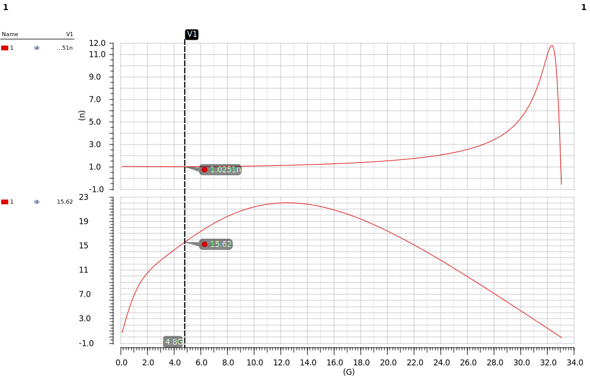
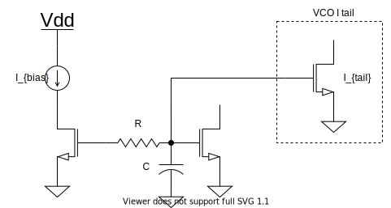
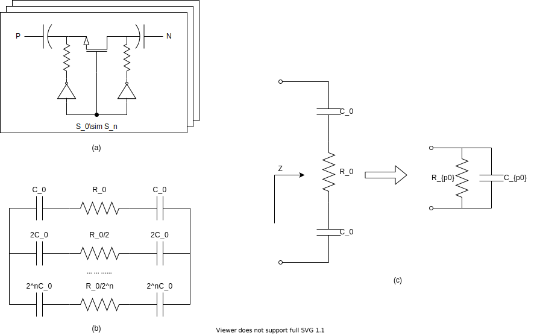
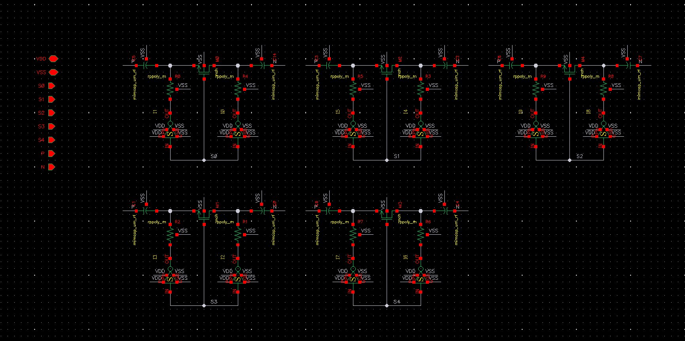
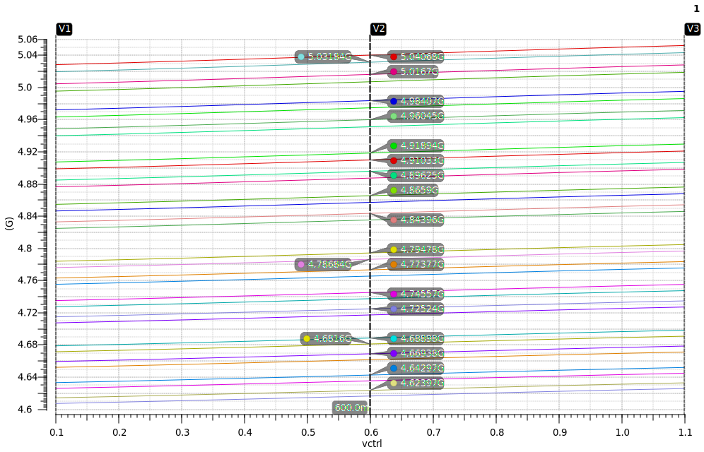
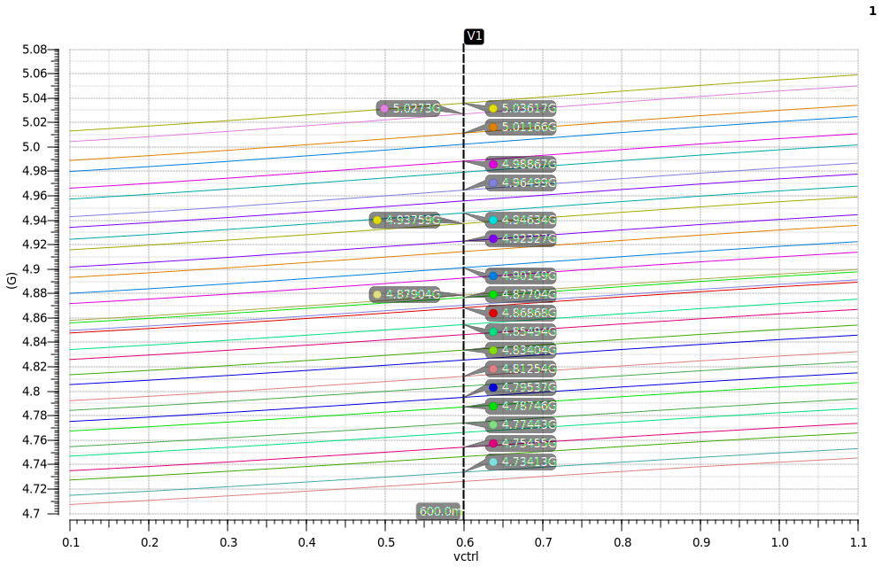
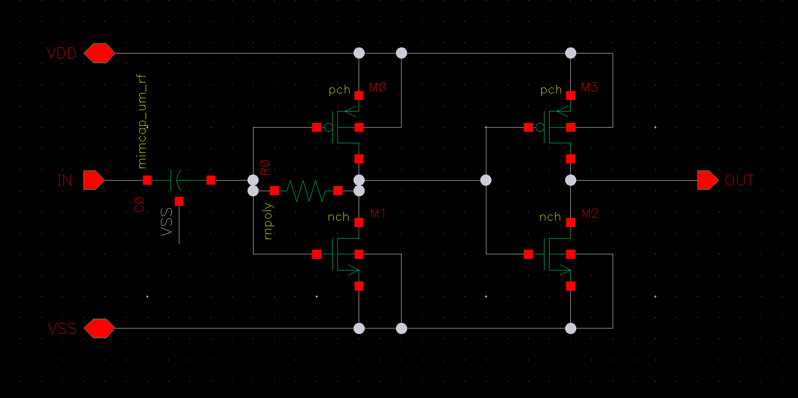
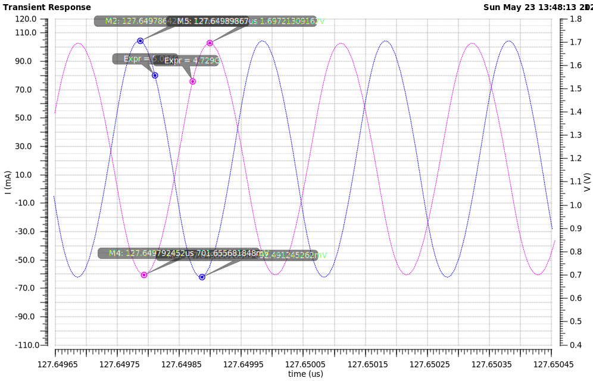

# 电感值的选取

谐振腔的谐振频率为：
$$
\omega = \frac{1}{\sqrt{LC}}
$$
可以看到谐振频率与电感值和电容值都有关。

电感值可以根据一个经验公式来粗略估计：$L=5/f$，其中 $L$ 为电感值，单位为 nH，$f$ 为振荡中心频率，单位为 GHz，若振荡器采用互补型结构，则 $L=10/f$。实际设计时，由于寄生效应的存在，电感值要适当缩小一点。

这里振荡中心频率为 $f=4.8\rm{GHz}$，选取电感值为 $L=1.025n$，$Q=15.62$。其 L-Q 随频率变化的关系如下图所示：

> 之前电感值取得比较大，大约 4.9nH，VCO 的相位噪声很差，只有 **-100dB@1MHz**，换成 1nH 的电感后，在相同的电流下，相噪变为 **-113dB@1MHz**，换成 0.5nH 的电感后，在相同的电流下，相噪变为 **-123dB@1MHz**，

> 仿真的时候发现了一个现象：改变电感的值（Q值几乎没有变），调节电容值，使振荡频率不变，在相同的功耗（电流相同）下，电感的值越小，相噪越好。
>
> **猜测：**
>
> L-C 振荡器的 Q 值由电感和电容共同决定，而在 CMOS 工艺下，电容的 Q 值比电感的 Q 值大很多，因此在振荡器中，在一定范围内，增大电容值，减小电感值，会增大谐振腔的 Q 值。
>
> 谐振腔的品质因数 Q 定义为：
> $$
> Q= 2\pi\frac{W_s}{W_r}
> $$
> 其中 $W_s$ 为谐振腔中电容和电感存储的总能量，$W_r$ 为每个周期消耗的能量。
>
> 高 Q 的系统，也可以用下面的式子来计算 Q：
> $$
> Q=\frac{f_r}{\Delta f}
> $$
> 其中 $f_r$ 为谐振频率，$\Delta f$ 为带宽。
>
> 并联 RLC 电路的品质因数定义为（串联 RLC 电路的 Q 为其倒数）：
> $$
> Q=R\sqrt{\frac{C}{L}}
> $$
> 在 L-C 振荡器中，$R=R_p = Q_L^2 R_L$，$Q_L=\omega_0L/R_L$，$\omega_0 = 1/\sqrt{L_pC_p}\approx 1/\sqrt{LC}$

# 负阻管的设计

$$
\left. \begin{matrix} R_p & = & Q\omega L \\ a & = &G_m \cdot R_p \\ G_m & = & g_m/2 \end{matrix} \right\} \Rightarrow g_m = \frac{2a}{Q\omega L}
$$

为了能够起振，要保证 $a>1$，通常将 $a$ 设为 $2\sim 3$，在本设计中取 $a=3$。根据电感的 Q 和 L，VCO 的工作中心频率为 4.8GHz，可以计算出 $g_m = 14.5\rm{mS}$。

为了获得最大的截止频率，负阻管的沟道长度取最小值。

# 尾电流源设计

VCO 的尾电流源使用镜像电流源实现，为了降低尾电流源的噪声，在镜像电流源中加入了低通滤波器。一阶 RC 低通滤波器的截止频率为 $\omega = 1/RC$，为了提高滤波的效果，应该尽可能将 R 和 C 取大，但 R 和 C 过大会占用太多的面积，同时寄生效应也会带来额外的噪声。由于低通滤波器对电阻和电容的精度要求不高，因此可以使用**多晶硅电阻**和 **MOS 电容**。

# 开关电容阵列设计

开关电容阵列的电路图如图（a）所示，其中电容值和开关管的尺寸都按二进制指数关系逐步增大。

其中反相器的输入端为开关电容阵列的控制端。当控制电压为高电平时，开关管开启，漏源两端电压被下拉到零，两个串联的电容接入谐振腔；当控制电压为低电平时，开关管关断，漏源两端的电压被上拉到高电平，源漏两端的电阻非常大，从而电容没有接入谐振腔。

图（c）是一个开关电容支路的等效变换，其输入阻抗为：
$$
Z = \frac{2}{j\omega C_0}+R_0=-j\frac{2}{\omega C_0}+R_0
$$
开关管工作在线性区，其漏端电流为：
$$
I_d \approx \mu C_{ox}\frac{W}{L}(V_{gs}-V_{th})V_{ds}
$$
可以得到漏源之间的电阻为：
$$
R_o= \frac{V_{ds}}{I_d} = \frac{1}{\mu C_{ox}\frac{W}{L}(V_{gs}-V_{th})}
$$
电容的 Q 值为：
$$
Q=\frac{2}{\omega C_0 R_0} = \frac{2\mu C_{ox}\frac{W}{L}(V_{gs}-V_{th})}{\omega C_0}
$$
其中：
$$
C_{p0} \approx \frac{C_0}{2}
$$

$$
R_{p0}=Q^2R_0 = \frac{4}{\omega^2 C_0^2 R_0}
$$

为了得到高的谐振腔品质因数，必须减小开关管的导通电阻。通过增大开关管的宽长比可以减小导通电阻，但开关管的寄生电容也会增加，使调谐范围减小。同时开关管的栅长取工艺允许的最小尺寸。

由 Q 的表达式可知，减小 $C_0$ 的值也可以提高 Q，但 $C_0$ 不能过小，否则无法覆盖所要的目标频率。

 理论上，改变电容阵列的电容接入数量，电容阵列的 Q 值不会改变，但这并不意味着可以随意增加开关的数量。随着开关数量的增加，整个电容阵列的等效电阻 $R_{total}$ 就会减小，会导致谐振腔的等效并联电阻减小，从而恶化谐振腔的品质因数。**一般情况下，开关的数量不会超过 6 个。**

实际设计中，开关管及电容的尺寸不一定是严格二进制加权的递增规律，需要观察调谐曲线的交叠大小，进行微调，通常是将调谐曲线交叠调大。

开关电容的原理图如下：

让电容和开关管的尺寸严格按照二进制来设置时，$C_0 = 35.3f$，仿真 VCO 的调谐曲线，会发现存在一些间隔较大的曲线，如下图所示：

调整电容和开关管的值，让其略小于 2 的指数倍，同时增大了可变电容的容值，增大了 Kvco，得到新的调谐曲线。保证了每两条相邻的子频带之间的交叠大于 50%。

# 二次谐波滤波技术

在差分 LC-VCO 中，由于尾电流源的存在使得互耦对共源点与地之间呈现高阻抗，这一高阻抗抑制了**线性区**工作的交叉耦合引起的能量流失。

**尾电流源的奇次谐波会在谐振腔中停留，偶次谐波会流通到地。**

在上图中，尾电流源上并联一个大电容，将尾电流源上的二次谐波处的噪声映入到地，但这会使共源点到地的阻抗进一步减小，因此在尾电流源与负阻管的共源点之间插入一个电感，该电感与负阻管共源点 S 处的寄生电容谐振在二次谐波频率处。

# 输出 Buffer

如果用从 VCO 出来的信号直接驱动后级电路，由于后级电路的电容会影响 VCO 的谐振频率，因此需要使用 buffer 将 VCO 和后级电路隔离开。由于设计的 VCO 工作频率并不是很高，因此使用反相器作为 buffer，电路原理图如下图所示。

其中 C0 为隔交电容，R0 用于提供直流偏置。

Buffer 的电容会接入 VCO 的谐振腔，因此仿真的时候需要将 VCO 和 buffer 一起仿真。

# 仿真结果

控制电压取 0.1V~1.1V 时，VCO 的调谐范围为 4.71GHz~5.06GHz，在 32 条子频带中每两个相邻的子频带之间没有盲区。$K_{VCO}$ 的范围在 30MHz/V~48MHz/V。

在 1MHz 频偏处，整个调谐范围内，相噪范围为 -119dB~-122dB。电流 15mA。

上图给出了 VCO 最大频率和最小频率的瞬态波形，两个信号的幅度基本相同，表示整个调谐范围内，VCO 都可以稳定振荡。

