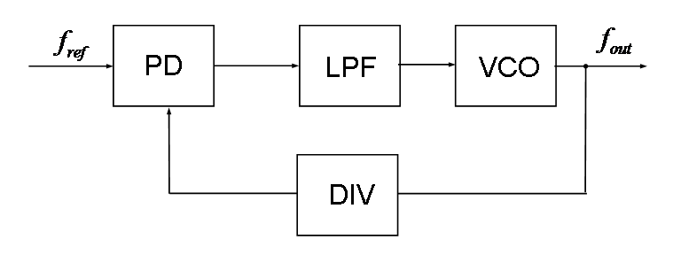
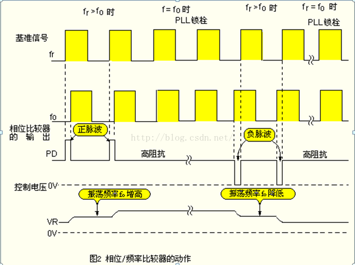

锁相环（PLL: Phase-locked loop）是一种利用反馈（Feedback）控制原理实现的频率及相位的同步技术，其作用是将电路输出的时钟与其外部的参考时钟保持同步。当参考时钟的频率或相位发生改变时，锁相回路会检测到这种变化，并且通过其内部的反馈系统来调节输出频率，直到两者重新同步，这种同步又称为“锁相”（Phase-locked）。

<!--more-->

# 时钟与振荡电路

芯片工作时，通常需要时钟，时钟的周期变化可以通过振荡来产生。振荡电路的形成通常可以分为两类：

1. 石英晶体压电效应：电导致晶片的机械变形，而晶片两侧施加机械压力又会产生电，形成振荡。它的谐振频率与晶片的切割方式、几何形状、尺寸有关，可以做得精确，因此其振荡电路可以获得很高的频率稳定度。
2. 电容Capacity的充电放电：LC振荡电路，能够存储电能，而充放电的电流方向是反的，形成振荡，可通过电压等控制振荡电路的频率。

# PLL 与倍频

由上面两种振荡方式可知，晶体振荡电路频率的稳定度优于 LC 振荡电路，但是晶体振荡电路除了可以使用数字电路分频以外，其频率几乎无法改变，由于成本与工艺限制，其频率无法做到很高。因此芯片中高频时钟就需要一种叫做压控振荡器（Voltage Controlled Oscillator）的东西生成了。可压控振荡器也有问题，其频率不够稳定，而且变化时很难快速稳定频率。这就是标准开环系统所出现的问题，解决办法就是接入反馈，使开环系统变成闭环系统，并且加入稳定的基准信号，与反馈比较，以便生成正确的控制。因此，为了将频率锁定在一个固定的期望值，锁相环 PLL 出现了。

## PLL(锁相环)电路的概要

PLL 通常由以下几个部分组成：

- 鉴相鉴频器 PFD（Phase Frequency Detector）：对输入的基准信号（来自频率稳定的晶振）和反馈回路的信号进行频率的比较，输出一个代表两者差异的信号

- 低通滤波器 LPF（Low-Pass Filter）：将PFD中生成的差异信号的高频成分滤除，保留直流部分；

- 压控振荡器 VCO（Voltage Controlled Oscillator）：根据输入电压，输出对应频率的周期信号。利用变容二极管（偏置电压的变化会改变耗尽层的厚度，从而影响电容大小）与电感构成的 LC 谐振电路构成，提高变容二极管的逆向偏压，二极管内耗尽层变大，电容变小，LC 电路的谐振频率提高，反之，降低逆向偏压时，二极管内电容变大，频率降低；

- 反馈回路 FL（Feedback Loop）：通常由一个分频器实现。将 VCO 的输出降低到与基准信号相同级别的频率才能在 PFD 中比较；

PLL 工作的基本原理就是将压控振荡器的输出经过分频后与基准信号输入 PFD，PFD 通过比较这两个信号的频率差，输出一个代表两者差异的信号，再经过低通滤波器转变成一个直流脉冲电压去控制 VCO 使它的频率改变。这样经过一个很短的时间，VCO 的输出就会稳定下来。所以 PLL 并不是直接对晶振进行倍频，而是将频率稳定的晶振作为基准信号，与 PLL 内部振荡电路生成的信号分频后进行比较，使 PLL 输出的信号频率稳定。

假设基准振荡器的频率为 `$f_r$`，VCO的频率为 `$f_o$`，在此一电路中，假设 `$f_r>f_o$` 时，也即是 VCO 的振荡频率 `$f_o$` 比 `$f_r$` 低时。此时的相位比较器的输出 PFD 会如下图所示，产生正脉波信号，使 VCO 的振荡器频率提高。相反，如果 `$f_r<f_o$` 时，会产生负脉波信号。

 (此为利用脉波的边缘做二个信号的比较。如果有相位差存在时，便会产生正或负的脉波输出。)

此 PD 脉波信号经过回路滤波器(LoopFilter)的积分，便可以得到直流电压 VR，可以控制 VCO 电路。由于控制电压 VR 的变化，VCO 振荡频率会提高。结果使得 `$f_r=f_o$`。在两者相位成为一致时，PD 端子会成为高阻抗状态，使 PLL 被锁栓(Lock)。

## 回路滤波器的选择方法

回路滤波器的时间常数与 PLL 控制的良否有很大的关系。在基准频率 `$f_r$` 为 10kHz 时，输往回路滤波器的脉波周期为 0.1ms。

为了保持电压值 VR 而增大回路滤波器的时间常数时，便无法追踪 VCO 的振荡频率的变化。如果时间常数太小时，会在 VR 上出现涟波，使 PLL 的稳定度恶化。

因此，根据经验，回路滤波器的时间常数，选择大约为基准频率的周期 (1/fr) 的数百倍。

# Reference

1. [锁相环PLL（Phase Locked Loop)](https://blog.csdn.net/u013754317/article/details/52799516)
2. [PLL(锁相环)电路原理](https://blog.csdn.net/leoufung/article/details/50268031)
3. [Phase-locked loop](https://en.wikipedia.org/wiki/Phase-locked_loop)

