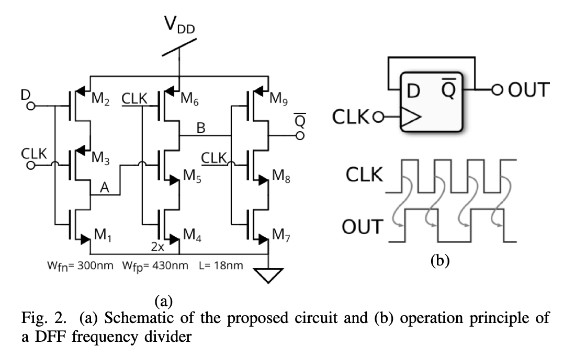
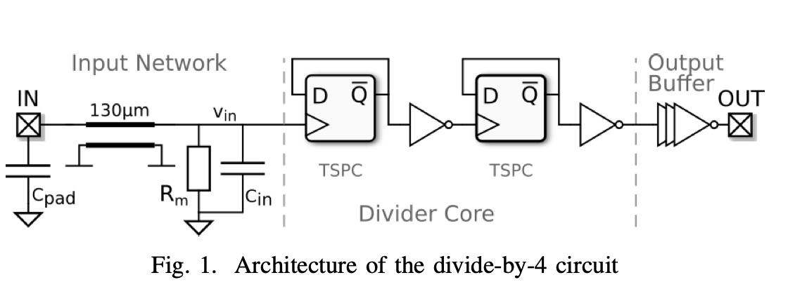
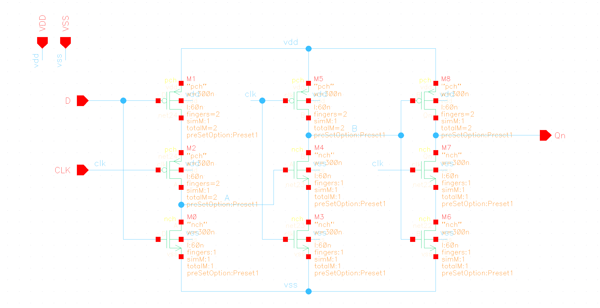
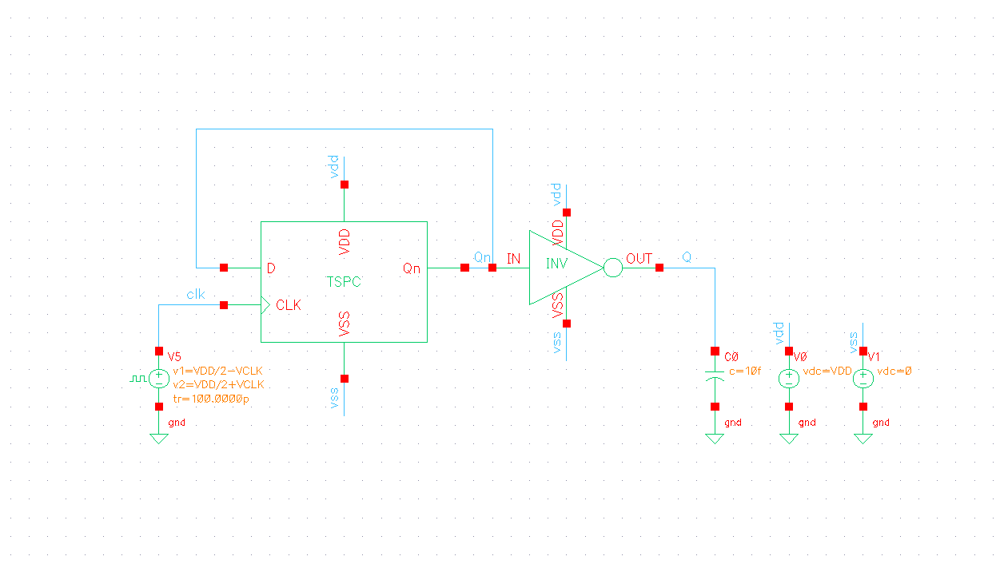
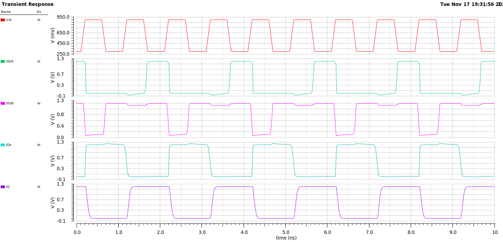
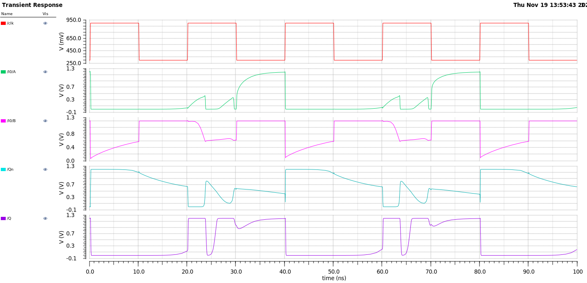
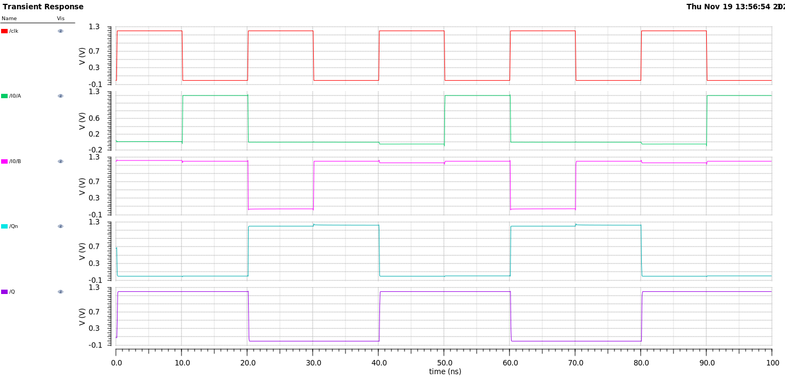
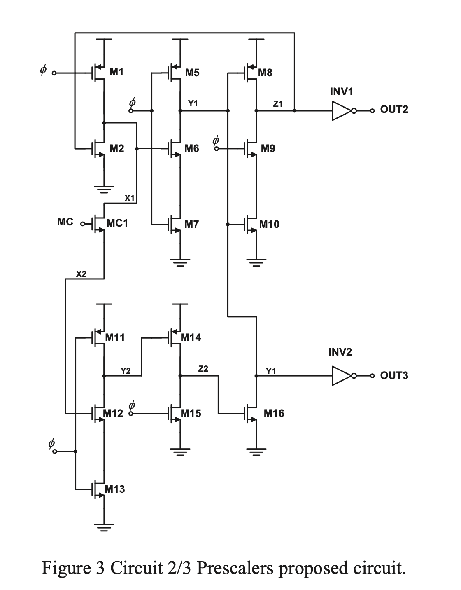
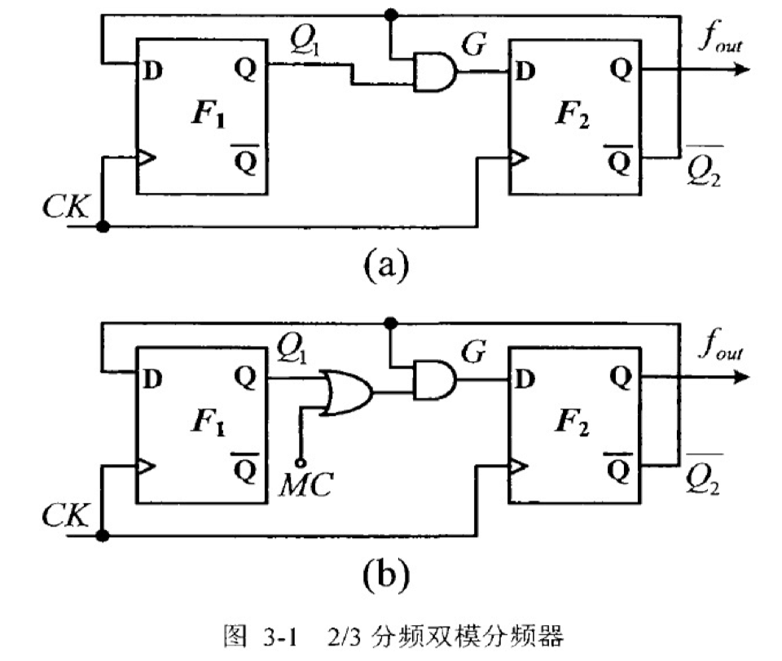
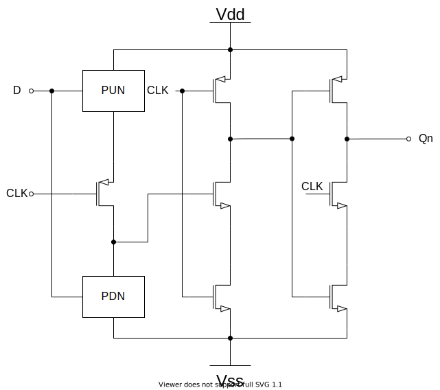

在 PLL 中，分频器负责将较高频率的 VCO 输出信号转换为与基准频率相近的信号，以进行相位比较。分频器通常消耗 PLL 中 VCO 之后的大部分功率，因此设计出低功耗的分频器有助于降低 PLL 的功耗。在高频中，注入锁定分频器 (injection-locked frequency divider, ILFD) 和再生分频器 (regenerative dividers) 比较常见。而基于 D 触发器 (D flip-flop, DFF) 的分频器由于其工作速度的限制通常用于预分频之后的低频率的分频。与高频分频器相比，DFF 分频器具有更低的功耗和更高的锁定范围。在 DFF 中，真**单相时钟控寄存器** (true single phase clock, TSPC) 仅使用单相时钟，避免了时钟重叠的影响。

<!--more-->

# TSPC 基本结构

TSPC 的基本结构如上图(a)所示，M1-M3 构成了第一级时钟控制反相器，M4-M6 构成了第二级时钟控制反相器，M7-M9 构成了第二级时钟控制反相器。

当时钟 CLK 由高变低后，第一级时钟控制反相器的输出 A 反相跟随数据输入 D，第二级时钟控制反相器的输出 B 被拉升至电源电平，由于 M9 和 M8 分别被 B 和 CLK 关闭，因此第三级时钟控制反相器的输出 C 维持前一时刻的电平，数据输出 Q 也维持前一时刻电平不变。

当 CLK 由低变高后，D 维持不变，M3 关断，A 点电平不变。若 A 点为高，则 M5 导通，同时 M6、M4 由于 CLK 分别是关断和导通，因此 B 点被拉至地电平；若 A 点为低，M5 关断，M6、M4 由于 CLK 分别为导通和关断，因此 B 被拉至高电平，实现了对 A 的反相跟随。此时 M8 由于 CLK 导通，M7、M9 构成一个反相器，输出 Qn。经过三级反相后，Qn 与 D 反相。

将 M1-M3 看作第一级，M4-M9 看作第二级，在 CLK 为低时，对第一级进行预充电时，第二级的输出保持不变。因此，当 CLK 为高电平时，第一级进行评估，而第二级检测，而当 CLK 为低电平时，第一级进行复位，而第二级进行存储[1]。

由于 TSPC 完全以节点寄生电容来存储电平，因此**不能工作在太低的频率下**，在文献[1]中提到，如果时钟周期过长，则由于亚阈值导通以及源极和漏极结引起的晶体管泄漏会破坏存储状态。在高温下，此问题通常会变得更加严重，需要仔细模拟。根据经验，对于低于100 MHz的时钟速率，需要考虑这些影响。

# 四分频电路

文献[2]提出了一个 TSPC 构成的异步四分频电路，如上图所示。其使用 22 nm FD-SOI CMOS 工艺，其工作电压范围为 0.4V-0.9V，并实现了 100MHz 至 70GHz 的输入频率范围。当以 70GHz 运行时，分频器在 0.9V 电源下仅消耗 393mA 电流，该电路实现了迄今为止[2020]的 TSPC 分频器的最高工作频率，以及最小的面积和最低的电流消耗。

尽管工作在很高的频率，但该电路任然使用的是常规的基带晶体管而非 RF 晶体管，从而减小了电路面积以及寄生电容，从而实现了更快，更高效的电路。NMOS 和 PMOS 晶体管的长宽比分别为 16.7 和 23.9。

## 仿真

TSPC 的电路图如下所示：

TestBench 如下所示：

输入的时钟摆幅为 600mV，频率为 1GHz，Vdd 为 1.2V，仿真结果如下：

输入的时钟摆幅为 600mV，频率为 50MHz，Vdd 为 1.2V，TSPC 已经不能正常工作了：

将输入的时钟摆幅提高到 1.2V，频率为 50MHz，Vdd 为 1.2V时：

# 2/3 双模分频电路

文献[3]使用 E-TSPC 结构实现了 2/3 双模预分频电路，在 1V 供电下，工作频率达 24 GHz。

## 2/3 分频电路原理

上图(a)是一种三分频电路[4]，这种电路只有三个状态：Q1Q2=00,10,11。如图(b)所示，在 F1 后插入一个或门，当 MC 输入高电平时，相当于 Q1 的输出被屏蔽了，因此 CLK 通过 F2 实现 2 分频；而 MC 输入低电平时，电路效果与图(a)相同，实现 3 分频。

## TSPC 中嵌入逻辑功能

可以在 TSPC 中嵌入逻辑功能，以减小与锁存器相关的延时。其基本的使用如上图所示。

# 测试

- Measured sensitivity curves as a function of the input frequency and the backgate voltages. VBN: NMOS, VBP: PMOS backgate voltage, respectively.

  测量各输入频率下所需要的最小输入电压

- Measured current consumption as a function of the input frequency and the backgate voltages.

  测量电流消耗与输入频率时间的关系

- Measured sensitivity of the self-resonance frequency on the operation points and the simulated transfer characteristic of the transistors for multiple backgate bias voltages. The trendlines were obtained for the whole dataset and their slope may vary once the dataset is narrowed for a variable.

  自谐振频率灵敏度

- Measured phase noise for multiple backgate bias voltages.

  相位噪声

- Measured output swing on a 50 Ω load as a function of input frequency and the backgate voltages.

  在50负载下测得的输出摆幅和输入频率的关系

# 参考文献

[1] B. Razavi, "TSPC Logic [A Circuit for All Seasons]," in *IEEE Solid-State Circuits Magazine*, vol. 8, no. 4, pp. 10-13, Fall 2016, doi: 10.1109/MSSC.2016.2603228.

[2] Z. Tibenszky, C. Carta and F. Ellinger, "A 0.35 mW 70 GHz Divide-by-4 TSPC Frequency Divider on 22 nm FD-SOI CMOS Technology," *2020 IEEE Radio Frequency Integrated Circuits Symposium (RFIC)*, Los Angeles, CA, USA, 2020, pp. 243-246, doi: 10.1109/RFIC49505.2020.9218362.

[3] I. Lawang, A. Tudsorn and S. Tooprakai, "1V High Speed E-TSPC 2/3 Prescalers," *2019 5th International Conference on Engineering, Applied Sciences and Technology (ICEAST)*, Luang Prabang, Laos, 2019, pp. 1-4, doi: 10.1109/ICEAST.2019.8802598.

[4] 尹江伟. 应用于OFDM UWB系统的高速分频器研究与设计[D].复旦大学,2009.