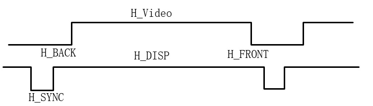
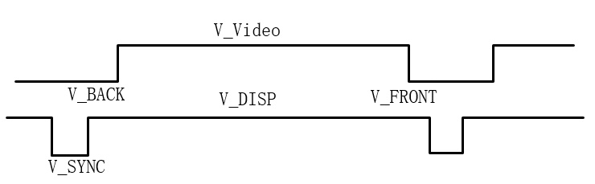
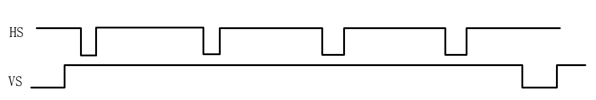
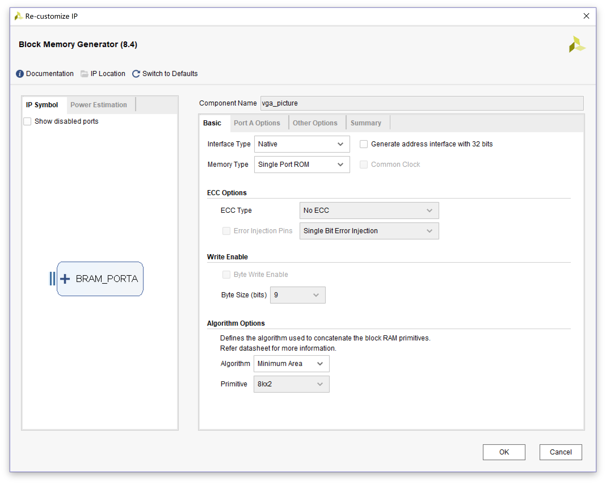
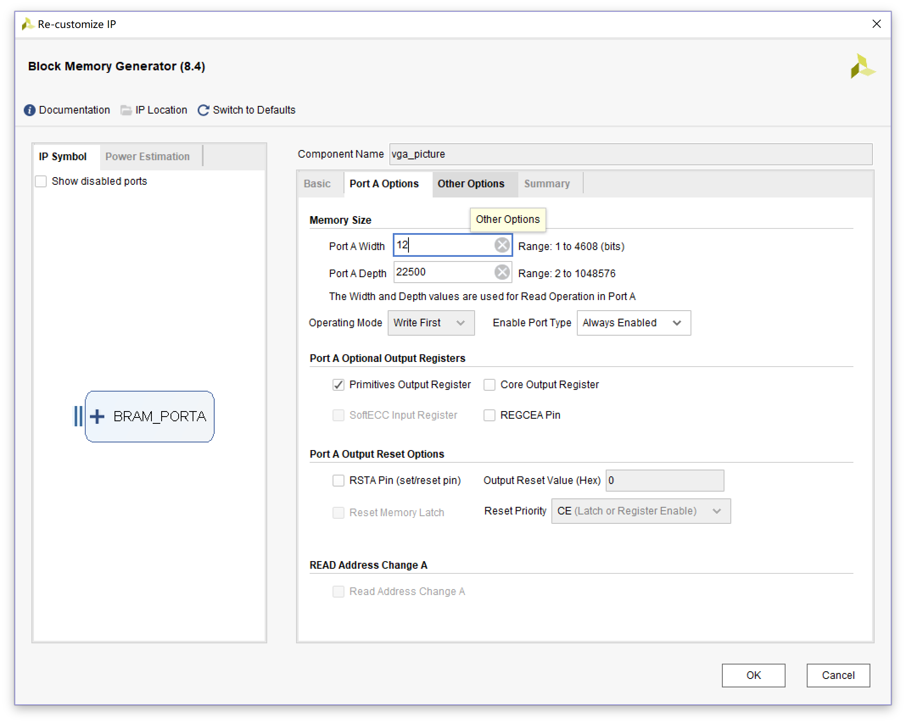
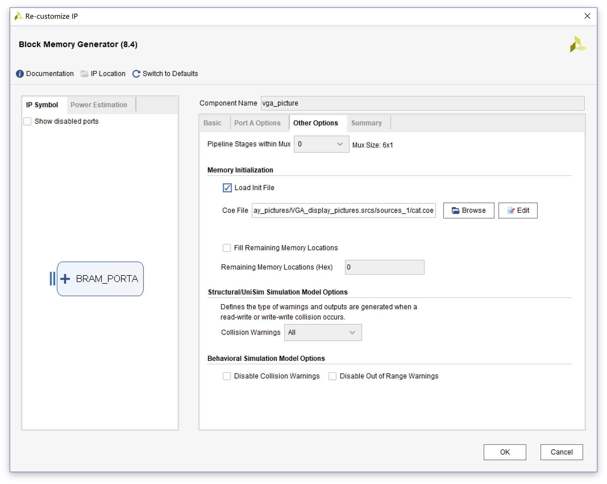
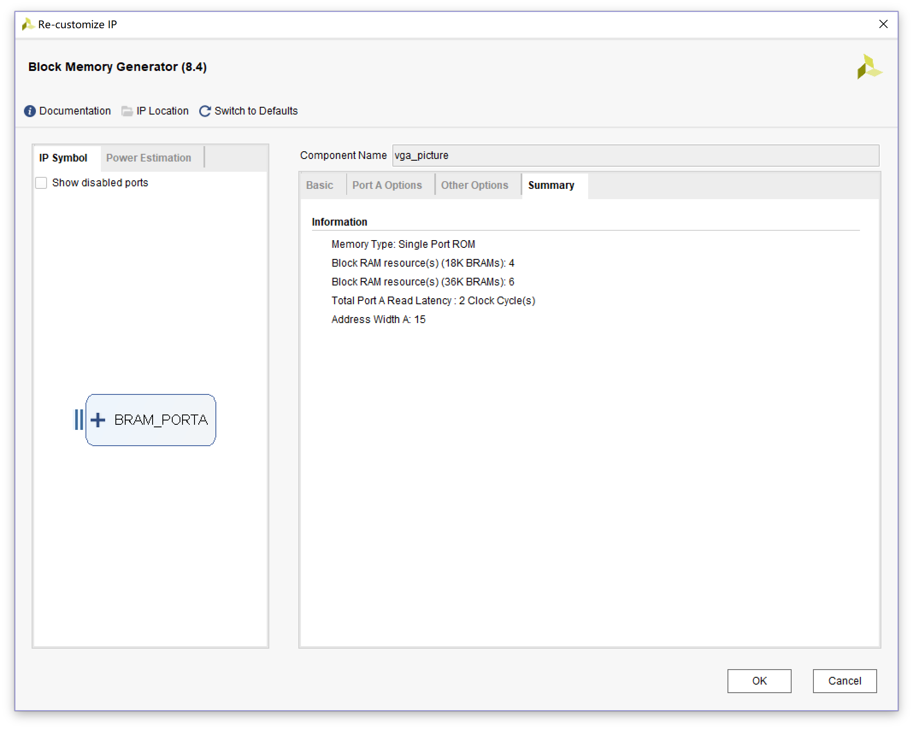
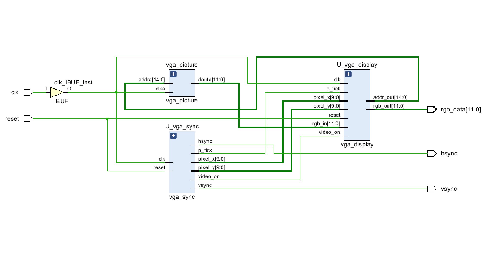

## 目标

​	设计一个基于FPGA的VGA控制器，可以显示640\*480的图片，为下一步学习摄像头做准备。

> 硬件平台：Basys 3 开发板

<!--more-->

## 原理

​	标准15针VGA接口共有五个信号接口，如下表所示，其中hsync、vsync为行同步和场同步信号，RGB为模拟信号。

| 信号名称  | 作用    |
| ----- | ----- |
| hsync | 行同步信号 |
| vsync | 场同步信号 |
| R     | 红色信号  |
| G     | 绿色信号  |
| B     | 蓝色信号  |

> 行扫描时序

> 场扫描时序

> VGA时序图

## 设计

整个电路分为这几个部分：

- VGA控制器
- 图像控制器
- ROM存储

1. 首先是VGA控制器部分，这部分产生行同步信号和场同步信号；

   ~~~ verilog
   module vga_sync(
   	input wire clk,reset,
   	output wire hsync,vsync,video_on,p_tick,
   	output wire [9:0] pixel_x,pixel_y,
   	output wire [18:0] addr
       );

   	//定义常数
   	//VGA 640 * 480 同步参数
   	localparam HD = 640;	//水平显示区域
   	localparam HF = 48;		//水平扫描左边界
   	localparam HB = 16;		//水平扫描右边界
   	localparam HR = 96;		//水平折回区
   	localparam VD = 480;	//垂直显示区域
   	localparam VF = 10;		//垂直扫描顶部边界
   	localparam VB = 33;		//垂直扫描底部边界
   	localparam VR = 2;		//垂直折回区

   	//模4计数器
   	reg [1:0] mod4_reg;
   	reg [1:0] mod4_next;
   	//同步计数器
   	reg [9:0] h_count_reg,h_count_next;
   	reg [9:0] v_count_reg,v_count_next;
   	//输出缓冲器
   	reg v_sync_reg,h_sync_reg;
   	wire v_sync_next,h_sync_next;
   	//状态信号
   	wire h_end,v_end,pixel_tick,addr_end;
   	//地址输出缓冲器
   	reg [18:0] addr_reg;
   	reg [18:0] addr_next;

   	always @(posedge clk or posedge reset) begin
   		if (reset) begin
   			// reset
   			mod4_reg <= 1'b0;
   			v_count_reg <= 0;
   			h_count_reg <= 0;
   			v_sync_reg <= 1'b0;
   			h_sync_reg <= 1'b0;
   			addr_reg <= 0;
   		end
   		else begin
   			mod4_reg <= mod4_next;
   			v_count_reg <= v_count_next;
   			h_count_reg <= h_count_next;
   			v_sync_reg <= v_sync_next;
   			h_sync_reg <= h_sync_next;
   			addr_reg <= addr_next;
   		end
   	end

   	//模4计数器产生25MHz时钟使能信号
   	always @(*) begin
   		if (reset) begin
   			// reset
   			mod4_next <= 2'b0;
   		end
   		else begin
   			mod4_next <= mod4_reg + 1;
   		end
   	end
   	// assign mod4_next = mod4_reg + 1;
   	assign pixel_tick = (mod4_reg == 2'b11)&&(!clk);

   	//状态信号
   	//水平扫描结束信号（799）
   	assign h_end = (h_count_reg==(HD+HF+HB+HR-1));
   	//垂直扫描计数器结束信号
   	assign v_end = (v_count_reg==(VD+VF+VB+VR-1));
   	//地址结束信号
   	assign addr_end = (addr_reg==(HD*VD-1));

   	//水平同步扫描模800计数器下一状态
   	always @(*) begin
   		if (pixel_tick) begin
   			if (h_end) begin
   				h_count_next = 0;
   			end else begin
   				h_count_next = h_count_reg + 1;
   			end
   		end else begin
   			h_count_next = h_count_reg;
   		end
   	end

   	//垂直同步扫描模525计数器新下一状态
   	always @(*) begin
   		if (pixel_tick && h_end) begin
   			if (v_end) begin
   				v_count_next = 0;
   			end else begin
   				v_count_next = v_count_reg + 1;
   			end
   		end else begin
   			v_count_next = v_count_reg;
   		end
   	end

   	//地址下一个状态
   	always @(*) begin
   		if (pixel_tick) begin
   			if (addr_end) begin
   				addr_next = 0;
   			end else if(video_on) begin
   				addr_next = addr_reg + 1;
   			end else begin
   				addr_next = addr_reg;
   			end
   		end else begin
   			addr_next = addr_reg;
   		end
   	end

   	//同步缓冲器
   	//h_sync_next 信号在计数器数值为656和751时赋值
   	assign h_sync_next = (h_count_reg >= (HD+HB)&&h_count_reg <= (HD+HB+HR-1));
   	//v_sync_next 信号在计数器数值为490和491时赋值
   	assign v_sync_next = (v_count_reg >= (VD+VB)&&v_count_reg <= (VD+VB+VR-1));

   	//产生video_on 信号
   	assign video_on = (h_count_reg < HD) && (v_count_reg < VD);

   	//输出
   	assign hsync = h_sync_reg;
   	assign vsync = v_sync_reg;
   	assign pixel_x = h_count_reg;
   	assign pixel_y = v_count_reg;
   	assign p_tick = pixel_tick;
   	assign addr = addr_reg;
   endmodule
   ~~~

   ​

2. 然后是图像控制部分；

   ~~~ verilog
   module vga_display
   	(
   		input clk,reset,
           input p_tick,
   		input [9:0] pixel_x,pixel_y,
           input video_on,
   		input [11:0] rgb_in,
   		output [14:0] addr_out,
   		output [11:0] rgb_out
       );

   	parameter DH = 150, DV = 150;
   	reg [14:0] addr_reg,addr_next;
   	reg [11:0] rgb_reg,rgb_next;

   	assign pic_en = ((pixel_x >= 0 && pixel_x < DH) && (pixel_y >= 0 && pixel_y < DV));

       always @(posedge clk or posedge reset) begin
       	if (reset) begin
       		// reset
       		addr_reg <= 15'b0;
       		rgb_reg <= 12'b0;
       	end else begin
       		addr_reg <= addr_next;
       		rgb_reg <= rgb_next;
       	end
       end

       always @(*) begin
           if (p_tick) begin
               if (addr_reg == DH * DV - 1) begin
                   addr_next = 0;
               end else if (pic_en) begin
                   addr_next = addr_reg + 1;
               end else begin
                   addr_next = addr_reg;
               end
           end else begin
               addr_next = addr_reg;
           end
       end

       always @(*) begin
       	if (pic_en) begin
       		rgb_next = rgb_in;
       	end else begin
       		rgb_next = 12'b0000_1111_1111;
       	end
       end

       assign addr_out = addr_reg;
       assign rgb_out = (video_on)?rgb_reg:12'b0;

   endmodule
   ~~~

   ​

3. 最后ROM储存。

   这部分调用了Xilinx官方的IP，在IP Catalog 中选择Block Memory Generator，

   1. 首先在Basis里选择Memory Type为Single Port ROM；

      

   2. 然后在Port A Options 里设置数据宽度和深度，因为Basys3上的VGA是RGB444格式的，所以数据宽度设为12位，深度可以理解为像素数，本来是想显示640\*480的图片的，但Basys3上的RAM容量不够，所以就显示的150\*150的图片,则深度为22500（150\*150），不需要使能，所以Enable Port Type设为Always Enable；

      

   3. Other Options里，装载 .coe文件。

      

      

   4. 顶层文件

      ~~~ verilog
      module VGA_display_pictures_top
      	(
      		input clk,reset,
      		output [11:0] rgb_data,
      		output hsync,vsync
          );

      	//信号声明
      	wire [14:0] addr;
      	wire [11:0] rom_data;		//rom输出rgb信号
      	wire [9:0] pixel_x,pixel_y;
      	wire video_on;

          vga_sync U_vga_sync
          (
          	.clk(clk),
          	.reset(reset),
          	.hsync(hsync),
          	.vsync(vsync),
          	.pixel_x(pixel_x),
          	.pixel_y(pixel_y),
          	.video_on(video_on),
          	.p_tick(p_tick)
      	);

          vga_display U_vga_display
          (
          	.clk(clk),
          	.reset(reset),
          	.pixel_x(pixel_x),
          	.pixel_y(pixel_y),
          	.rgb_in(rom_data),
          	.rgb_out(rgb_data),
          	.addr_out(addr),
          	.video_on(video_on),
          	.p_tick(p_tick)
      	);

      	vga_picture vga_picture
      	(
      		.clka(clk),
      		.addra(addr),
      		.douta(rom_data)
      	);

      endmodule
      ~~~

4. 整体连线图

   

   ## 总结

   - 为了防止自己忘记，所以写下来；
   - 暂时先写这么多，以后再补充。

