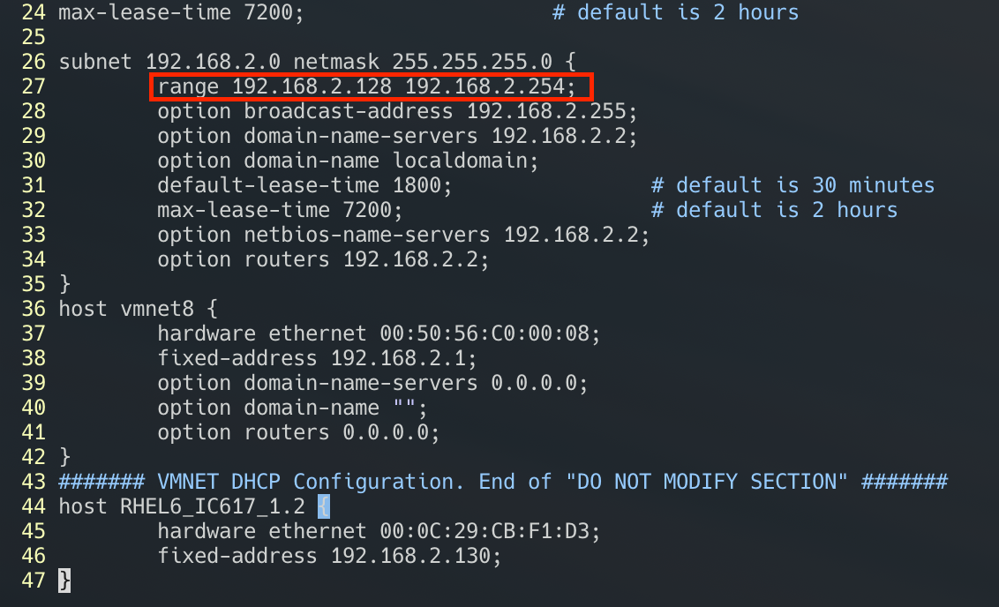
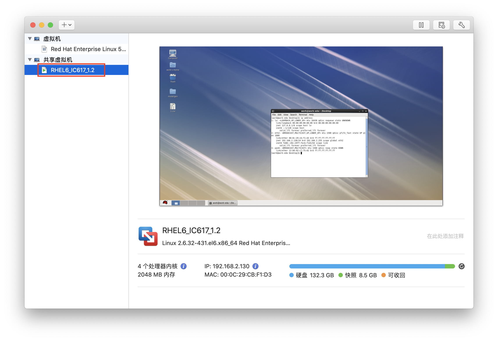

Mac 上的 VMware Fusion 设置静态 IP 没有 Windows 上那么方便，记录一下设置过程。

建议设置静态 IP 后配合[秘钥登录](https://zhouyuqian.com/2020/04/25/%E8%AE%BE%E7%BD%AEssh%E9%80%9A%E8%BF%87%E7%A7%98%E9%92%A5%E7%99%BB%E5%BD%95/)使用。

<!--more-->

# 设置 VM 虚拟机对应的静态 IP

编辑文件 */Library/Preferences/VMware\ Fusion/vmnet8/dhcpd.conf*：

~~~bash
sudo vim /Library/Preferences/VMware\ Fusion/vmnet8/dhcpd.conf
~~~

在 `####### VMNET DHCP Configuration. End of "DO NOT MODIFY SECTION" #######` 这一行后面添加下面内容：

~~~json
host RHEL6_IC617_1.2 {
	hardware ethernet 00:0C:29:CB:F1:D3;
	fixed-address 192.168.2.130;
}
~~~

其中 `hardware ethernet` 表示 Mac 地址，`fixed-address` 表示 IP 地址，注意 IP 地址设置的范围要在 **subnet range** 的范围内（上图红框中）；

`RHEL6_IC617_1.2` 是虚拟机的名字，要和虚拟机资源库中的名字相同（上图红框中）。

# 刷新 VM 网络配置

执行如下三行命令：

~~~bash
$ sudo /Applications/VMware\ Fusion.app/Contents/Library/vmnet-cli --configure
$ sudo /Applications/VMware\ Fusion.app/Contents/Library/vmnet-cli --stop
$ sudo /Applications/VMware\ Fusion.app/Contents/Library/vmnet-cli --start
~~~

# 虚拟机重新获取配置

可以直接重启 VMware Fusion 和虚拟机系统，也可以直接在虚拟机命令行中执行 `sudo dhclient -v -r eth0`, **eth0** 为对应网卡。

---

**Reference：**

- https://www.jianshu.com/p/af179e61ac7f

