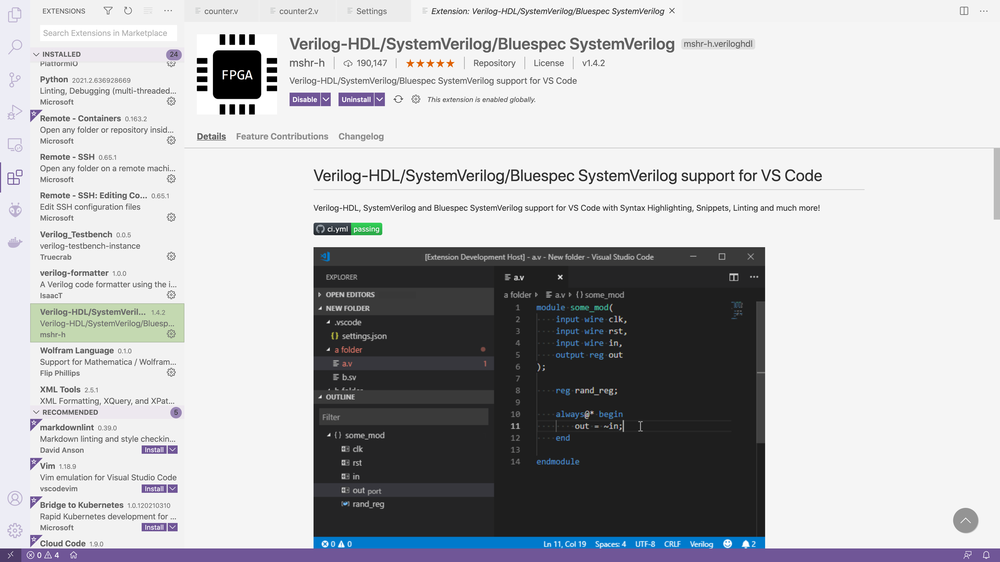
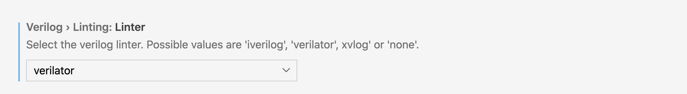
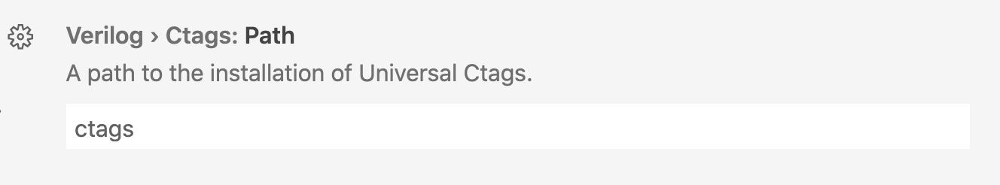
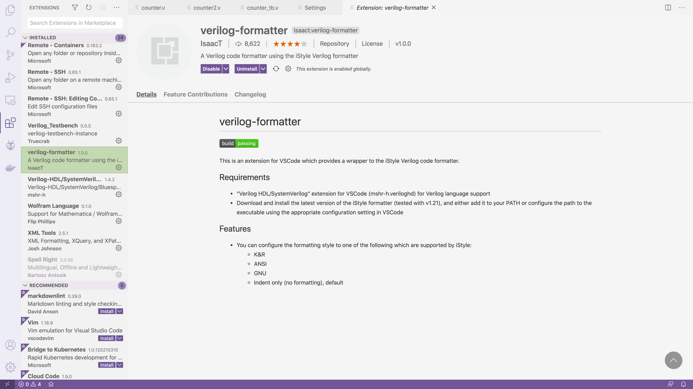
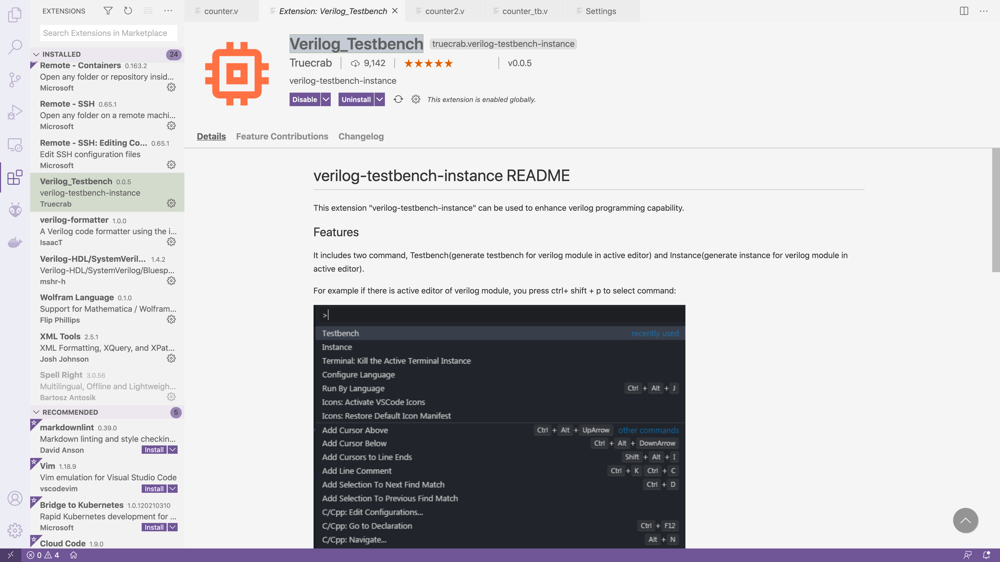
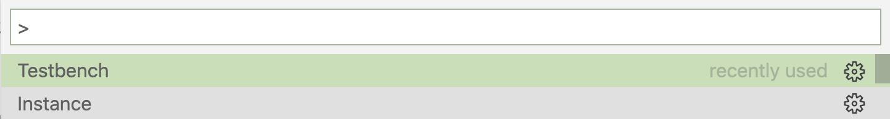
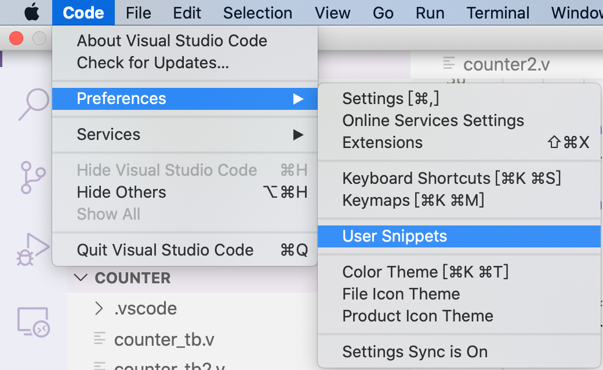

# 安装 HDL 语言支持插件

首先我们安装 [Verilog-HDL/SystemVerilog/Bluespec SystemVerilog](https://marketplace.visualstudio.com/items?itemName=mshr-h.VerilogHDL)。



它能够为包括 Verilog 在内的多种 HDL 提供语法高亮、常用代码片段、符号补全以及代码分析的功能。

然而不要着急，该插件并未实现后两种功能，而是从其他更专业的程序中获得帮助。因此我们还需要进行相应配置。

# 使用 Verilator/iVerilog 作为代码分析工具

~~~shell
# Mac 安装 Verilator
❯ brew install verilator
# Debian 系
❯ sudo apt-get install verilator
# Windows
# Windows 可以使用 WSL
# 需要开启 Verilog > Linting > Verilator: Use WSL
~~~

在 VS Code 的用户设置中 `Verilog > Linting: Linter` 一项选择 `verilator`:



# 使用 ctags 作为符号补全工具

`ctags` 是老牌的符号补全工具，至今你还可以在 `Vim` 中见到它的身影。

在 Linux 中可以直接通过包管理安装。

在 Windows 中则需要安装 `universal-ctags`。

**配置：**



**效果：**

- 鼠标放在信号上，就会有声明显示在悬浮框中；

- Ctrl+左键，点击信号名，自动跳转到声明处，

  返回：

  - **Windows**: `Alt` + `←` ;或者 鼠标侧键
  - **Linux**: `Ctrl` + `Alt` + `-` ;貌似数字键盘的减号没效果
  - **Mac**: `Ctrl` + `-`

- 光标放在信号处，右键选择查看定义（快捷键可自行绑定），可以在此处展开声明处的代码，用于修改声明十分方便，就不用再来回跳转了。按ESC，关闭。

# 安装并配置代码格式化插件

接下来我们需要安装 [verilog-formatter](https://marketplace.visualstudio.com/items?itemName=IsaacT.verilog-formatter) 来进行格式化。



除此之外，我们需要下载 [编译后的 iStyle](https://github.com/0qinghao/istyle-verilog-formatter/releases) 或者 [iStyle 源代码](https://github.com/thomasrussellmurphy/istyle-verilog-formatter/releases)并手动编译(`make all`)。

最后在 VS Code 中配置 `Verilog-formatter > Istyle` 到你的可执行文件。

另外在下方的 `Verilog-formatter > Istyle: Style` 一项，你可以选择多种格式化方式，我比较喜欢 `kr`。


之后在 VS Code 中，每当调用 `Format Document` 命令(`Ctrl+Shift+P` 后输入)，当前文件就会进行格式化（快捷键 `Shift + Alt + F`）。

# 将文件代码与 Vivado 项目分离

通常来说，新手在创建一个 Vivado 项目之后，常常会在 Vivado 中新建 Verilog 文件，然后直接编辑。

这样的结果就是，**Verilog 代码会埋在 Vivado 项目很深的路径之中**：

```
└── vivado # 你的 Vivado 项目
    └── vivado.srcs
        └── sources_1
            └── new
                └── your-verilog-file.v # 你的 Verilog 文件
```

但是这样既不方便你通过 VS Code 打开代码，也不方便使用 Git 进行版本控制。

因此正确的方式应该是在**独立的文件夹**中手动创建 `.v` 文件：

```
├── vivado # 你的 Vivado 项目
└── src
    └── your-verilog-file.v # 你的 Verilog 文件
```

然后在 Vivado 中通过 `Add Directory` 将整个 `src` 目录添加到 Vivado 开发环境中，Vivado 将自动寻找可能的顶层文件，并自动梳理文件间依赖关系。

注意 Vivado 对文件更新的监听规则为：自动监听已经加入的文件，不监听新创建的文件。也就是说：**如果你新建了一个 Verilog 文件，则需要再次添加入 Vivado 项目中**。

# 用 Git 进行版本控制

通过 [gitignore.io](https://www.toptal.com/developers/gitignore)，你可以快速生成一份可用的 [`.gitignore` 文件](https://www.toptal.com/developers/gitignore/api/vivado,visualstudiocode)，或者基于此进行改进。


# 自动生成例化，自动生成testbench

安装的第一个插件Verilog-HDL/System...就有自动例化功能

按F1或者Ctrl+Shift+P，输入

```text
verilog:instantiate
```

非常的好用，但是不够完美。

需要安装插件 [Verilog_Testbench](https://marketplace.visualstudio.com/items?itemName=Truecrab.verilog-testbench-instance)



按F1或者Ctrl+Shift+P，输入:

~~~bash
Instance # 例化
Testbench # tb
~~~



可以会报错缺少文件：

~~~
can't open file '~/.vscode/extensions/truecrab.verilog-testbench-instance-0.0.5/outvTbgenerator.py': [Errno 2] No such file or directory
~~~

其实是路径的写法有问题：

~~~
python /Users/zhouyuqian/.vscode/extensions/truecrab.verilog-testbench-instance-0.0.5/out\vTbgenerator.py
~~~

直接在对应位置创建一个超链接就可以了。

~~创建相应的文件，内容如下：~~

~~~python
#! /usr/bin/env python

'''
vTbgenerator.py -- generate verilog module Testbench
generated bench file like this:


        fifo_sc #(
            .DATA_WIDTH ( 8 ),
            .ADDR_WIDTH ( 8 )
        )
         u_fifo_sc (
            .CLK   ( CLK                     ),
            .RST_N ( RST_N                   ),
            .RD_EN ( RD_EN                   ),
            .WR_EN ( WR_EN                   ),
            .DIN   ( DIN   [DATA_WIDTH-1 :0] ),
            .DOUT  ( DOUT  [DATA_WIDTH-1 :0] ),
            .EMPTY ( EMPTY                   ),
            .FULL  ( FULL                    )
        );


Usage:
      python vTbgenerator.py ModuleFileName.v


'''
import random
import re
import sys
from queue import Queue


import chardet


def delComment(Text):
    """ removed comment """
    single_line_comment = re.compile(r"//(.*)$", re.MULTILINE)
    multi_line_comment = re.compile(r"/\*(.*?)\*/", re.DOTALL)
    Text = multi_line_comment.sub('\n', Text)
    Text = single_line_comment.sub('\n', Text)
    return Text


def delBlock(Text):
    """ removed task and function block """
    Text = re.sub(r'\Wtask\W[\W\w]*?\Wendtask\W', '\n', Text)
    Text = re.sub(r'\Wfunction\W[\W\w]*?\Wendfunction\W', '\n', Text)
    return Text


def findName(inText):
    """ find module name and port list"""
    p = re.search(r'([a-zA-Z_][a-zA-Z_0-9]*)\s*', inText)
    mo_Name = p.group(0).strip()
    return mo_Name


def paraDeclare(inText, portArr):
    """ find parameter declare """
    pat = r'\s' + portArr + r'\s[\w\W]*?[;,)]'
    ParaList = re.findall(pat, inText)


    return ParaList


def portDeclare(inText, portArr):
    """find port declare, Syntax:
       input [ net_type ] [ signed ] [ range ] list_of_port_identifiers


       return list as : (port, [range])
    """
    port_definition = re.compile(
        r'\b' + portArr +
        r''' (\s+(wire|reg|logic|interface)\s+)* (\s*signed\s+)*  (\s*\[.*?:.*?\]\s*)*
        (?P<port_list>.*?)
        (?= \binput\b | \boutput\b | \binout\b | ; | \) )
        ''',
        re.VERBOSE | re.MULTILINE | re.DOTALL
    )


    pList = port_definition.findall(inText)
    t = []
    for ls in pList:
        if len(ls) >= 2:
            t = t + portDic(ls[-2:])
    return t


def portDic(port):
    """delet as : input a =c &d;
        return list as : (port, [range])
    """
    pRe = re.compile(r'(.*?)\s*=.*', re.DOTALL)


    pRange = port[0]
    pList = port[1].split(',')
    pList = [i.strip() for i in pList if i.strip() != '']
    pList = [(pRe.sub(r'\1', p), pRange.strip()) for p in pList]


    return pList


def formatPort(AllPortList, isPortRange=1):
    PortList = AllPortList


    str = ''
    if PortList != []:
        l1 = max([len(i[0]) for i in PortList])+2
        l3 = max(18, l1)


        strList = []
        str = ',\n'.join([' ' * 4 + '.' + i[0].ljust(l3)
                          + '(' + (i[0]) + ')' for i in AllPortList])
        strList = strList + [str]


        str = ',\n\n'.join(strList)


    return str


def formatDeclare(PortList, portArr, initial=""):
    str = ''


    if PortList != []:
        str = '\n'.join([portArr.ljust(4) + '  '+(i[1]+min(len(i[1]), 1)*'  '
                                                  + i[0]) + ';' for i in PortList])
    return str


def formatPara(ParaList):
    paraDec = ''
    paraDef = ''
    if ParaList != []:
        s = '\n'.join(ParaList)
        pat = r'([a-zA-Z_][a-zA-Z_0-9]*)\s*=\s*([\w\W]*?)\s*[;,)]'
        p = re.findall(pat, s)


        l1 = max([len(i[0]) for i in p])
        l2 = max([len(i[1]) for i in p])
        paraDec = '\n'.join(['parameter %s = %s;'
                             % (i[0].ljust(l1 + 1), i[1].ljust(l2))
                             for i in p])
        paraDef = '#(\n' + ',\n'.join(['    .' + i[0].ljust(l1 + 1)
                                       + '( ' + i[1].ljust(l2)+' )' for i in p]) + ')\n'
    return paraDec, paraDef


def portT(inText, ioPadAttr):
    x = {}
    count_list = []
    order_list = []
    for i in ioPadAttr:
        p = port_index_list(inText, i)
        for j in p:
            count_list.append(j)
            x[j] = i
    count_list = quick_sort(count_list, 0, len(count_list)-1)
    for c in count_list:
        order_list.append(x.get(c))
    return order_list


def quick_sort(myList, start, end):
    if start < end:
        i, j = start, end
        base = myList[i]
        while i < j:
            while (i < j) and (myList[j] >= base):
                j = j - 1


            myList[i] = myList[j]


            while (i < j) and (myList[i] <= base):
                i = i + 1
            myList[j] = myList[i]
        myList[i] = base


        quick_sort(myList, start, i - 1)
        quick_sort(myList, j + 1, end)
    return myList


def formatPort_order(padAttr, orderList):


    for p in padAttr:
        q = Queue()
        for i in padAttr.get(p):
            q.put(i)
        padAttr[p] = q
    AllPortList = []
    for o in orderList:
        AllPortList.append(padAttr.get(o).get())
    return AllPortList


def port_index_list(intext, text):
    l = []
    t = intext
    index = t.find(text)
    while index > -1:
        t = t.replace(text, random_str(len(text)), 1)
        l.append(index)
        index = t.find(text)
    return l


def random_str(size):
    s = ''
    for i in range(size):
        s += str(random.randint(0, 9))
    return s


def getPortMap(AllPortList, ioPadAttr):
    if len(AllPortList) != len(ioPadAttr):
        return


    p_map = {}
    for i in range(len(AllPortList)):
        p_map[ioPadAttr[i]] = AllPortList[i]
    return p_map


def writeTestBench(input_file):
    """ write testbench to file """
    with open(input_file, 'rb') as f:
        f_info = chardet.detect(f.read())
        f_encoding = f_info['encoding']
    with open(input_file, encoding=f_encoding) as inFile:
        inText = inFile.read()


    # removed comment,task,function
    inText = delComment(inText)
    inText = delBlock(inText)


    # moduel ... endmodule  #
    moPos_begin = re.search(r'(\b|^)module\b', inText).end()
    moPos_end = re.search(r'\bendmodule\b', inText).start()
    inText = inText[moPos_begin:moPos_end]


    name = findName(inText)
    paraList = paraDeclare(inText, 'parameter')
    paraDec, paraDef = formatPara(paraList)


    ioPadAttr = ['input', 'output', 'inout','interface']
    orlder = portT(inText, ioPadAttr)
    input = portDeclare(inText, ioPadAttr[0])
    output = portDeclare(inText, ioPadAttr[1])
    inout = portDeclare(inText, ioPadAttr[2])
    interface = portDeclare(inText, ioPadAttr[3])


    portList = formatPort(formatPort_order(
        getPortMap([input, output, inout,interface], ioPadAttr), orlder))


    input = formatDeclare(input, 'reg')
    output = formatDeclare(output, 'wire')
    inout = formatDeclare(inout, 'wire')
    interface = formatDeclare(interface, 'wire')
    # write Instance


    # module_parameter_port_list
    if(paraDec != ''):
        print("// %s Parameters\n%s\n" % (name, paraDec))


    # list_of_port_declarations
    #print("// %s Inputs\n%s\n" % (name, input))
    #print("// %s Outputs\n%s\n" % (name, output))
    #if(inout != ''):
    #    print("// %s Bidirs\n%s\n" % (name, inout))
    print("\n")
    # UUT
    print("%s %s inst_%s (\n%s\n);" % (name, paraDef, name, portList))


if __name__ == '__main__':
     writeTestBench(sys.argv[1])
~~~

# More

## [Verilog Snippet](https://marketplace.visualstudio.com/items?itemName=czh.czh-verilog-snippet) 可以提供更强大的补全


## 自定义补全

其实关于自动补全，还可以前往 "Preference->User Snippets"，来添加您自己的代码，虽然这个操作目前还是比较麻烦的。



# Reference

[1] [**HDL 的现代代码编辑体验——配置 VS Code 的 Verilog 开发环境**](https://blog.fkynjyq.com/write-verilog-with-vscode/)

[2] [用VSCode编辑verilog代码、iverilog编译、自动例化、自动补全、自动格式化等常用插件](https://zhuanlan.zhihu.com/p/338497672)