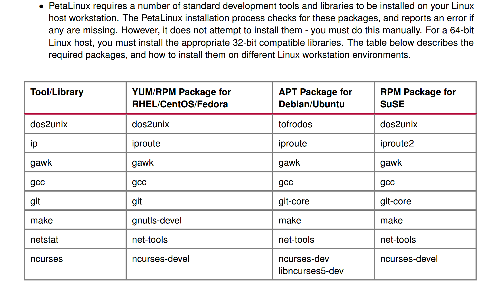
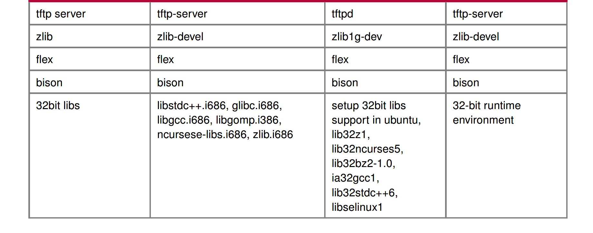
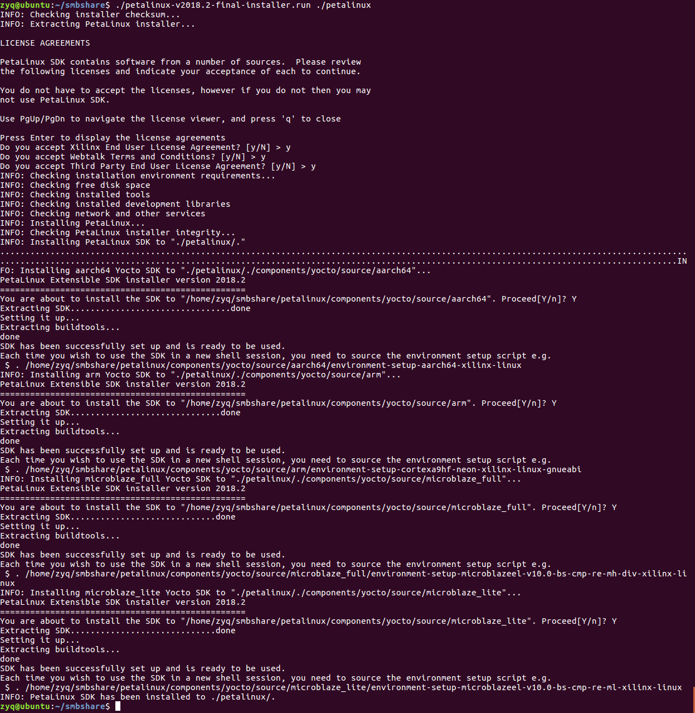
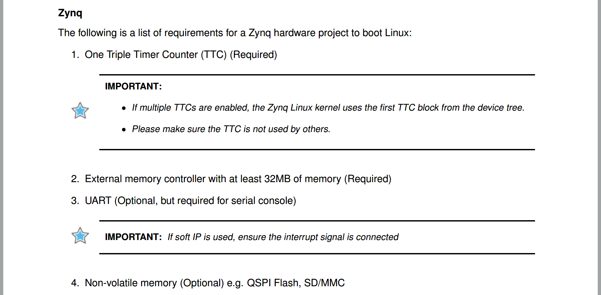
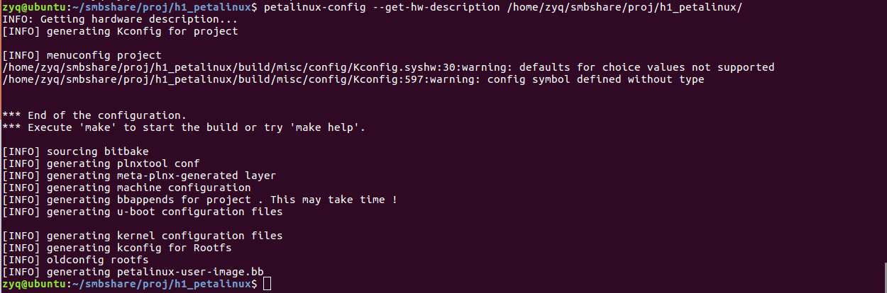

# 一、开发环境搭建与Petalinux安装

[参考](http://www.cnblogs.com/vacajk/p/6146146.html)

开发环境VMware，***Ubuntu16.04***（目前Petalinux不支持Ubuntu18.04，坑）。

## step1 安装VMware，新建Ubuntu虚拟机；

这里安装完成后最好配置一下共享文件夹，方便后期使用。

[参考](https://www.cnblogs.com/gzdaijie/p/5194033.html)

### 1.1 安装samba

~~~shell
sudo apt-get install samba
~~~

### 1.2 创建共享目录

~~~shell
// 创建的目录即之后能够在Windows主机上直接访问的目录。
// 例如：在用户zyq的主目录下新建share文件夹为共享目录
mkdir /home/zyq/smbshare
// 由于Windows下的文件夹需可读可写可执行，需更改权限为777
sudo chmod 777 /home/zyq/smbshare
~~~

### 1.3 修改samba配置文件

~~~shell
// 修改 /etc/samba/smb.conf
sudo vim /etc/samba/smb.conf
// 在smb.conf文件最后加上以下内容
~~~

~~~shell
[share]
path = /home/zyq/smbshare
public = yes
writable = yes
valid users = zyq
create mask = 0644
force create mode = 0644
directory mask = 0755
force directory mode = 0755
available = yes
~~~

> #### 关于smb.conf的几点解释：
>
> (1) [share]表示共享文件夹的别名，之后将直接使用这个别名
>
> (2) `force create mode` 与 `force directory mode`的设置是因为Windows下与Linux下文件和文件夹的默认权限不同造成的，Windows下新建的文件是可执行的，必须强制设定其文件权限。
>
> (3) valid users 设置为你当前的Linux用户名，例如我的是zyq，因为第一次打开共享文件夹时，需要验证权限。

### 1.4 设置登录密码

~~~shell
// 新建/etc/samba/smbpasswd文件
sudo touch /etc/samba/smbpasswd
// 根据2.3设置的valid users，设置用户密码
// zyq 替换为你在2.3中设置的用户名
sudo smbpasswd -a zyq
// 输入两次密码后，会提示 Added user zyq. 表示设置成功
// 若用户名非当前登录系统的用户名，可能会提示Failed
~~~

### 1.5 启动samba服务器

~~~shell
sudo /etc/init.d/samba restart
~~~

### 1.6 测试是否共享成功

~~~shell
sudo apt-get install smbclient 
smbclient -L localhost/share
//还记得吗？share为2.3中设置的共享文件夹的别名
//如果共享成功，将要求输入之前设置的密码
~~~

### 1.7 在windows上测试

打开windows文件管理器，输入\\Linux ip地址或主机名\share


## step2 Ubuntu换源

这里更换的是清华的源。

~~~shell
# 备份原来的sourcelist
mv /etc/apt/sources.list /etc/apt/sources.list.bakup
# 新建sourcelist并填入源
# https://mirrors.tuna.tsinghua.edu.cn/help/ubuntu/
sudo vim /etc/apt/sources.list
~~~

保存并退出，运行apt-get update

~~~shell
apt-get update
~~~

## step3 安装Petalinux需要的依赖库

参考ug1144，需要安装一些库。





~~~shell
apt-get install tofrodos:i386
apt-get install iproute2:i386
apt-get install gawk:i386
apt-get install gcc:i386
apt-get install git-core:i386
apt-get install make:i386
apt-get install net-tools:i386
apt-get install libncurses5-dev:i386
apt-get install zlib1g-dev:i386
apt-get install libssl-dev:i386
apt-get install flex:i386
apt-get install bison:i386
apt-get install libselinux1:i386
~~~

然后是一些可能会导致不能正常安装petalinux，或是编译时出现问题的依赖库。

~~~shell
#在运行petalinux-config -c kernel出现错误，需要提前安装下面两个库
apt-get install libncurses5 libncurses5-dev
 
#编译时会出现错误arm-xilinx-linux-gnueabi-gcc: Command not found，需要安装下面三个库
apt-get install libc6:i386
apt-get install libstdc++6:i386
apt-get install zlib1g:i386
 
#安装petalinux时出现错误，提示缺少zlib和openssl，需要安装下面一个库
apt-get install libssl-dev
 
#安装petalinux时出现警告，提示No tftp server found - please refer to "PetaLinux SDK Installation Guide" for its impact and solution，需要安装下面3个库
apt-get install tftpd tftp openbsd-inetd
gedit /etc/inetd.conf
#在文件中增加以下内容
tftp dgram udp wait nobody /usr/sbin/tcpd /usr/sbin/in.tftpd /tftproot
#保存并退出
mkdir /tftproot
chmod 777 /tftproot
/etc/init.d/openbsd-inetd restart
netstat -an | more | grep udp
#看到有如下输出，即表示tftp安装成功
#udp        0      0 0.0.0.0:69              0.0.0.0:*
~~~

## step4. 安装petalinux

首先在用个用户目录下创建petalinux文件夹作为petalinux的安装目录

~~~shell
mkdir /home/zyq/smbshare/petalinux
~~~

然后安装petalinux

> 一定要使用普通用户权限安装，不能sudo

~~~shell
./petalinux-v2018.2-final-installer-dec.run /home/zyq/smbshare/petalinux
~~~

如果权限不够，可用 `chmod 777` 提权。

安装过程中有3个许可，需要都同意。



每次开机使用petalinux时，要在命令行输入：

~~~shell
source /home/zyq/smbshare/petalinux/settings.sh
echo $PETALINUX
#会看到打印信息
#/home/zyq/smbshare/petalinux/
~~~

可以将 `source /home/zyq/smbshare/petalinux/settings.sh` 加入 `.bashrc` 就不用每次开机都输入上述命令了。

# 二、 建立PetaLinux工程

[参考](https://www.cnblogs.com/vacajk/p/6148857.html)

## step1 硬件描述文件

有两种PetaLinux工程建立的方法，一种是下载官方开发板的BSP包并安装，一种就是针对自己的硬件平台去剪裁Linux功能以适应自己的需求。

这里我们使用第二种方法。

使用vivado建立一个zynq工程，需要分配一些外设资源，参考ug1144。




生成bitstream文件，导入到SDK。

输出的文件都在“/<vivado project>/<project name>.sdk/<top module name>_hw_platform_0”文件夹下。

后面使用只需要将“<top module name>_hw_platform_0”文件夹中”system_wapper.hdf“文件复制到Linux就行了。

## step2 创建Petalinux工程

首先，创建一个PetaLinux工程目录。执行命令：

~~~shell
#创建工程，针对Zynq芯片，工程名称 h1_petalinux
petalinux-create --type project --template zynq --name h1_petalinux
~~~

接着，将 .hdf 文件复制到 h1_petalinux 文件夹下，然后我们来引用刚才输出的硬件描述文件。执行命令：

~~~shell
petalinux-config --get-hw-description = /home/zyq/smbshare/proj/h1_petalinux
~~~

注意 ”=“ 后面是hdf文件的路径，不是文件本身。

因为是空工程，我们会进入一个配置界面。在里面我们可以配置一些系统参数，主要的配置包括：启动方式，启动存储器分区表，启动文件名称等等。

这里我们先使用默认配置，直接按两次esc保存退出。

config需要的时间较长，耐心等待。



如果config报错，可能是工程目录权限不够，执行命令：

~~~shell
# 提示工程文件夹和petalinux的安装文件夹权限
chmod 777 ../h1_petalinux
chmod 777 petalinux
# 否则编译的时候，会发生错误
~~~

## step3 内核配置

我把USB配置一下，让系统能够识别出U盘，并进行读写操作。以后可能用到USB摄像头，就顺便把这个功能也打开吧。参考网址：http://www.wiki.xilinx.com/Zynq+Linux+USB+Device+Driver

配置kernel，执行命令：

~~~shell
petalinux-config -c kernel
~~~

打开了kernel的配置界面，

USB的配置如下：

~~~shell
Device Drivers
USB support
    <*> Support for Host-side USB
    <*> EHCI HCD (USB 2.0) support
    <*> USB Mass Storage support
    <*> ChipIdea Highspeed Dual Role Controller
    <*> ChipIdea host controller
        USB Physical Layer drivers --->
        <*> Generic ULPI Transceiver Driver
~~~

上面都是按照主机模式来配置的。

其实除了“NOP USB Transceiver Driver”是默认没有打开，剩下都是默认打开的。

USB摄像头配置如下：

```shell
`#Device Drivers --->``#    Multimedia Support --->``#        Media USB Adapter --->``#            <*>USB Video Class (UVC) (also UVC Input Event Support) #打开``#    USB Support --->``#        < >USB 2.0 OTG FSM Implementation #关闭`
```

配置完成后，ESC并保存。

## step3 u-boot配置

shell中输入`petalinux-config -c u-boot`，然后等待GUI出来，这里暂时不改动啥，直接save（save为u-boot.config，名字随便取但不要留空），然后继续等（新建工程要等的时间还是比较长的，后来就会好的）。

## step4 编译rootfs

命令`petalinux-config -c rootfs`，操作同上（save为默认即可）。

## step5 **设备树配置** 
若要修改，直接在工程文件夹下，Ctr+F搜索`.dts`就可以找到相关文件，做出相应修改暂时默认吧，不修改，按照它自动生成的设备树。

## step6 编译工程
输入命令`petalinux-build`，等待即可，最后生成的文件在 **image/linux**下。

## step7 生成BOOT.BIN 
把shell定位到image/linux目录下，执行命令 

~~~shell
petalinux-package --boot --format BIN --fsbl zynq_fsbl.elf --fpga system.bit --u-boot
~~~

在文件夹下就可以发现，多了一个BOOT.BIN

## step8 将文件拷入SD卡

首先需要将SD卡分区，[参考](https://blog.csdn.net/lulugay/article/details/83240981)。

打开文件夹{工程目录/images/linux/}，将 BOOT.BIN, image.ub拷贝到BOOT分区：

~~~shell
cp BOOT.BIN image.ub /media/zyq/BOOT
~~~

将 rootfs.cpio 拷贝到rootfs分区：

~~~shell
cp rootfs.cpio /media/zyq/rootfs
~~~

## step9 **开机** 
将SD卡，插回，开机。

开机时登录的用户名和密码都是`root`。


