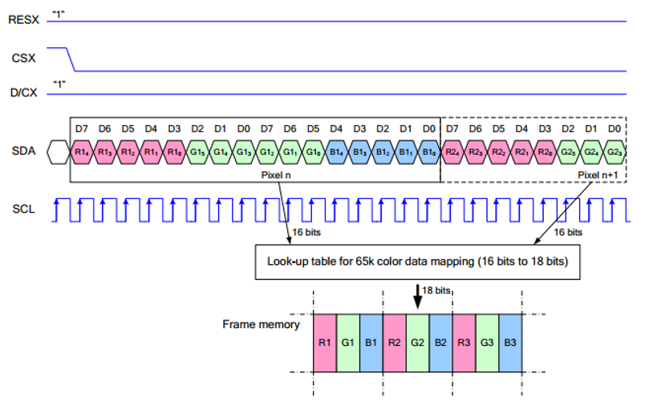
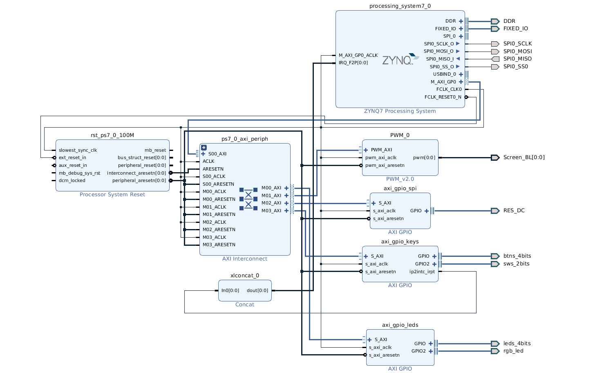
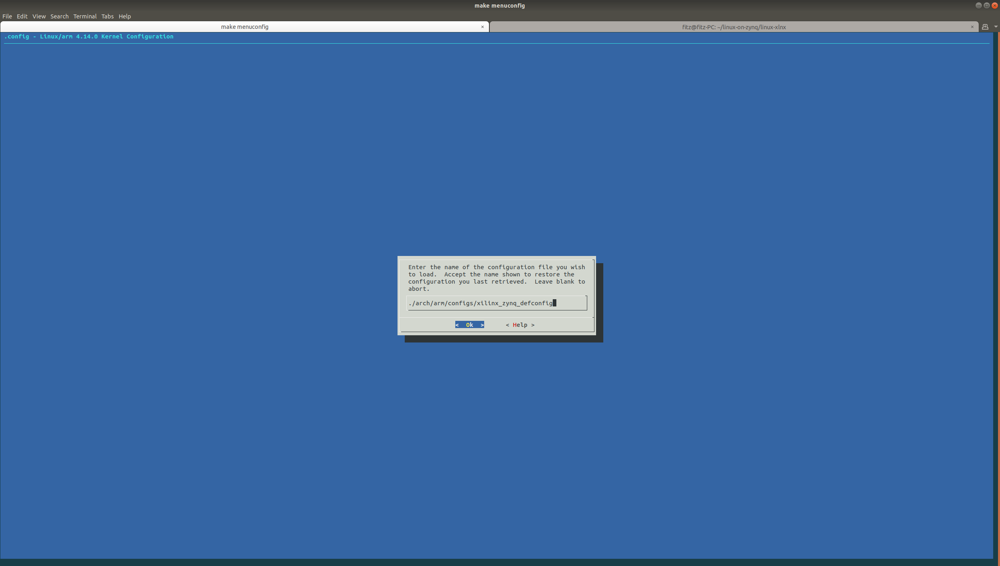
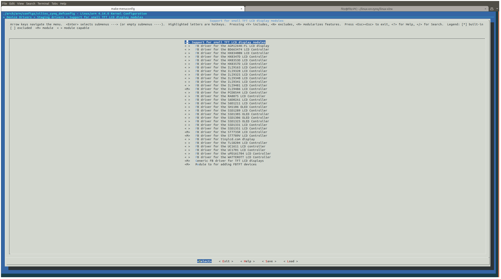
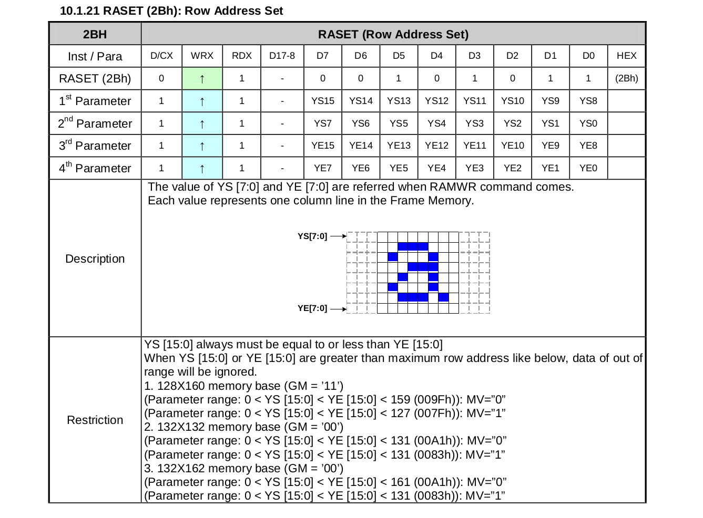
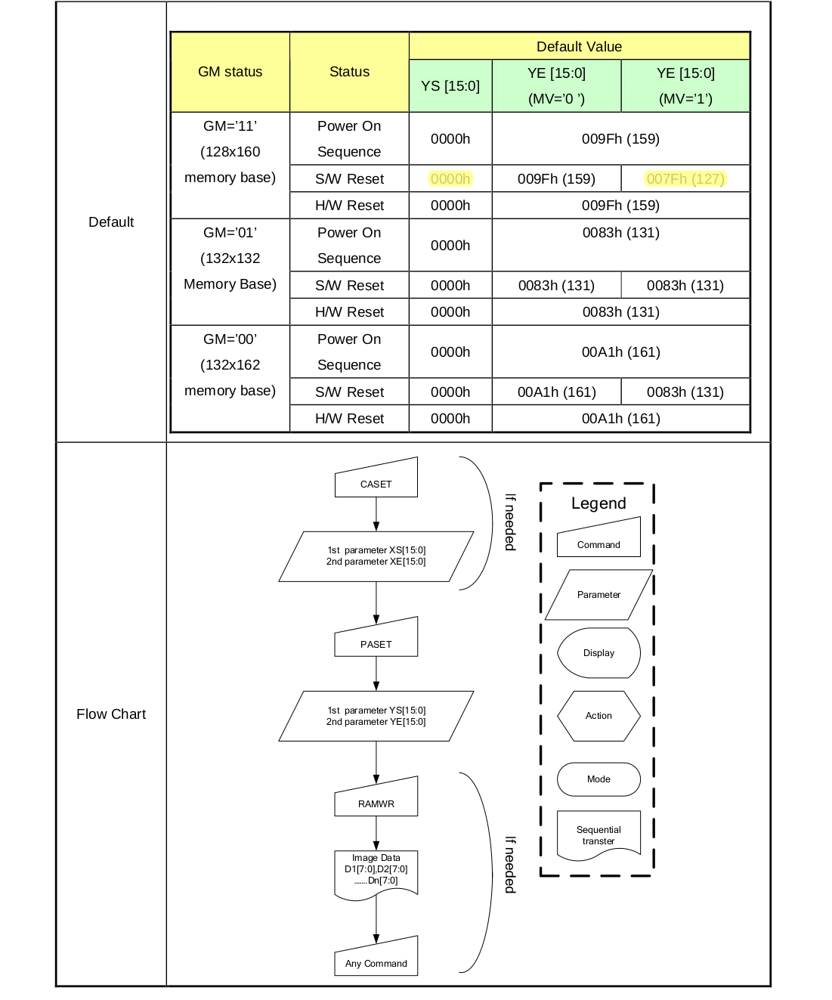

Framebuffer 是用一个视频输出设备从包含完整的帧数据的一个内存缓冲区中来驱动一个视频显示设备。简单的来说，就是使用一个内存区来存储显示内容，改变内存的数据就可以改变显示的内容。
在 github 上有一个开源工程：[framebuffer](https://github.com/notro/fbtft)
完整的实现了 framebuffer驱动

<!--more-->

> ref:
>
> http://www.waveshare.net/wiki/1.3inch_LCD_HAT
>
> https://krystof.io/mirroring-raspberry-pi-hdmi-video-to-a-st7789-1-3-inch-lcd-display/

使用的屏幕分辨率 80*160，驱动芯片是 ST7735s，屏幕上除了 SPI 接口外，还有 RES、DC、BLK 三个接口

> 注：与传统的SPI协议不同的地方是：由于是只需要显示，故而将从机发往主机的数据线进行了隐藏

RESX：复位，模块上电时拉低，通常情况下置1；
CSX：从机片选， 仅当CS为低电平时，芯片才会被使能。
D/CX：芯片的数据/命令控制引脚，当DC = 0时写命令，当DC = 1时写数据
SDA：传输的数据，即RGB数据；
SCL：SPI通信时钟；
对于SPI通信而言，数据是有传输时序的，即时钟相位（CPHA）与时钟极性(CPOL)的组合：
CPHA的高低决定串行同步时钟是在第一时钟跳变沿还是第二个时钟跳变沿数据被采集，当CPHL = 0，在第一个跳变沿进行数据采集；
CPOL的高低决定串行同步时钟的空闲状态电平，CPOL = 0，为低电平。
从图中可以看出，当SCLK第一个下降沿时开始传输数据，一个时钟周期传输8bit数据，使用SPI0，按位传输,高位在前,低位在后。

# 修改 Vivado 工程

可以看出需要一个 SPI 接口和两个 GPIO 口，GPIO 口用来控制 RESX 和 D/CX 信号，BlockDesign 如图：

其实驱动可以用 zynq 的 EMIO 的，但是一直没驱动起来，就用了 AXI-GPIO

# 重新生成 BOOT.bin

因为修改了 vivado 工程，所以需要使用新的 *bitstream* 文件重新生成 BOOT.bin，步骤参考 [ZYNQ 移植 Linux-创建 BOOT.bin](https://blog.leo-fitz.com/2020/03/30/ZYNQ-%E7%A7%BB%E6%A4%8D-Linux/#%E5%88%9B%E5%BB%BA-BOOT-bin)

 # 修改 device-tree

在上一篇 [ZYNQ 移植 Linux -- SPI](https://blog.leo-fitz.com/2020/05/05/ZYNQ-移植-Linux-SPI/) 的基础上就增加了一个 AXI-GPIO，这部分的 dtc 可以直接使用 sdk 生成，无需修改，步骤参考 [ZYNQ 移植 Linux-创建设备树文件](https://blog.leo-fitz.com/2020/03/30/ZYNQ-%E7%A7%BB%E6%A4%8D-Linux/#%E5%88%9B%E5%BB%BA%E8%AE%BE%E5%A4%87%E6%A0%91%E6%96%87%E4%BB%B6)

# 配置内核

1. AXI-GPIO 配置

   在上一篇 [ZYNQ 移植 Linux -- SPI](https://blog.leo-fitz.com/2020/05/05/ZYNQ-移植-Linux-SPI/) 的基础上需要启用 AXI-GPIO 的驱动，步骤参考 xilinx-wiki：

   [AXI GPIO](https://xilinx-wiki.atlassian.net/wiki/spaces/A/pages/18841846/AXI+GPIO)

   修改内核配置文件，启用如下配置：

   ~~~
   CONFIG_GPIO_SYSFS=y
   CONFIG_SYSFS=y
   CONFIG_GPIO_XILINX=y (for axi_gpio)
   ~~~

2. fbtft 配置

   打开配置菜单，在 *linux-xlnx/* 目录下运行：

   ~~~bash
   make menuconfig
   ~~~

   load 之前的配置文件：

   

   启动 fbtft 驱动，路径：

   ~~~bash
   Device Drivers  --->
   	 [*] Staging drivers  --->
   	 	<*>   Support for small TFT LCD display modules  --->
   	 		<M>   FB driver for the ST7735R LCD Controller # st7735 芯片对应的驱动
   	 		<M>   Module to for adding FBTFT devices       # fbtft_device 驱动
   ~~~

   

   > 注意这里至少需要选择两个驱动，一个是 fbtft_device，一个是屏幕芯片对应的驱动，如果这里没有所使用的屏幕芯片的驱动，可以选择 `Generic FB driver for TFT LCD displays` 通用驱动，不过用起来稍微有点烦，需要 init 参数。
   >
   > 选中的那个地方是 `<M>`，这样可以为这些驱动单独生成 *.ko* 驱动文件，方便调试

   保存后，编译内核：

   ~~~bash
   make xilinx_zynq_defconfig
   make -j8
   make UIMAGE_LOADADDR=0x8000 uImage -j8
   ~~~

   其中在第二个命令输出的 log 中会说生成的 *.ko* 文件的位置，将生成的内核 uImage 拷贝到内存卡，*.ko* 文件拷贝到 U盘 中。

# 加载驱动

使用新的 *devicetree.dtb, uImage, BOOT.bin* 启动后，可以在 */dev* 目录下看到 gpio 设备和 spi 设备，

## 测试 GPIO

先测试下 gpio 是否工作正常，步骤可以参考 [xilinx-wiki -- AXI GPIO](https://xilinx-wiki.atlassian.net/wiki/spaces/A/pages/18841846/AXI+GPIO)

在 */sys/class/gpio* 目录下执行 `ls -all` 命令可以看到 gpio 设备的信息：

~~~bash
xilinx@pynq:/sys/class/gpio$ ls -all
total 0
drwxr-xr-x  2 root root    0 May 11 15:11 .
drwxr-xr-x 48 root root    0 Jan 28  2018 ..
--w-------  1 root root 4096 May 11 15:11 export
lrwxrwxrwx  1 root root    0 May 11 15:11 gpiochip1014 -> ../../devices/soc0/amba_pl/41210000.gpio/gpio/gpiochip1014
lrwxrwxrwx  1 root root    0 May 11 15:11 gpiochip1016 -> ../../devices/soc0/amba_pl/41200000.gpio/gpio/gpiochip1016
lrwxrwxrwx  1 root root    0 May 11 15:11 gpiochip1020 -> ../../devices/soc0/amba_pl/41200000.gpio/gpio/gpiochip1020
lrwxrwxrwx  1 root root    0 May 11 15:11 gpiochip896 -> ../../devices/soc0/amba/e000a000.gpio/gpio/gpiochip896
--w-------  1 root root 4096 May 11 15:11 unexport
~~~

我的 DC 和 RST 引脚是接在了 *gpiochip1014* 上了，这里 gpio 的编号是怎么来的还没完全搞明白，不过可以通过 gpio 设备的地址来确定

接下来对 gpio 的电平，测一下 fpga 管脚上的电平是不是按预期的变化，在 */sys/class/gpio* 目录下执行：

~~~bash
echo 1014 > export # gpiochip1014 的第一个管脚
echo 1015 > export # gpiochip1014 的第二个管脚
# 这时在 /sys/class/gpio 目录下应该会产生 gpio1014 gpio1015 两个目录
echo out > gpio1014/direction # 设置 gpio 方向为输出
echo out > gpio1015/direction
echo 1 > gpio1014/value # 在第一个管脚上输出高电平
echo 1 > gpio1015/value # 在第二个管脚上输出高电平
echo 0 > gpio1014/value # 在第一个管脚上输出低电平
echo 0 > gpio1015/value # 在第二个管脚上输出低电平
~~~

接在 DC 和 RST 上的两个 gpio 管脚应该会按预期输出电平

## 加载 fbtft 驱动

*.ko* 文件放在了 U盘里，首先将 U盘 挂载上，然后进入 *.ko* 文件所在位置，如何在 zynq 上挂载 U盘 可以参考 [ZYNQ 移植 Linux -- USB](https://blog.leo-fitz.com/2020/04/13/ZYNQ-移植-Linux-USB/)

使用如下命令加载驱动：

~~~bash
sudo insmod fbtft_device.ko name=adafruit18 busnum=1 gpios="reset:1014,dc:1015" rotate=90 custom=1 height=160 width=80
sudo insmod fb_st7735r.ko
~~~

如果成功了屏幕应该就会有显示了，在 */dev* 目录下会产生 *fb0* 设备，不成功可以用 `dmesg` 命令查看内核 log，看下报错信息。

到这步还出现了个小问题，就是 fbtft 里面提供的 st7735 驱动是 160x128 分辨率的，而我的屏幕是 160x80 分辨率的，虽然已经在 fbtft_device.ko 的参数里制定了自定义的分辨率，但是屏幕的内容就显示不全，上面内容的冒到屏幕外了，下面还有一点屏幕空白，这应该是显示区域的起点错了，导致显示区域偏屏幕上方，看了下 st7735 的手册，发现这个芯片工作的逻辑是先发送要刷新区域的位置，然后再发送显示的内容：

然后就在驱动代码里找啊找，在 *linux-xlnx/drivers/staging/fbtft/fb_st7735r.c* 文件里找到了 `static void set_addr_win(struct fbtft_par *par, int xs, int ys, int xe, int ye)` 这个函数，这应该就是发送显示区域的函数了，给 `ys` 和 `ye` 加了一个偏移，完美，显示区域到了屏幕中央了：

~~~c
static void set_addr_win(struct fbtft_par *par, int xs, int ys, int xe, int ye)
{	
	ys += 0x18; // (128-80)/2
	ye += 0x18;

	write_reg(par, MIPI_DCS_SET_COLUMN_ADDRESS,
		  xs >> 8, xs & 0xFF, xe >> 8, xe & 0xFF);

	write_reg(par, MIPI_DCS_SET_PAGE_ADDRESS,
		  ys >> 8, ys & 0xFF, ye >> 8, ye & 0xFF);

	write_reg(par, MIPI_DCS_WRITE_MEMORY_START);
}
~~~

# 开机自动加载驱动

> ref: 
>
> https://blog.csdn.net/hunanchenxingyu/article/details/47292327
>
> http://www.waveshare.net/wiki/1.3inch_LCD_HAT

## 将驱动放到 rootfs 的内核目录下

将 *fbtft_device.ko*、*fb_st7735r.ko* 放到 */lib/modules/`uname -r`/* 对应目录下：

具体在 `/lib/modules/<uname -r>/kernel/drivers/staging/fbtft/`

~~~bash
xilinx@pynq:/lib/modules/4.14.0-xilinx-00001-gbba05abe65f5-dirty/kernel/drivers/staging/fbtft$ ls
fb_ili9486.ko  fb_st7735r.ko  fb_st7789v.ko  fbtft_device.ko  flexfb.ko
~~~

> tips:
>
> `uname -r` 命令可以用来查看内核版本号

之后在生成 map 文件：

~~~bash
sudo depmod -A
~~~

> 这步目的是为了生成一个引索，这样内核可以找到之前拷贝过来的驱动

可以用 `modprobe` 命令测试是否可以加载，用法（在任意目录下执行）：

~~~bash
modprobe xxx.ko        #加载某个模块
modprobe -r xxx.ko     #卸载某个模块
~~~

## 启用模块

编辑文件 */etc/modules*，添加如下：

~~~
fb_st7735r
fbtft_device
~~~

## 新建配置文件，配置 fbtft

新建配置文件 */etc/modprobe.d/fbtft.conf*，内容如下：

~~~
options fbtft_device name=adafruit18 busnum=1 gpios=reset:1014,dc:1015 rotate=90 custom=1 height=160 width=80
~~~

上面 3 步完成后重启，应该就可以看到屏幕被点亮并显示了 console，说明驱动被自动加载了

# 使用

> ref: https://github.com/notro/fbtft/wiki/Framebuffer-use

1. 显示图像化界面

   ~~~bash
   FRAMEBUFFER=/dev/fb0 startx
   ~~~

2. 播放视频

   ~~~bash
   mplayer -vo fbdev:/dev/fb0 -zoom -x 160 -y 80 -nosound test.mp4
   ~~~
   
   

     <iframe src="//player.bilibili.com/player.html?aid=243218293&bvid=BV1ae411W731&cid=189943254&page=1" scrolling="no" border="0" frameborder="no" framespacing="0" allowfullscreen="true" style="position: absolute; width: 100%; height: 100%; left: 0; top: 0;"></iframe>
   

