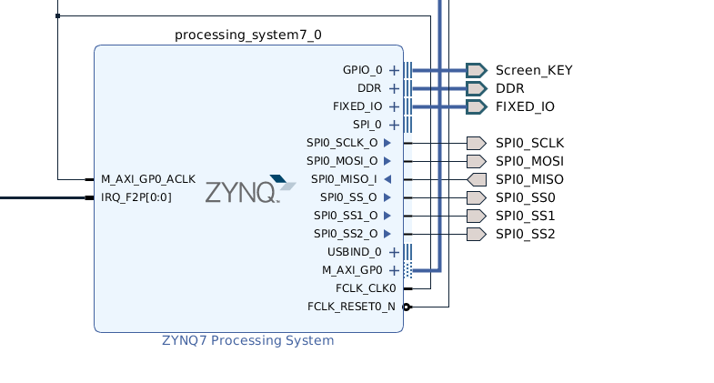
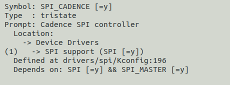
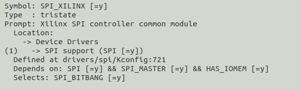
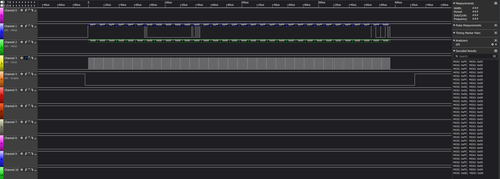

# 修改 vivado 工程，启用 PS-SPI

<!--more-->

# 重新生成 BOOT.bin

因为修改了 vivado 工程，所以需要使用新的 *bitstream* 文件重新生成 BOOT.bin

# 修改 device-tree

1. 首先参考[创建设备树文件](https://blog.leo-fitz.com/2020/03/30/ZYNQ-%E7%A7%BB%E6%A4%8D-Linux/#%E5%88%9B%E5%BB%BA%E8%AE%BE%E5%A4%87%E6%A0%91%E6%96%87%E4%BB%B6)使用 SDK 重新生成设备树文件，可以看到在 *pcw.dtsi* 文件中多了 `&spi0 {`，这个是 SDK 自动生成的设备树；

2. 修改 *pcw.dtsi* 文件中的 `&spi0 {`：

   ~~~c
   &spi0 {
   	is-decoded-cs = <0>;
   	num-cs = <3>;
   	status = "okay";
   	spidev@0 {
   		compatible = "spidev";
   		reg = <0>; /*chipselect 0*/
   		spi-max-frequency = <50000000>;
   		spi-cpol;
           spi-cpha;
   	};
   	spidev@1 {
   		compatible = "spidev";
   		reg = <1>; /*chipselect 1*/
   		spi-max-frequency = <50000000>;
   		spi-cpol;
           spi-cpha;
   	};
   	spidev@2 {
   		compatible = "spidev";
   		reg = <2>; /*chipselect 2*/
   		spi-max-frequency = <50000000>;
   		spi-cpol;
           spi-cpha;
   	};
   };
   ~~~

   其中 `reg = <*>;` 为片选信号，可以控制 `SPIO_SS*` 引脚；

   `is-decoded-cs = <0>;` 为不使用编码器，所以现在 zynq 的 SPI-Mater 最多只能接 3 个 slaver，需要更多的 slaver 可以使用 3-8编码器；

   **!!!** `spi-cpol; spi-cpha;` 这两行一定要加！

   修改 *top.dts* 中的 `aliases`：

   ~~~c
   	aliases {
   		ethernet0 = &gem0;
   		i2c0 = &i2c0;
   		serial0 = &uart0;
   		spi0 = &qspi;
   		spi1 = &spi0;
   	};
   ~~~

   添加了 `spi1 = &spi0;`

3. 重新编译设备树：

   ~~~bash
   dtc -I dts -O dtb -o devicetree.dtb zynq-pynqz2.dts
   ~~~

# 配置内核

参考 [Xlinx wiki: SPI Zynq driver](https://xilinx-wiki.atlassian.net/wiki/spaces/A/pages/18842437/SPI+Zynq+driver) 需要启用 `CONFIG_SPI_CADENCE`，这个选项在 *xilinx_zynq_defconfig* 文件中是默认启用的：

参考 [Xlinx wiki: Linux SPI Driver](https://xilinx-wiki.atlassian.net/wiki/spaces/A/pages/18842255/Linux+SPI+Driver) 需要启用 `CONFIG_SPI_XILINX`，这个选项在 *xilinx_zynq_defconfig* 文件中也是默认启用的：

但是这样配置怎么也找不到 *spidev* 设备，后来在 [forums.xilinx](https://forums.xilinx.com/t5/Embedded-Linux/linux-SPI-for-zynq/td-p/417133) 上看到的一个回答：

需要启用 `CONFIG_SPI_SPIDEV` ，在 *Device Drivers -> SPI Support -> User mode SPI device driver support* 

最后重新编译内核：

~~~bash
make xilinx_zynq_defconfig
make -j8
make UIMAGE_LOADADDR=0x8000 uImage -j8
~~~

使用新的 *dtb, uImage, BOOT.bin* 启动后，就可以在 */dev/* 下面看到 SPI 设备了：

~~~bash
xilinx@pynq:~$ ls /dev/spi*
/dev/spidev1.0  /dev/spidev1.1  /dev/spidev1.2
~~~

# 用户程序测试

linux-xlnx 中提供了 spi test 程序，自己写可以参考，路径在 *linux-xlnx/tools/spi/spidev_test.c*，编译命令如下：

~~~bash
arm-linux-gnueabihf-gcc -O2 spidev_test.c -o spidev_test
~~~

将生成的 *spidev_test* 拷贝到 ZYNQ 中，运行 `./spidev_test`，可以看到 SPI 接口上产生了正确的波形：

