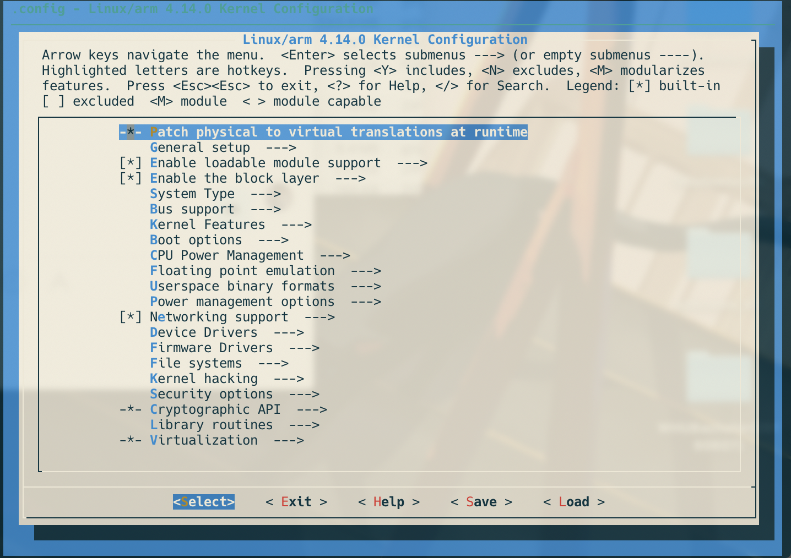
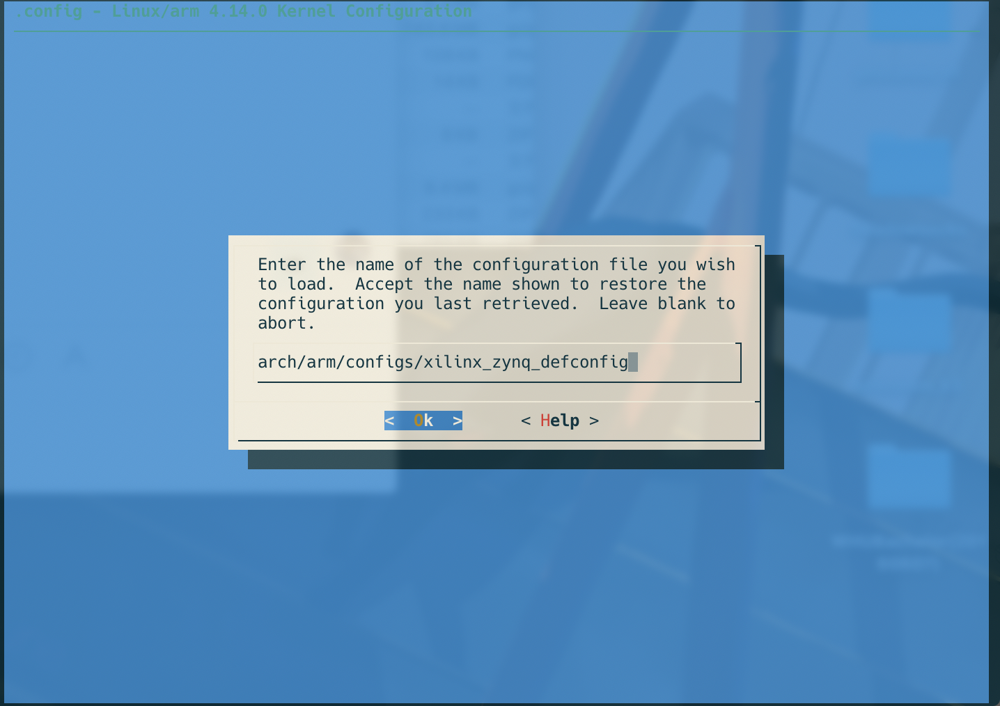

在之前 [ZYNQ 移植 Linux](https://blog.leo-fitz.com/2020/03/30/ZYNQ-移植-Linux/) 的基础上，下一步就是要移植驱动了，但是每次都把 SD 卡拔下来把驱动拷进去再重新开机太麻烦了，ZYNQ 上有两个 USB 外设，可以配成 Host、Peripheral、OTG 三种模式，因此我们可以将 USB 配置成 Host 模式，这样 ZYNQ 上的 Linux 系统就可以读取 USB 接口上的 U盘了。

<!--more-->

>  Reference:
>
> https://xilinx-wiki.atlassian.net/wiki/spaces/A/pages/18842272/Zynq+Linux+USB+Device+Driver#ZynqLinuxUSBDeviceDriver-PeripheralMode
>
> https://blog.csdn.net/u010580016/article/details/104188236?depth_1-utm_source=distribute.pc_relevant.none-task-blog-BlogCommendFromBaidu-8&utm_source=distribute.pc_relevant.none-task-blog-BlogCommendFromBaidu-8
>
> https://stackoverflow.com/questions/57823438/how-to-configure-petalinux-device-tree-with-usb-correctly

这里现在只写了 Host 模式的配置，其他模式的配置可以参考 [ZYNQ学习之路8.USB总线学习(一)](https://blog.csdn.net/u010580016/article/details/104188236?depth_1-utm_source=distribute.pc_relevant.none-task-blog-BlogCommendFromBaidu-8&utm_source=distribute.pc_relevant.none-task-blog-BlogCommendFromBaidu-8) 和 [xilinx-wiki](https://xilinx-wiki.atlassian.net/wiki/spaces/A/pages/18842272/Zynq+Linux+USB+Device+Driver#ZynqLinuxUSBDeviceDriver-PeripheralMode)。

# 配置内核

按照 [xilinx-wiki](https://xilinx-wiki.atlassian.net/wiki/spaces/A/pages/18842272/Zynq+Linux+USB+Device+Driver#ZynqLinuxUSBDeviceDriver-PeripheralMode) 中的步骤，需要对内核进行如下配置：

~~~
Device Drivers
USB support
    <*> Support for Host-side USB
    <*> EHCI HCD (USB 2.0) support
    <*> USB Mass Storage support
    <*> ChipIdea Highspeed Dual Role Controller
    <*> ChipIdea host controller
        USB Physical Layer drivers --->
        <*> Generic ULPI Transceiver Driver
~~~

不过这些在 *xilinx_zynq_defconfig* 这个文件里好像都配置好了，不过还是按照步骤来一遍：

在 [编译内核](https://blog.leo-fitz.com/2020/03/30/ZYNQ-%E7%A7%BB%E6%A4%8D-Linux/#%E7%BC%96%E8%AF%91%E5%86%85%E6%A0%B8) 这一步，先运行：

~~~bash
make menuconfig
~~~

使用这种类似图像界面配置：

然后 `<Load>` 配置文件：

 配置文件的路径是 *arch/arm/configs/xilinx_zynq_defconfig*，按照上面的要求进行配置，最后 `<Save>`，然后 `<Exit>`

然后重新编译内核：

~~~bash
make xilinx_zynq_defconfig
make -j8
make UIMAGE_LOADADDR=0x8000 uImage -j8
~~~

# 修改设备树

之前的在这里被坑了一下，[xilinx-wiki](https://xilinx-wiki.atlassian.net/wiki/spaces/A/pages/18842272/Zynq+Linux+USB+Device+Driver#ZynqLinuxUSBDeviceDriver-PeripheralMode) 写的不太明白，像我这种菜鸡没看懂怎么去修改设备树，后来在 [stackoverflow](https://stackoverflow.com/questions/57823438/how-to-configure-petalinux-device-tree-with-usb-correctly) 上找到了一篇文章解决了问题。

在前一篇的 [创建设备树文件](https://blog.leo-fitz.com/2020/03/30/ZYNQ-%E7%A7%BB%E6%A4%8D-Linux/#%E5%88%9B%E5%BB%BA%E8%AE%BE%E5%A4%87%E6%A0%91%E6%96%87%E4%BB%B6) 步骤中，会生成 *system-top.dts, pcw.dtsi, pl.dtsi* 三个文件，需要修改 *system-top.dts, pcw.dtsi* 这两个文件：

修改 *pcw.dtsi* ：

~~~
/*
 * CAUTION: This file is automatically generated by Xilinx.
 * Version:
 * Today is: Thu Apr  9 12:48:12 2020
 */

/ {
    cpus {
        cpu@0 {
            operating-points = <650000 1000000 325000 1000000>;
        };
    };
};
&gem0 {
    phy-mode = "rgmii-id";
    status = "okay";
    xlnx,ptp-enet-clock = <0x6750918>;
};
&i2c0 {
    clock-frequency = <400000>;
    status = "okay";
};
&intc {
    num_cpus = <2>;
    num_interrupts = <96>;
};
&qspi {
    is-dual = <0>;
    num-cs = <1>;
    spi-rx-bus-width = <4>;
    spi-tx-bus-width = <4>;
    status = "okay";
};
&sdhci0 {
    status = "okay";
    xlnx,has-cd = <0x1>;
    xlnx,has-power = <0x0>;
    xlnx,has-wp = <0x0>;
};
&uart0 {
    device_type = "serial";
    port-number = <0>;
    status = "okay";
};
&usb0 {
    status = "okay";
    dr_mode = "host";
    phy_type = "ulpi";
    usb-phy = <&usb_phy0>;
};
&clkc {
    fclk-enable = <0x7>;
    ps-clk-frequency = <50000000>;
};
~~~

然后修改 *system-top.dts* :

~~~
/*
 * CAUTION: This file is automatically generated by Xilinx.
 * Version:
 * Today is: Thu Apr  9 12:48:12 2020
 */

/dts-v1/;
/include/ "zynq-7000.dtsi"
/include/ "pl.dtsi"
/include/ "pcw.dtsi"
/ {
    chosen {
        bootargs = "earlycon";
        stdout-path = "serial0:115200n8";
    };
    aliases {
        ethernet0 = &gem0;
        i2c0 = &i2c0;
        serial0 = &uart0;
        spi0 = &qspi;
    };
    memory {
        device_type = "memory";
        reg = <0x0 0x20000000>;
    };
    usb_phy0: phy0 {
        compatible = "ulpi-phy";
        #phy-cells = <0>;
        reg = <0xe0002000 0x1000>;
        view-port = <0x170>;
        drv-vbus;
    };
};
~~~

可以看到，在 *pcw.dtsi* 中修改了 *usb0* 这一项，设置了 `dr_mode` 为 `host`，设置了 `usb-phy` 为 `usb_phy0`，然后在 *system-top.dts* 对 `usb_phy0` 进行了定义，这个与 [xilinx-wiki](https://xilinx-wiki.atlassian.net/wiki/spaces/A/pages/18842272/Zynq+Linux+USB+Device+Driver#ZynqLinuxUSBDeviceDriver-PeripheralMode) 中略有不同，其实是在 *zynq-7000.dtsi* 文件中对 `usb0` 有定义，而 *pcw.dtsi* 中对 `usb0` 的是一个覆盖定义(表述不是很准确，等我后面再去查一下 dts 的语法)。

然后重新编译设备树：

~~~bash
dtc -I dts -O dtb -o devicetree.dtb zynq-pynqz2.dts
~~~

# 最后

最后将内核 *uImage* 和 设备树 *devicetree.dtb* 拷贝到 SD 卡重新启动 ZYNQ，在将 U盘插入 USB 口后，可以看到 */dev/* 下多了 *sda* 设备，将其挂载，便可读写 U盘的文件了：

~~~bash
mount /dev/sda1 /mnt
~~~

通过访问 */mnt* 文件夹就可以访问 U盘的文件了。

# 主要问题总结

- 不熟悉设备树编写的规则，卡了好久；

