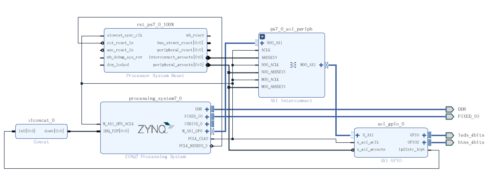
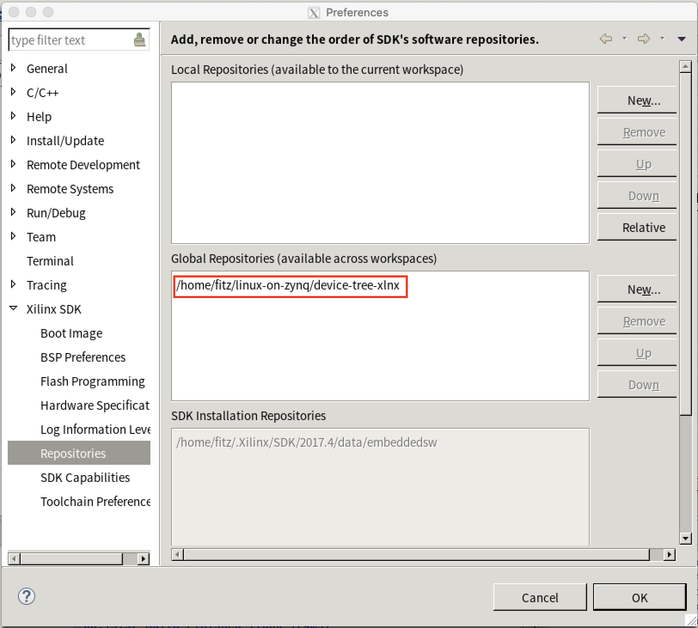
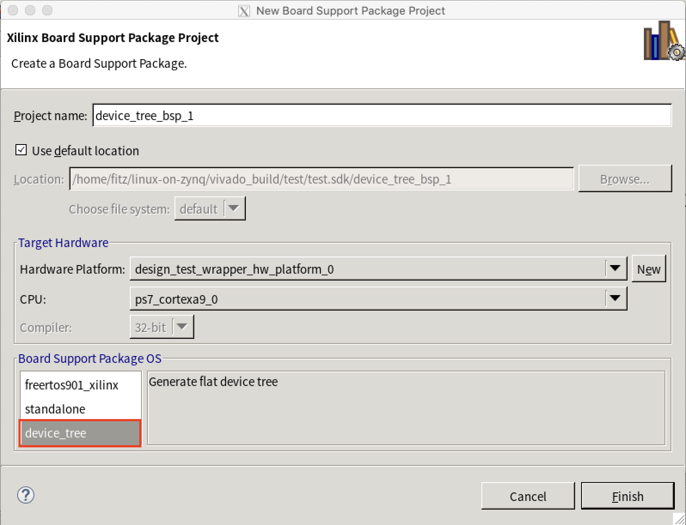
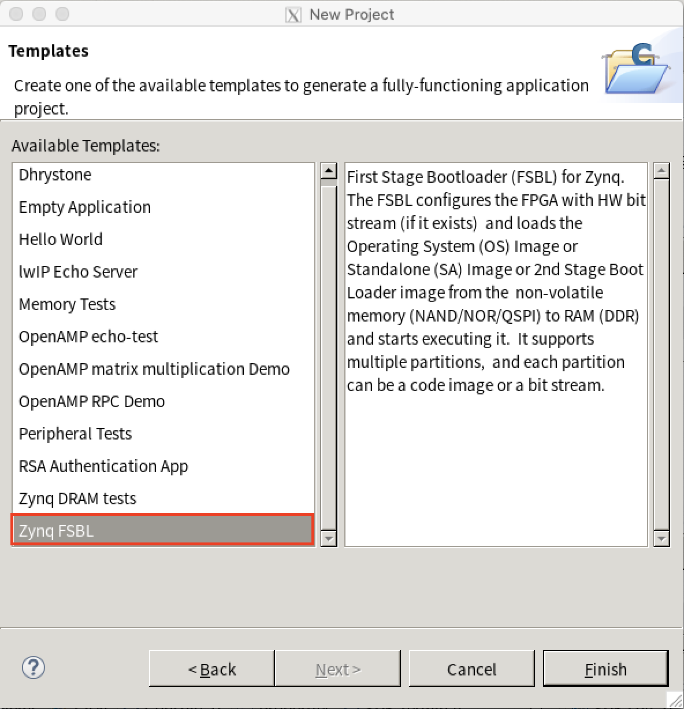
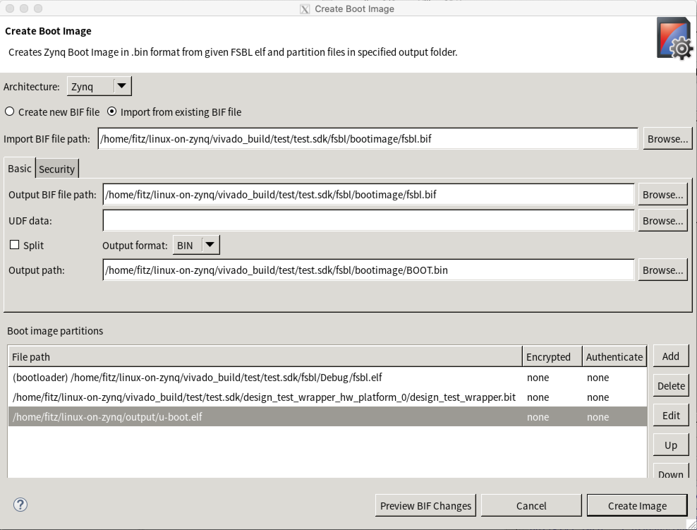

使用传统方式在 ZYNQ 上移植 Linux。

> reference: https://xilinx-wiki.atlassian.net/wiki/spaces/A/pages/18841738/Getting+Started
>
> 硬件平台: [PYNQ-Z2](http://www.tul.com.tw/ProductsPYNQ-Z2.html)
>
> Vivado版本: 2017.4

<!--more-->

# Vivado 工程创建

创建一个 zynq 的 vivado 工程，最小系统就行了，blockdesign 如图：

这里添加了一个 AXI-GPIO，是为了后面练习驱动。

生成 bitstream 后，导出到 sdk。

# 下载需要的资源

|      | **Repository Name**                                | **Content**                                                  |
| ---- | -------------------------------------------------- | ------------------------------------------------------------ |
| 1    | https://github.com/Xilinx/linux-xlnx.git           | The Linux kernel with Xilinx patches and drivers             |
| 2    | https://github.com/Xilinx/u-boot-xlnx.git          | The u-boot bootloader with Xilinx patches and drivers        |
| 3    | https://github.com/Xilinx/device-tree-xlnx.git     | Device Tree generator plugin for xsdk                        |
| 4    | https://git.kernel.org/pub/scm/utils/dtc/dtc.git   | Device Tree compiler (required to build U-Boot)              |
| 5    | https://github.com/Xilinx/arm-trusted-firmware.git | ARM Trusted Firmware (required for Zynq UltraScale+ MPSoC and Versal platforms) |
| 6    | https://github.com/Xilinx/xen.git                  | Xilinx Xen branch for Zynq UltraScale+ and Versal platforms  |
| 7    | https://github.com/Xilinx/embeddedsw.git           | Xilinx embeddedsw repository for bare-metal applications such as FSBL, PMU Firmware, PLM |

# 配置环境

## Build Device Tree Compiler (dtc)

> Tools Required: vivado sdk
>
> Source Required: [Device Tree compiler](https://git.kernel.org/pub/scm/utils/dtc/dtc.git)

下载[Device Tree compiler](https://git.kernel.org/pub/scm/utils/dtc/dtc.git)，在目录 *dtc* 下运行：

~~~
make
~~~

会在当前目录生成 `dtc`，一个可执行文件，将其添加到 PATH 中：

~~~bash
export PATH=`pwd`:$PATH # 或者把 `pwd` 换为 <dtc> 目录
~~~

## 其他

~~~bash
# export PATH=/home/fitz/linux-on-zynq/linux-xlnx/scripts/dtc:$PATH
export PATH=/home/fitz/linux-on-zynq/dtc:$PATH
export PATH=/home/fitz/linux-on-zynq/u-boot-xlnx/tools:$PATH
export CROSS_COMPILE=arm-linux-gnueabihf-
export ARCH=arm
~~~

# 创建设备树文件

> Tools Required: vivado sdk
>
> Source Required: [device-tree-xlnx](https://github.com/Xilinx/device-tree-xlnx.git)

下载与 vivado 版本对应的 device-tree-xlnx

在 vivado sdk 中添加设备树插件：

SDK Menu: Xilinx > Repositories > New... (<device-tree-xlnx>) > OK

然后创建一个 BSP，选择 device_tree 模板：

生成的 .dts/.dtsi 在 */device_tree_bsp_0/ folder* 目录下，会使用到文件有：*system-top.dts, pcw.dtsi, pl.dtsi*

这几个文件在后面编译 u-boot 的时候会用到，在编译 u-boot 的时候同时生成 .dtb

# 编译 U-BOOT & 编译设备树

> Tools Required: vivado sdk
>
> Source Required: [u-boot-xlnx](https://github.com/Xilinx/device-tree-xlnx.git)

下载与 vivado 版本对应的 u-boot-xlnx，需要创建/修改 4 个文件：

1. *u-boot-xlnx/include/configs/zynq_pynqz2.h*（新建）

   ~~~c
   #ifndef __CONFIG_ZYNQ_PYNQZ2_H
   #define __CONFIG_ZYNQ_PYNQZ2_H
   
   #define CONFIG_ZYNQ_I2C0
   
   /* Define PYNQZ2 PS Clock Frequency to 50MHz */
   #define CONFIG_ZYNQ_PS_CLK_FREQ 50000000UL
   
   #include <configs/zynq-common.h>
   
   #endif /* __CONFIG_ZYNQ_PYNQZ2_H */
   ~~~

   这里面定义了 PS 时钟频率 50 MHz

2. *u-boot-xlnx/include/configs/zynq-common.h*（修改）

   将：

   ~~~C
       "sdboot=if mmcinfo; then " \
               "run uenvboot; " \
               "echo Copying Linux from SD to RAM... && " \
               "load mmc 0 ${kernel_load_address} ${kernel_image} && " \
               "load mmc 0 ${devicetree_load_address} ${devicetree_image} && " \
               "load mmc 0 ${ramdisk_load_address} ${ramdisk_image} && " \
               "bootm ${kernel_load_address} ${ramdisk_load_address} ${devicetree_load_address}; " \
           "fi\0" \
   ~~~

   改为：

   ~~~c
       "sdboot=if mmcinfo; then " \
               "run uenvboot; " \
               "echo Copying Linux from SD to RAM... && " \
               "load mmc 0 ${kernel_load_address} ${kernel_image} && " \
               "load mmc 0 ${devicetree_load_address} ${devicetree_image} && " \
               "bootm ${kernel_load_address} - ${devicetree_load_address}; " \
           "fi\0" \
   ~~~

   修改 sboot 这段，这段表示从 SD 卡启动时，文件加载的情况，我们将文件系统放在了 SD 卡的第二个分区，因此不需要 load ramdisk，这里的 `-` 号，左右都要有空格，意思是替代的地址，那么就要把 `-` 作为 `${ramdisk_load_address}` 的替代，告诉 u-boot 和内核没有文件系统，启动的时候就不会加载它。

3. *u-boot-xlnx/configs/zynq_pynqz2_defconfig*

   *zynq_pynqz2_defconfig* 可以参考同目录下的 *u-boot-xlnx/configs/zynq_zybo_defconfig*，稍作修改：

   将：

   ~~~c
   CONFIG_ARM=y
   CONFIG_SYS_CONFIG_NAME="zynq_zybo"
   CONFIG_ARCH_ZYNQ=y
   CONFIG_SYS_TEXT_BASE=0x4000000
   CONFIG_DEFAULT_DEVICE_TREE="zynq-zybo"
   ~~~

   改为：

   ~~~c
   CONFIG_ARM=y
   CONFIG_SYS_CONFIG_NAME="zynq_pynqz2"
   CONFIG_ARCH_ZYNQ=y
   CONFIG_SYS_TEXT_BASE=0x4000000
   CONFIG_DEFAULT_DEVICE_TREE="zynq-pynqz2"
   ~~~

   在这里指定了 device tree，因此需要将前一个步骤中生成的 *system-top.dts, pcw.dtsi, pl.dtsi* 复制到 *u-boot-xlnx/arch/arm/dts/* 目录下，将 *system-top.dts* 改名为 *zynq-pynqz2.dts*

在完成这些后，就可以编译 u-boot 了，运行命令：

~~~bash
make distclean
make zynq_pynqz2_defconfig
make # 或者 make -j8
~~~

会在 *u-boot-xlnx/* 目录下生成 *u-boot* 文件，将其改名为 *u-boot.elf* 待用，更新一些版本的 vivado 可以直接生成 *u-boot.elf* 文件。

同时在 *arch/arm/dts/* 目录下生成 *zynq-pynqz2.dtb* 文件，即编译好的设备树文件，将其改名为 *devicetree.dtb* 待用。

> 设备树也可以单独编译，命令：
>
> ~~~bash
> dtc -I dts -O dtb -o devicetree.dtb system-top.dts
> ~~~
>
> *devicetree.dtb* 为生成的 dtb 文件名字/路径，*system-top.dts* 为待编译的设备树文件

# 创建 BOOT.bin

> Tools Required: vivado sdk

首先用 vivado sdk 生成 fsbl，即新建一个 `Application Project`，选择 `Zynq FSBL` 模板：

然后在这个 Project 上右击 > Create Boot Image

依次添加 *fsbl.elf, .bit, u-boot.elf*，其中的 *u-boot.elf* 是在上一个步骤中生成的，最后点击 `Create Image`，会在 *<vivado_project>/<vivado_project>.sdk/fsbl/bootimage/* 目录下生成 *BOOT.bin* 文件。

# 编译内核

> Tools Required: vivado sdk
>
> Source Required: [linux-xlnx](https://github.com/Xilinx/linux-xlnx.git)

在目录 *linux-xlnx* 下，运行命令：

~~~bash
make xilinx_zynq_defconfig
make -j8
make UIMAGE_LOADADDR=0x8000 uImage -j8
~~~

编译完成后，在目录 *linux-xlnx/arch/arm/boot/* 下生成未经压缩过的内核镜像 *uImage* 文件。

> 下载不同版本的 *linux-xlnx*，编译后可以得到不同内核版本

# 环境变量文件

创建一个名为 *uEnv.txt* 的文件，内容如下：

~~~
bootargs=console=ttyPS0,115200n8 root=/dev/mmcblk0p2 rw noinitrd earlyprintk rootfstype=ext4 rootwait devtmpfs.mount=0
~~~

这里面是系统启动时传给内核的参数，

`console=ttyPS0,115200n8` 表示控制台的串口号；

`root=/dev/mmcblk0p2 rw noinitrd rootfstype=ext4` 配合之前对 *u-boot-xlnx/include/configs/zynq-common.h* 的修改，实现了从 SD 的第二分区读取文件系统，该分区为 ext4 格式；

# 最后

> Source Required: [linaro 文件系统](https://releases.linaro.org/archive/12.09/ubuntu/precise-images/ubuntu-desktop/linaro-precise-ubuntu-desktop-20120923-436.tar.gz)

将 SD 分两个区，第一个区 200M，为 FAT32 格式，剩余容量给第二个分区，为 ext4 格式。

将前几步得到的 *BOOT.bin, devicetree.dtb, uImage, uEnv.txt* 拷贝到 SD 卡的 FAT32 分区中；

将下载的 [linaro 文件系统](https://releases.linaro.org/archive/12.09/ubuntu/precise-images/ubuntu-desktop/linaro-precise-ubuntu-desktop-20120923-436.tar.gz) 解压，将 *binary/boot/filesystem.dir* 目录下的文件拷贝到 ext4 分区中：

~~~bash
sudo rsync -a --progress ./ /media/fitz/sandisk
~~~

最后，将 SD 卡插回板子上，板子上的条线帽选择 SD 卡启动，打开电源，连上串口线，可以看到串口输出如下信息，表示启动成功：

~~~
U-Boot 2017.01-dirty (Mar 31 2020 - 17:21:17 +0800)

Model: Zynq pynq z2 Development Board
Board: Xilinx Zynq
I2C:   ready
DRAM:  ECC disabled 512 MiB
MMC:   sdhci@e0100000: 0 (SD)
SF: Detected s25fl128s_64k with page size 256 Bytes, erase size 64 KiB, total 16 MiB
*** Warning - bad CRC, using default environment

In:    serial@e0000000
Out:   serial@e0000000
Err:   serial@e0000000
Model: Zynq pynq z2 Development Board
Board: Xilinx Zynq
Net:   ZYNQ GEM: e000b000, phyaddr ffffffff, interface rgmii-id
eth0: ethernet@e000b000
reading uEnv.txt
119 bytes read in 8 ms (13.7 KiB/s)
Importing environment from SD ...
Hit any key to stop autoboot:  0
Device: sdhci@e0100000
Manufacturer ID: 3
OEM: 5344
Name: SC16G
Tran Speed: 50000000
Rd Block Len: 512
SD version 3.0
High Capacity: Yes
Capacity: 14.8 GiB
Bus Width: 4-bit
Erase Group Size: 512 Bytes
reading uEnv.txt
119 bytes read in 8 ms (13.7 KiB/s)
Loaded environment from uEnv.txt
Importing environment from SD ...
Copying Linux from SD to RAM...
reading uImage
3745912 bytes read in 325 ms (11 MiB/s)
reading devicetree.dtb
9958 bytes read in 14 ms (694.3 KiB/s)
## Booting kernel from Legacy Image at 02080000 ...
   Image Name:   Linux-4.9.0-xilinx
   Image Type:   ARM Linux Kernel Image (uncompressed)
   Data Size:    3745848 Bytes = 3.6 MiB
   Load Address: 00008000
   Entry Point:  00008000
   Verifying Checksum ... OK
## Flattened Device Tree blob at 02000000
   Booting using the fdt blob at 0x2000000
   Loading Kernel Image ... OK
   Loading Device Tree to 1eb1e000, end 1eb236e5 ... OK

Starting kernel ...

...

Last login: Thu Jan  1 00:00:06 UTC 1970 on tty1
cat: /var/lib/update-notifier/fsck-at-reboot: No such file or directory
run-parts: /etc/update-motd.d/98-fsck-at-reboot exited with return code 1
Welcome to Linaro 12.09 (GNU/Linux 5.4.0-xilinx-28096-gef412ed37999 armv7l)

 * Documentation:  https://wiki.linaro.org/
root@linaro-ubuntu-desktop:~#
~~~

# 坑

1. 在 build device tree 时，报错：

   ~~~
   devicetree.dtb: Warning (unit_address_vs_reg): Node /memory has a reg or ranges property, but no unit name
   ~~~

   解决办法：

   1. ~~dtc 版本与 vivado sdk 版本不对应，换成对应版本的 dtc 就行~~
   
   2. 修改 *system-top.dts* 中的 `memory`：
   
      将：

      ~~~
      memory {
      device_type = "memory";
      reg = <0x0 0x20000000>;
      };
      ~~~

      改为：
      
      ~~~
      memory@0 {
      device_type = "memory";
      reg = <0x0 0x20000000>;
      };
      ~~~

2. Linux 启动时内存分配失败：

   启动时串口输出类似信息：

   ~~~
   U-Boot 2017.01-dirty (Mar 31 2020 - 17:21:17 +0800)
   
   Model: Zynq pynq z2 Development Board
   Board: Xilinx Zynq
   I2C:   ready
   DRAM:  ECC disabled 0 MiB
   MMC:   sdhci@e0100000: 0 (SD)
   SF: Detected s25fl128s_64k with page size 256 Bytes, erase size 64 KiB, total 16 MiB
   ~~~

   可以看到 DRAM 为 0，应该是修改 *u-boot-xlnx/include/configs/zynq-common.h* 或 *u-boot-xlnx/include/configs/zynq_pynqz2.h* 的问题，DRAM 的大小应该在设备树文件里面的 `memory` 定义，不要在 *zynq-common.h* 里面用 `#define CONFIG_SYS_SDRAM_SIZE (512 * 1024 * 1024)` 定义。

