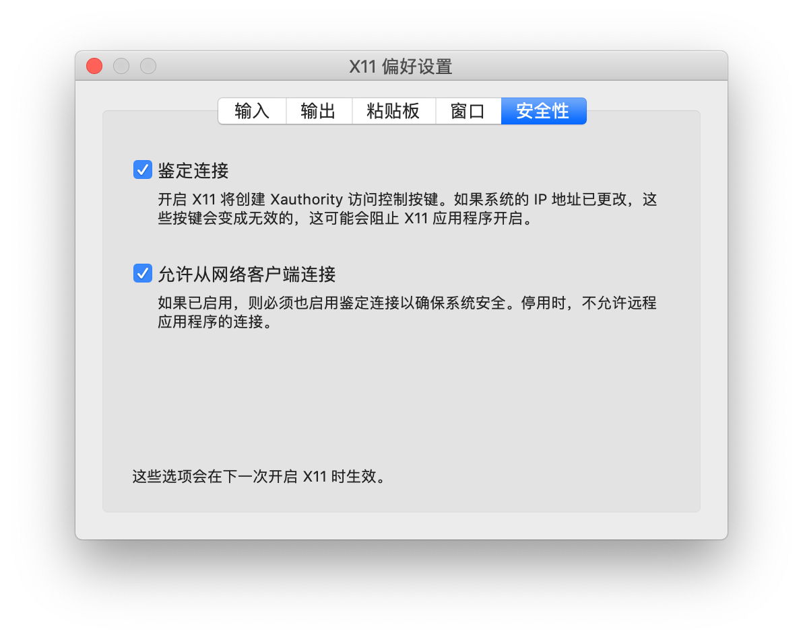
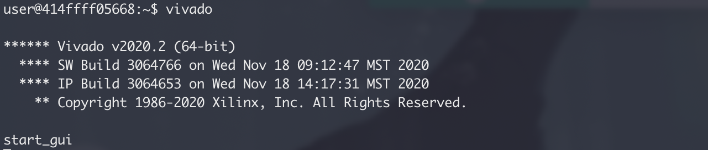

最近台式机崩了，只能使用使用笔记本了（macOS 系统）。因为要用到 vivado，想着装个虚拟机，发现了这篇[文章](https://blog.myon.info/entry/2018/09/15/install-xilinx-tools-into-docker-container/)，原来 docker 也可以使用图形化界面，于是选择了将 vivado 安装到 docker 中，避免虚拟机的臃肿。~~从此，vivado 成为了全平台软件，macOS 终于站起来了。~~🤪

<!--more-->

本次安装使用的 vivado 安装包是 *Xilinx_Unified_2020.2_1118_1232.tar.gz*，需要自行去 [Xilinx 官网](https://www.xilinx.com/support/download.html)下载，其他的文件已经上传到 [github](https://github.com/Starrynightzyq/MyDocker.git)。

# 准备

在 Docker 中安装软件，用 Dockerfile 的方式，需要使用命令行的方式来安装软件，vivado 可以使用命令行的方式安装，安装的设置使用配置文件来实现。

下载 vivado 的安装包，然后解压，然后运行：

~~~bash
(host)$ docker container run --rm -it -v </path/to/Xilinx_Vivado>:/vivado -w /vivado ubuntu:xenial /bin/bash
root@187602ac180d:/vivado# ./xsetup -b ConfigGen
Running in batch mode...
Copyright (c) 1986-2021 Xilinx, Inc.  All rights reserved.

INFO : Log file location - /root/.Xilinx/xinstall/xinstall_1622527035477.log
Select a Product from the list:
1. Vitis
2. Vivado
3. On-Premises Install for Cloud Deployments (Linux only)
4. BootGen
5. Lab Edition
6. Hardware Server
7. PetaLinux (Linux only)
8. Documentation Navigator (Standalone)

Please choose: 2

Select an Edition from the list:
1. Vivado HL WebPACK
2. Vivado HL Design Edition
3. Vivado HL System Edition

Please choose: 3

INFO : Config file available at /root/.Xilinx/install_config.txt. Please use -c <filename> to point to this install configuration.
~~~

这时生成了 vivado 安装的配置文件，将其从 docker 中拷贝出来，执行如下命令：

~~~bash
root@187602ac180d:/vivado# cp /root/.Xilinx/install_config.txt ./
~~~

退出容器后，将 *install_config.txt* 拷贝到合适的位置，再作修改：

~~~
#### Vivado HL System Edition Install Configuration ####
Edition=Vivado HL System Edition

Product=Vivado

# Path where Xilinx software will be installed.
Destination=/opt/Xilinx

# Choose the Products/Devices the you would like to install.
Modules=Zynq UltraScale+ MPSoC:0,Versal AI Core Series ES1:0,Versal Prime Series:0,DocNav:1,System Generator:0,Virtex UltraScale+ HBM:0,Virtex UltraScale+ 58G:0,Virtex UltraScale+ 58G ES:0,Kintex-7:0,Virtex UltraScale+:0,Zynq-7000:1,Versal AI Core Series:0,Kintex UltraScale+:0,Model Composer and System Generator:0,Spartan-7:0,Kintex UltraScale:0,Virtex UltraScale:0,Engineering Sample Devices:0,Zynq UltraScale+ RFSoC:0,Virtex-7:0,Versal Prime Series ES1:0,Artix-7:0,Virtex UltraScale+ HBM ES:0,Zynq UltraScale+ RFSoC ES:0

# Choose the post install scripts you'd like to run as part of the finalization step. Please note that some of these scripts may require user interaction during runtime.
InstallOptions=Acquire or Manage a License Key:0,Enable WebTalk for Vivado to send usage statistics to Xilinx (Always enabled for WebPACK license):1

## Shortcuts and File associations ##
# Choose whether Start menu/Application menu shortcuts will be created or not.
CreateProgramGroupShortcuts=1

# Choose the name of the Start menu/Application menu shortcut. This setting will be ignored if you choose NOT to create shortcuts.
ProgramGroupFolder=Xilinx Design Tools

# Choose whether shortcuts will be created for All users or just the Current user. Shortcuts can be created for all users only if you run the installer as administrator.
CreateShortcutsForAllUsers=0

# Choose whether shortcuts will be created on the desktop or not.
CreateDesktopShortcuts=1

# Choose whether file associations will be created or not.
CreateFileAssociation=1

# Choose whether disk usage will be optimized (reduced) after installation
EnableDiskUsageOptimization=1
~~~

# 创建 Docker 镜像

## ubuntu-xorg

第一个 `ubuntu-xorg` 的 `Dockerfile` 是这样的：

~~~dockerfile
FROM ubuntu:xenial

ENV DEBIAN_FRONTEND noninteractive

RUN \
  sed -i 's/archive.ubuntu.com/mirrors.ustc.edu.cn/g' /etc/apt/sources.list && \
  apt update && \
  apt upgrade -y && \
  apt -y --no-install-recommends install \
    ca-certificates curl sudo xorg dbus dbus-x11 ubuntu-gnome-default-settings gtk2-engines \
    ttf-ubuntu-font-family fonts-ubuntu-font-family-console fonts-droid-fallback lxappearance && \
  apt-get autoclean && \
  apt-get autoremove && \
  rm -rf /var/lib/apt/lists/* && \
  echo "%sudo ALL=(ALL) NOPASSWD: ALL" >> /etc/sudoers

ARG gosu_version=1.10
RUN \
  curl -SL "https://github.com/tianon/gosu/releases/download/${gosu_version}/gosu-$(dpkg --print-architecture)" \
    -o /usr/local/bin/gosu && \
  curl -SL "https://github.com/tianon/gosu/releases/download/${gosu_version}/gosu-$(dpkg --print-architecture).asc" \
    -o /usr/local/bin/gosu.asc && \
  gpg --keyserver ha.pool.sks-keyservers.net --recv-keys B42F6819007F00F88E364FD4036A9C25BF357DD4 && \
  gpg --verify /usr/local/bin/gosu.asc && \
  rm -rf /usr/local/bin/gosu.asc /root/.gnupg && \
  chmod +x /usr/local/bin/gosu
~~~

然后创建这个镜像：

~~~bash
$ docker image build --rm --no-cache --pull -t ubuntu-xorg .
~~~

> - **--rm :** 设置镜像成功后删除中间容器；
> - **--no-cache : **创建镜像的过程不使用缓存；
> - **--pull :** 尝试去更新镜像的新版本；
> - **--tag,  -t :** 镜像的名字及标签，通常 name:tag 或者 name 格式；可以在一次构建中为一个镜像设置多个标签。

## ubuntu-vivado

第二个镜像 `ubuntu-vivado` 的 `Dockerfile` 是这样的：

~~~dockerfile
FROM ubuntu-xorg

RUN \
  dpkg --add-architecture i386 && \
  apt update && \
  apt -y --no-install-recommends install \
    build-essential git gcc-multilib libc6-dev:i386 ocl-icd-opencl-dev libjpeg62-dev && \
  apt-get install -y vim && \
  apt-get autoclean && \
  apt-get autoremove && \
  rm -rf /var/lib/apt/lists/*

COPY install_config.txt /vivado-installer/
COPY Vivado_license_to2037.lic /vivado-installer/

ARG VIVADO_TAR_URI=http://host.docker.internal/Xilinx_Unified_2020.2_1118_1232.tar.gz
RUN \
  curl ${VIVADO_TAR_URI} | tar zx --strip-components=1 -C /vivado-installer && \
  /vivado-installer/xsetup \
    --agree 3rdPartyEULA,WebTalkTerms,XilinxEULA \
    --batch Install \
    --config /vivado-installer/install_config.txt && \
  echo "source /opt/Xilinx/Vivado/2020.2/.settings64-Vivado.sh" >> /etc/bash.bashrc && \
  mkdir -p /work/.Xilinx && \
  cp /vivado-installer/Vivado_license_to2037.lic /work/.Xilinx/Vivado_license_to2037.lic && \
  rm -rf /vivado-installer

ADD pynq-z2.tar.gz /opt/Xilinx/Vivado/2020.2/data/boards/board_files/

COPY entrypoint.sh /usr/local/bin/entrypoint.sh
RUN chmod +x /usr/local/bin/entrypoint.sh
ENTRYPOINT ["/usr/local/bin/entrypoint.sh"]

CMD ["/bin/bash", "-l"]
~~~

> 这里使用 `http://host.docker.internal` 来访问宿主机，这种用法似乎只在 windows 和 macOS 版的 docker 上可以用，linux 要换种方法。

这里使用 curl 来获取 vivado 安装包，避免了生成的镜像过大的问题（其实安装的时候还是需要很大空间，安装后的镜像有快 43G 了，安装过程中还有解压后的安装包，因此最好将 Disk image size 设置为大于 100G，否则可能会因为空间不足而安装失败），因此需要在本地搭建一个文件服务器，来提供 vivado 安装包。

在含有 vivado 安装包的目录下运行如下命令：

~~~bash
python3 -m http.server 80
~~~

> Dockerfile 中，vivado安装包的路径是 `http://host.docker.internal/Xilinx_Unified_2020.2_1118_1232.tar.gz`，在宿主机中应该可以通过 `http://127.0.0.1/Xilinx_Unified_2020.2_1118_1232.tar.gz` 访问到 vivado 的安装包，路径不对的可以改一下。

在运行 docker bulid 之前，先要确保在含有 `Dockerfile` 的文件夹下有这些文件：

~~~bash
$ ls
Dockerfile                Vivado_license_to2037.lic entrypoint.sh             install_config.txt        pynq-z2.tar.gz
~~~

> **install_config.txt** 是第一步生成的 vivado 安装配置文件；
>
> **pynq-z2.tar.gz** 是板卡文件，可以换成别的板卡文件，不过需要修改一下 Dockerfile；
>
> **Vivado_license_to2037.lic** 是 license，~~不要也没关系，反正还没找到用命令行安装 license 的方法~~，会安装到 */work/.Xilinx/* 目录下；
>
> **entrypoint.sh** 是一个把宿主机用户和容器内用户的 UID 组合在一起的脚本，内容如下：
>
> ~~~shell
> #!/bin/bash
> 
> UART_GROUP_ID=${UART_GROUP_ID:-20}
> if ! grep -q "x:${UART_GROUP_ID}:" /etc/group; then
>   groupadd -g "$UART_GROUP_ID" uart
> fi
> UART_GROUP=$(grep -Po "^\\w+(?=:x:${UART_GROUP_ID}:)" /etc/group)
> 
> if [[ -n "$USER_ID" ]]; then
>   useradd -s /bin/bash -u "$USER_ID" -o -d "$PWD" user
>   usermod -aG sudo user
>   usermod -aG "$UART_GROUP" user
>   chown user $(tty)
>   exec /usr/local/bin/gosu user "$@"
> else
>   exec "$@"
> fi
> ~~~

然后含有 `Dockerfile` 的目录下运行：

~~~bash
docker image build --rm --no-cache -t ubuntu-vivado .
~~~

# 使用已安装的 Vivado

## ~~在容器中创建一个工作用户~~

~~~bash
docke container run -it --rm -e USER_ID=$UID -v <localhost/vivado/workspace>:/work -w /work ubuntu-vivado
~~~

这一步只是演示如何以非 root 用户启动 docker 容器。

## 在 Docker 中调用 X11

> 在 MAC 上需要先安装 XQuartz 在转发 X11，可以使用 brew 安装：
>
> ~~~bash
> brew install --cask xquartz
> ~~~
>
> 安装完需要重启电脑，并且在 XQuartz 的设置里勾选上 *安全性--允许从网络连接*
>
> 

首先，允许工作用户使用以下命令在本地请求 X11：

~~~bash
$ xhost +si:localuser:$(whoami)
# or
$ xhost +
~~~

接下来，使用以下选项启动 Docker 容器：

~~~bash
$ docker container run -it --rm \
    -e USER_ID=$UID \
    -e DISPLAY \
    -v /tmp/.X11-unix:/tmp/.X11-unix:ro \
    -v <localhost/vivado/workspace>:/work \
    -w /work \
    ubuntu-vivado
~~~

> 上面的命令在 MAC 中使用的时候会提示无权限使用 X11，将 `-e DISPLAY` 换成了 `-e DISPLAY=host.docker.internal:0` 就可以运行了。
>
> ~~~bash
> docker container run -it --rm \
>  -e USER_ID=$UID \
>  -e DISPLAY=host.docker.internal:0 \
>  -v /tmp/.X11-unix:/tmp/.X11-unix:ro \
>  -v $PWD:/work \
>  -w /work \
>  ubuntu-vivado
> ~~~

> - **-i:** 以交互模式运行容器，通常与 -t 同时使用；
> - **-t:** 为容器重新分配一个伪输入终端，通常与 -i 同时使用；
> - **--volume , -v:** 绑定一个卷；
> - **-w, --workdir= :** Working directory inside the container；
> - **-e, --env=[] :** Set environment variables(设置环境变量) ；
> - **--rm=false** Automatically remove the container when it exits；

这时，在终端里输入 `vivado`，就可以打开 vivado 了：

# Reference

[1] [Xilinx の開発ツールを Docker コンテナに閉じ込める](https://blog.myon.info/entry/2018/09/15/install-xilinx-tools-into-docker-container/)

