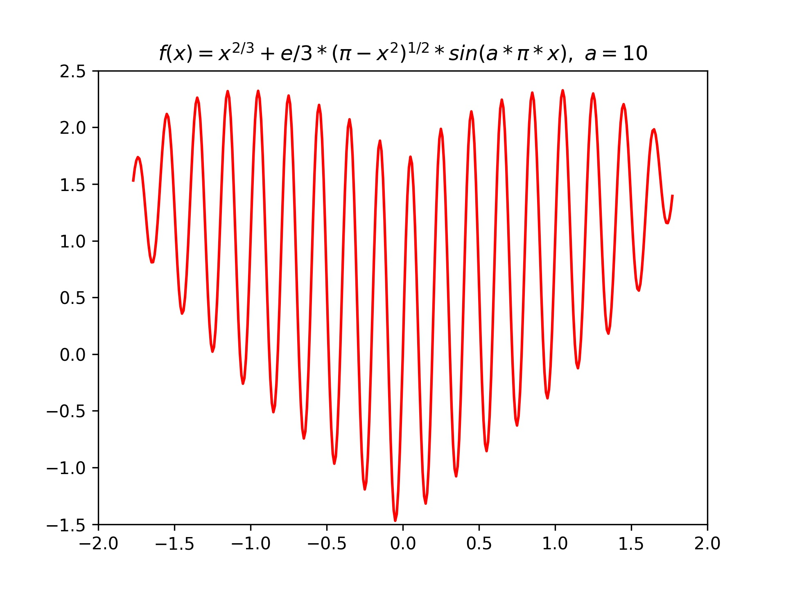
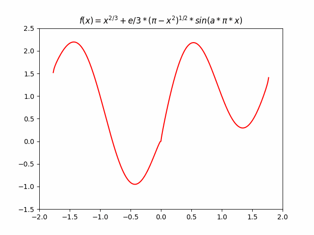

<!--more-->

> 灵感来自：https://mp.weixin.qq.com/s/ZozqC8chJPQP84gcpju4mQ

原作者用 MATLAB 和 Verilog 实现了心形图案，由于手上电脑没有装可以运行 MATLAB 或者 Verilog 的软件，因此我用 Python 写了一个，最重要的是这个公式：$f(x) = x^{2/3}+e/3*(\pi-x^2)^{1/2}*sin(a*\pi*x)$，代码如下：

~~~python
import matplotlib.pyplot as plt
import matplotlib.animation as animation
import numpy as np

def love_line(x, a, w):
    y = np.power(np.abs(x), 2/3) + np.exp(1)/3 * np.sqrt(np.pi - np.square(x)) * np.sin(a*np.pi*x)
    return w*y

if __name__ == "__main__":
    # draw multiple pictures
    x = np.arange(-2, 2, 0.01)
    num_start = 1
    num_end = 20
    loop = np.arange(num_start,num_end,1)
    loop = np.hstack((loop,[num_end],loop[::-1]))

    fig = plt.figure()
    ims = []

    plt.title(r"$f(x) = x^{2/3}+e/3*(\pi-x^2)^{1/2}*sin(a*\pi*x)$")
    plt.axis([-2, 2, -1.5, 2.5])

    for i in loop:
        y = love_line(x, i, 1.0)
        im = plt.plot(x, y, color="r")
        ims.append(im)

    ani = animation.ArtistAnimation(fig, ims, interval=200)
    ani.save("love.gif", writer='pillow')
    plt.close()

    # draw single picture
    x = np.arange(-2, 2, 0.01)
    y = love_line(x, 10, 1.0)
    plt.clf
    plt.plot(x, y, color="r")
    plt.axis([-2, 2, -1.5, 2.5])
    plt.title(r"$f(x) = x^{2/3}+e/3*(\pi-x^2)^{1/2}*sin(a*\pi*x),\ a = 10$")
    plt.savefig('./love.jpg', dpi=300)
    plt.show()
    plt.close()
~~~

**GIF版：**

