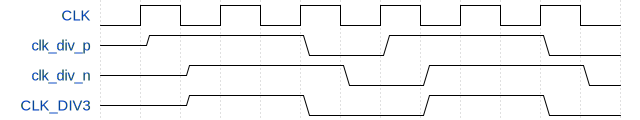
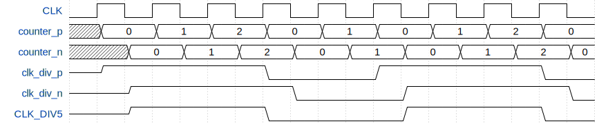
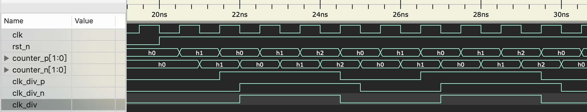

在做 FPGA 设计时，需要不同频率的时钟，通常会使用 Xilinx 提供 MMCM/PLL 时钟 IP 分频或者倍频得到。偶数分频很简单，只需要用一个以 分频数/2 为最大值的计数器控制输出时钟翻转即可。但奇数分频不能用这种方法来实现，以 3 分频为例，其每个周期的高电平时间占原始时钟的 1.5 个周期，计数器无法计数 0.5 个时钟周期。

<!--more-->

但是换个角度来看，3 分频的波形其高电平占了 3 个 $\frac{1}{2}$ 的时钟周期，是否可以设计一种触发器，让其在时钟的上升沿和下降沿都触发，这样的计数器就可以计数半个时钟周期了。不过在 FPGA 中，这种触发器是不存在的，不过可以用一个上升沿触发的触发器和一个下降沿触发的触发器组合来达到这样的效果。

如上图所示，两个脉冲 `clk_div_p` 和 `clk_div_n` 分别在时钟的上升沿和下降沿变化，都是高电平占两个时钟周期，低电平占一个时钟周期，将两者做**与**运算，就得到了 3 分频时钟信号。

同样的，可以推断出 5 分频的时序图：

高电平时间占 3 个时钟周期，低电平时间占 2 个时钟周期。

为此，可以推断出，在这种结构下，任意奇数分频数 $N(N \geq 3)$，则 `clk_div_[p/n]` 高电平时间为 $N/2 + 0.5$，低电平时间为 $N/2-0.5$。

---

代码如下：

**divider.v**

~~~verilog
module divider #(
    parameter DIV_P = 2
    )(
    input clk,
    input rst_n,
    output clk_div);

    parameter DIV_N = DIV_P-1;
    parameter DIV_W = $clog2(DIV_P);

    reg [DIV_W-1:0] counter_p;
    reg [DIV_W-1:0] counter_n;
    reg clk_div_p;
    reg clk_div_n;

    always @(posedge clk or negedge rst_n) begin
        if(!rst_n) begin
            counter_p <= 'b0;
        end else if (clk_div_p) begin
            if (counter_p == DIV_P-1) begin  
                counter_p <= 'b0;
            end else begin
                counter_p <= counter_p + 1'b1;
            end
        end else begin
            if (counter_p == DIV_N-1) begin  
                counter_p <= 'b0;
            end else begin
                counter_p <= counter_p + 1'b1;
            end
        end
    end

    always @(negedge clk or negedge rst_n) begin
        if(!rst_n) begin
            counter_n <= 'b0;
        end else if (clk_div_n) begin
            if (counter_n == DIV_P-1) begin  
                counter_n <= 'b0;
            end else begin
                counter_n <= counter_n + 1'b1;
            end
        end else begin
            if (counter_n == DIV_N-1) begin  
                counter_n <= 'b0;
            end else begin
                counter_n <= counter_n + 1'b1;
            end
        end
    end

    always @(posedge clk or negedge rst_n) begin
        if(!rst_n) begin
            clk_div_p <= 1'b0;
        end else if (clk_div_p) begin
            if (counter_p == DIV_P-1) begin
                clk_div_p <= 1'b0;
            end
        end else begin
            if (counter_p == DIV_N-1) begin
                clk_div_p <= 1'b1;
            end
        end
    end

    always @(negedge clk or negedge rst_n) begin
        if(!rst_n) begin
            clk_div_n <= 1'b0;
        end else if (clk_div_n) begin
            if (counter_n == DIV_P-1) begin  
                clk_div_n <= 1'b0;
            end
        end else begin
            if (counter_n == DIV_N-1) begin  
                clk_div_n <= 1'b1;
            end
        end
    end

    assign clk_div = clk_div_p && clk_div_n;

endmodule
~~~

**tb_divider.sv**

~~~verilog
`timescale 1ns/1ps
`include "divider.v"

module tb_divider ();

    logic rst_n;
    logic srst;
    logic clk;

    // clock
    initial begin
        clk = '0;
        forever #(0.5) clk = ~clk;
    end

    // reset
    initial begin
        rst_n <= '0;
        srst <= '0;
        #20
        rst_n <= '1;
        repeat (5) @(posedge clk);
        srst <= '1;
        repeat (1) @(posedge clk);
        srst <= '0;
    end

    // (*NOTE*) replace reset, clock, others

    parameter DIV_P   = 3; // (奇数分频数)/2 + 0.5, 5 分频则 3, (>= 2)

    logic  clk_div;

    divider #(
        .DIV_P(DIV_P)
    )
    inst_divider (
        .clk(clk), 
        .rst_n(rst_n), 
        .clk_div(clk_div));

    initial begin
        // do something

        repeat(100)@(posedge clk);
        $finish;
    end

    // dump wave
    initial begin
        $dumpfile("tb_divider.vcd");
        $dumpvars(0, tb_divider);
    end

endmodule
~~~

**5 分频仿真结果**

>Reference:
>
>[FPGA三分频,五分频,奇数分频](https://blog.csdn.net/lt66ds/article/details/10035187)
>
>[基于Verilog的偶数、奇数、半整数分频以及任意分频器设计](https://www.cnblogs.com/xiaoxie2014/p/4135078.html)