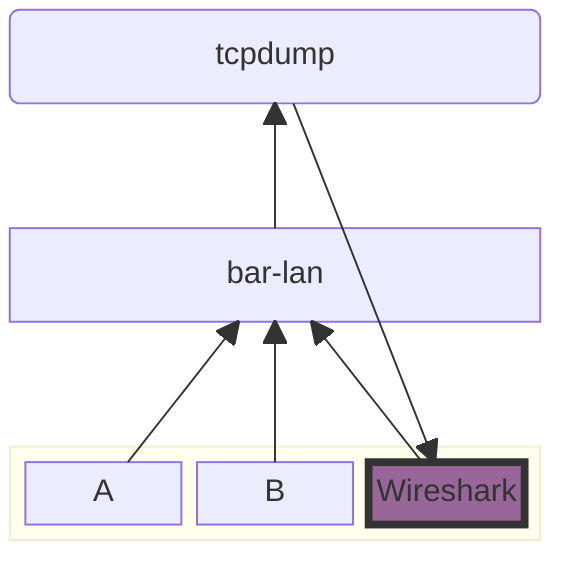

# 背景

如果需要对局域网中两个设备之间的通讯进行抓包调试，一种比较方便的方式就是在路由器上通过 tcpdump 抓包，然后传回电脑上，利用 Wireshark 查看抓包内容。

# 准备

1. PC上安装 Wireshark
   
   安装的时候需要勾选 “Sshdump and Ciscodump”

2. 路由器上安装 tcpdump

# 抓包

1. 打开 Wireshark，选择捕获——选项；
2. 选择 SSH remote capture，点击开始；
3. 输入路由器的ip地址和ssh端口号（默认22）；
4. 输入路由器用户名和密码/密钥；

# Reference

* [利用Wireshark和tcpdump对整个局域网进行实时抓包](https://jayant-tang.github.io/jayant97.github.io/2022/12/dad29a5a49fd/index.html)