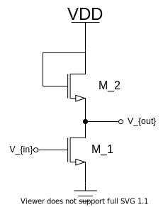
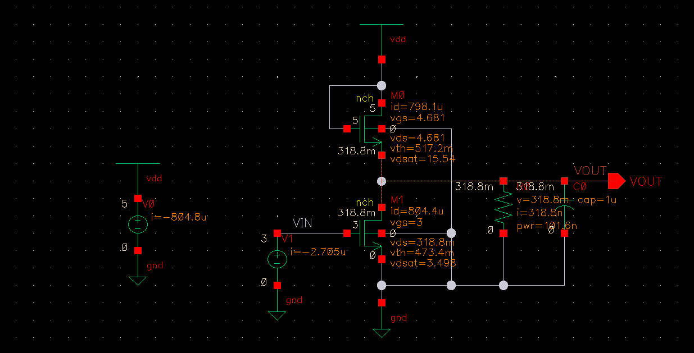
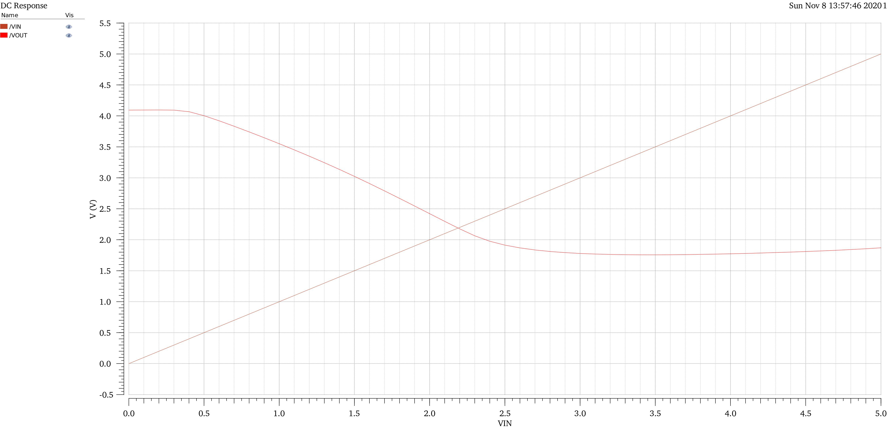
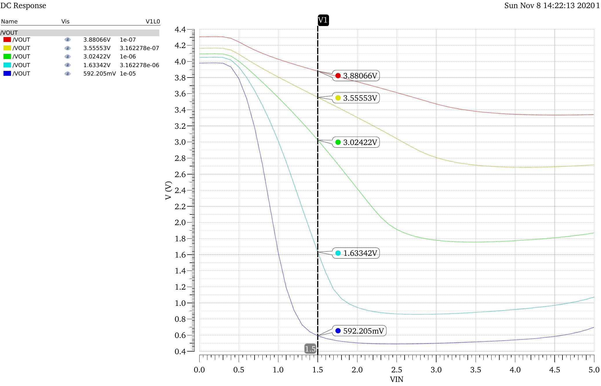
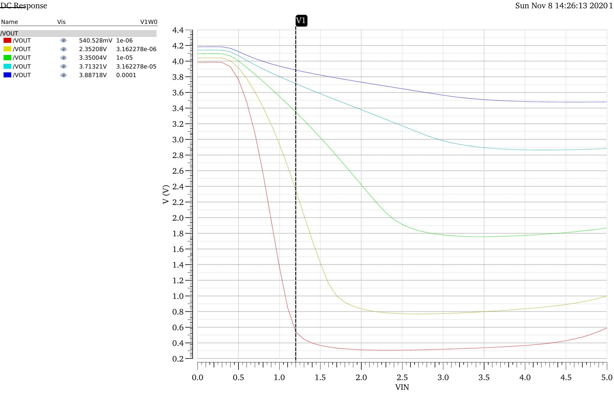
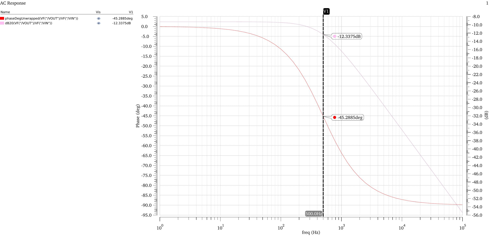
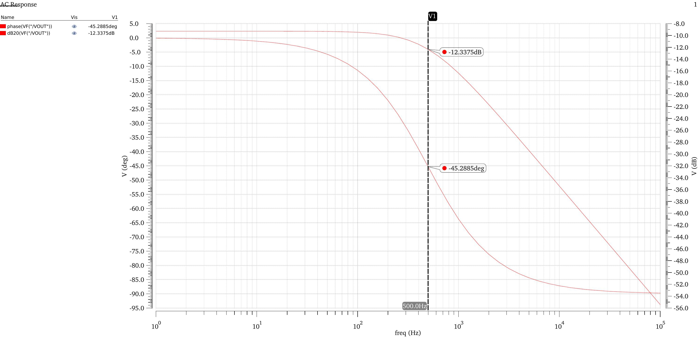

单级放大器可以分为四种基本类型：

- 共源结构；
- 共栅结构；
- 源级跟随器；
- 共源共栅结构；

<!--more-->

# 1. 电阻负载的共源级

借助 MOS 管的跨导，可以将栅源电压转化为小信号漏极电流，再通过电阻将电流转为电压。

    
     
    
图1.1 采用电阻负载的共源极

图1.1(a)是一个采用电阻负载的共源极放大器，首先分析其大信号特性：

如果输入电压从零开始增大，则 M1 工作状态会有这样的变化：截止区 -> 饱和区 -> 线性区。

当 $V_{in} < V_{TH} 时，$ M1 工作在截止区：
$$
V_{out} = V_{DD}
$$
当 $V_{in}$ 接近 $V_{TH}$ 时，M1 开始导通，电流流过 $R_D$，使 $V_{out}$ 减小，如果 $V_{DD}$ 不是特别小，则 M1 饱和导通：
$$
V_{out} = V_{DD} - R_D \frac{1}{2} \mu _n C_{ox} \frac{W}{L} (V_{in} - V_{TH}) ^2
$$
当 $V_{in}$ 继续增大，$V_{out}$ 继续下降，直到 $V_{out} = V_{in} - V_{TH}$ 时，M1 到达饱和区与线性区的临界状态：
$$
V_{in1} - V_{TH} = V_{out} = V_{DD} - R_D \frac{1}{2} \mu _n C_{ox} \frac{W}{L} (V_{in1} - V_{TH}) ^2
$$
当 $V_{in} > V_{in1}$ 时，M1 工作在线性区：
$$
V_{out}= V_{DD} - R_D \frac{1}{2} \mu _n C_{ox} \frac{W}{L} [ 2(V_{in1} - V_{TH}) V_{out} - V_{out} ^2 ]
$$
当 $V_{in}$ 继续增大，$V_{out} << 2(V_{in} - V_{TH})$ 时，M1 工作在深线性区，等效电路如图1.1(c)所示：
$$
V_{out} = V_{DD} \frac{R_{on}}{R_{on} + R_D} = \frac{V_{DD}}{1+\mu _n C_{ox} \frac{W}{L} R_D (V_{in} - V_{TH})}
$$
因此其输入输出特性曲线如图1.2所示。

    
     
    
图1.2 采用电阻负载的共源极

分析其小信号特性，当 $V_{out} > V_{in} - V_{TH}$ 时，即在图1.2 A 点左侧时，曲线的斜率可以看做小信号增益：
$$
\begin{split}
A_v = {}& \frac{\partial V_{out}}{\partial V_{in}} \\
= {}& - R_D \mu _n C_{ox} \frac{W}{L} (V_{in} - V_{TH}) \\
= {}& -g_m R_D
\end{split}
$$
由于 $g_m$ 会随输入 $V_{in}$ 变化，因此在大信号时，增益会发生较大的变化，该结构的增益线性度不好。

# 2. 二极管负载的共源极

## 电路分析

如图2.1(a)所示，将 MOS 管的删漏短接，该 MOS 管可以起一个小信号电阻的作用。

    
     
    
图2.1 Diode MOS

由于 $V_G = V_D$，因此该 MOS 管工作在饱和区，图2.1(b)为小信号等效电路，$V_1 = V_X$，$I_X = V_X/r_o + g_m V_X$，所以二极管的阻抗等于：
$$
r_{equ} = (1/g_m) || r_o \approx 1/g_m
$$
如果存在体效应，则如图2.1(c)和图2.1(d)的小信号等效电路，$V_1 = -V_X$，$V_{bs} = -V_X$，则：
$$
(g_m + g_{mb})V_X + \frac{V_X}{r_o} = I_X
$$
—>
$$
r_{eq} = \frac{V_X}{I_X} = \frac{1}{g_m+g_{mb}} || r_o \approx \frac{1}{g_m+g_{mb}}
$$

    
     
    
图2.2 采用二极管负载的共源极

分析二极管负载的共源极，如图2.2所示，忽略沟道长度调制效应，则：
$$
\begin{split}
A_v = {}& -g_{m1}\frac{1}{g_{m2}+g_{mb}} \\
={}& -\frac{g_{m1}}{g_{m2}} \frac{1}{1+\eta} \\
\\
\eta = {}& \frac{g_{mb2}}{g_{m2}}
\end{split}
$$

$$
A_v = -\frac{\sqrt{2\mu _n C_{ox} (W/L)_1 I_{D1}}}{\sqrt{2\mu _n C_{ox} (W/L)_2 I_{D2}}} \frac{1}{1+\eta}
$$

因为 $I_{D1} = I_{D2}$，则：
$$
A_v = -\frac{\sqrt{(W/L)_1}}{\sqrt{(W/L)_2}} \frac{1}{1+\eta}
$$
由等式可以看出，如果忽略 $1/{1+\eta}$ 随输出电压的变化，则只要 MOS 管工作在饱和区，增益和偏置电压电流没有关系。这表明输入输出特性呈线性。

## 仿真

    
     
    
图2.3 二极管负载的共源极schematic

- DC

| 器件   | 参数    | 值   |
| ---- | ---- | ---- |
| M0   | L    | 1u   |
| M0   | W    | 10u  |
| M1   | L    | 1u   |
| M2   | W    | 10u  |

  

      
       
      
图2.6 DC

  

- M0 L sweep

  M1 参数不变，M0 W 不变，L 从 0.1u - 10u

  

      
       
      
图2.7 L0 sweep

  

- M0 W sweep

  M1 参数不变，M0 L 不变，W 从 1u - 100u

  

      
       
      
图2.8 W0 sweep

  

- AC

  - Frequency-Gain

    

        
         
        
图2.9 频率-增益曲线

    

  - Frequency-Phase

    

        
         
        
图2.10 频率-相位曲线

    

# 3. 共栅极

> TODO

# 4. 共源共栅

> TODO

