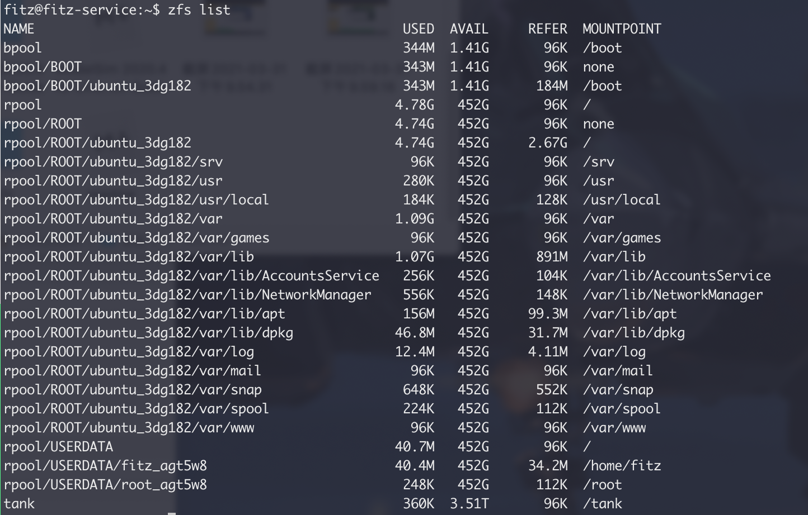
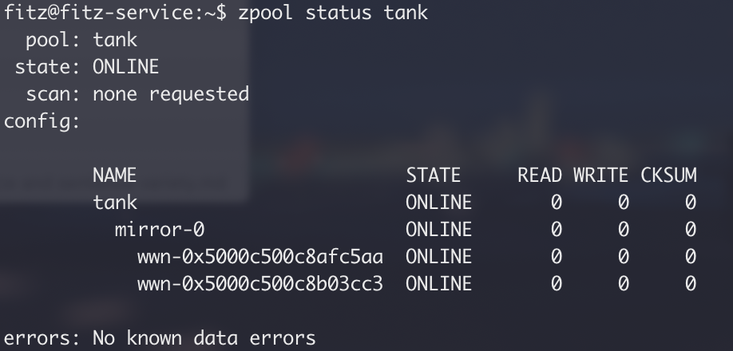
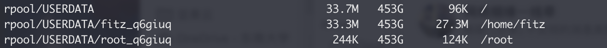
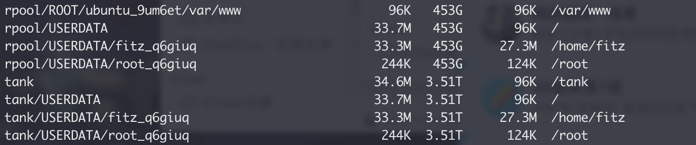

# 安装

> https://openzfs.github.io/openzfs-docs/Getting%20Started/Ubuntu/index.html#installation
>
> https://manpages.debian.org/unstable/zfsutils-linux/zfs-mount-generator.8.en.html

# 创建 zpool

先查看硬盘的 id

~~~bash
ls -al /dev/disk/by-id
~~~

创建了一个名为 tank 的新池，mirror格式

~~~bash
sudo zpool create tank mirror /dev/disk/by-id/xxxxxxx1 /dev/disk/by-id/xxxxxxx2
~~~

查看存储池列表

~~~
zfs list
~~~

查看存储池的状态信息

~~~bash
zpool status tank
~~~

## 其他命令：

显示 ZFS 存储池命令历史记录
`zpool history`

查看 ZFS 存储池的 I/O 统计信息
`zpool iostat`

销毁存储池
`zpool destroy zpoolname`

向存储池添加设备
`zpool add tank c2t1d0 #向存储池tank中添加设备`

## 数据压缩

数据压缩默认是关闭的，使用如下命令打开：

~~~bash
zfs set compression=lz4 tank
~~~

# ZFS 文件系统

## 创建文件系统

~~~bash
zfs create tank/home
sudo zfs create -o mountpoint=/home/EDA tank/EDA
~~~

在 tank 中创建了一个名为 home 的文件系统，如果新文件系统创建成功，则 ZFS 会自动挂载该文件系统。

## 销毁文件系统

~~~bash
zfs destroy tank/home # 销毁tank/home 文件系统
~~~

如果要销毁的文件系统处于繁忙状态而无法取消挂载，则 zfs destroy 命令将失败。要销毁活动文件系统，请使用 -f 选项。由于此选项可取消挂载、取消共享和销毁活动文件系统，从而导致意外的应用程序行为，因此请谨慎使用此选项。

## 重命名文件系统

~~~bash
zfs rename tank/test2 tank/testrename # 将文件系统 tank/test2 重命名为 /tankrename
~~~

## ~~~将 ZFS 文件系统挂载到 /home~~~

~~~bash
sudo rsync -avh /home/* /tank/home
sudo rm -rf /home
sudo zfs set mountpoint=/home tank/home
~~~

使用 zfs-mount-generator 工具

> https://manpages.ubuntu.com/manpages/focal/man8/zfs-mount-generator.8.html

## 迁移用户目录

用 `zfs list` 命令可以看到用户目录是在 `rpool/USERDATA` 下的：

我想把他们迁移到 HDD 硬盘的存储池 `tank` 里，直接修改挂载点的方法是不行的，新建一个用户后挂载点还会在原来的 `rpool/USERDATA` 下，在[此处](https://github.com/ubuntu/zsys/issues/132)找到了方法。

- create your pool2/USERDATA/ with the same dataset name than on the first pool
- ensure you have the same properties and **user properties** set on that dataset
- do a zfs send/recv between the 2 datasets
  Then, once ready, remove the second dataset.
- If you delete rpool/USERDATA, then the new users will be created under secondarypool/USERDATA!

1. 创建快照

   ~~~bash
   sudo zfs snapshot -r rpool/USERDATA@now
   ~~~

2. send/recv

   ~~~bash
   sudo zfs send -R rpool/USERDATA@now | sudo zfs receive -F tank/USERDATA
   ~~~

   这时可以看到 `tank/USERDATA` 和 `rpool/USERDATA` 的结构是相同的：

   

3. 删除原来的 `rpool/USERDATA`：

   ~~~
   sudo zfs destroy -r -f rpool/USERDATA
   ~~~

   这个时候可以会提示 `umount: /home/fitz: target is busy.`，因为我想在就是在这个用户下操作的，所以删不掉这个目录，不过 `rpool/USERDATA/root_*` 已经删掉了，因此此时退出当前用户，换 root 登录，再次执行上面的命令，就可以把 `rpool/USERDATA` 全删掉了。

   现在再新建一个用户，可以看到新用户的目录是在 `tank/USERDATA` 下的。

# 快照和克隆

> https://www.howtoing.com/how-to-use-snapshots-clones-and-replication-in-zfs-on-linux
>
> https://docs.oracle.com/cd/E26926_01/html/E25826/gbchp.html

# 自动快照

https://blog.vgot.net/archives/zfsnap.html

https://serverfault.com/questions/855895/how-to-set-the-number-of-snapshots-zfs-auto-snapshot-should-retain

http://knowledgebase.45drives.com/kb/setting-up-zfs-auto-snapshots-in-linux/

~~~bash
sudo apt-get install zfs-auto-snapshot
~~~

# ~~备份整个系统&恢复~~

> https://www.thegeekdiary.com/how-to-backup-and-restore-zfs-root-pool-in-solaris-10/

> Reference:
>
> https://wiki2.xbits.net:4430/storage:zfs:zfs%E6%89%8B%E5%86%8C#zfs_send_receive
>
> https://aws.amazon.com/cn/blogs/china/architecture-and-practice-of-shared-storage-system-based-on-zfs-for-eda-scenario/