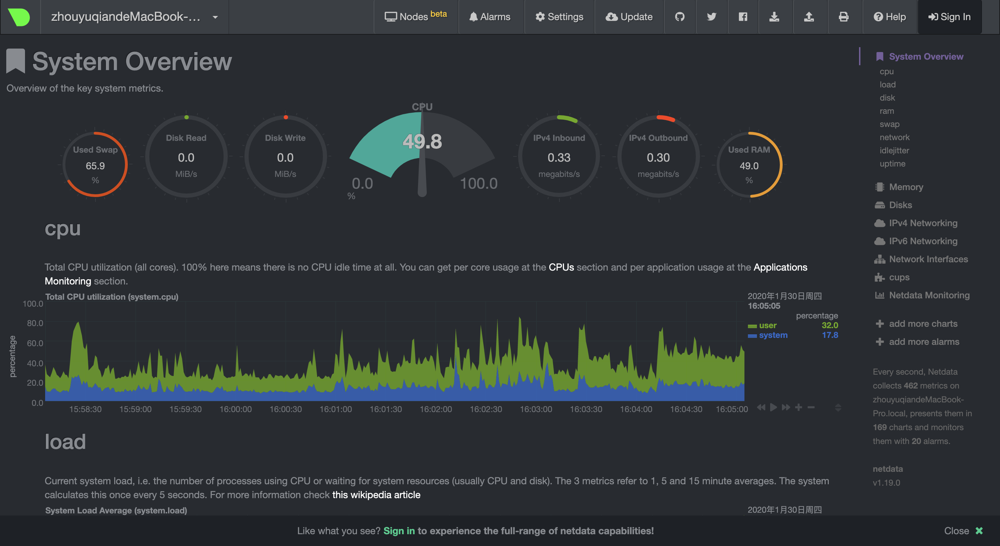

# 购买域名

域名购买于https://www.namesilo.com，可以用支付宝，比较方便。

# 内网穿透：frp

项目地址：https://github.com/fatedier/frp

之前用的是zerotier，优点是使用起来比较方便啦，不过就是有时会莫名其妙断连。

买了一个翻车讯的k3路由器，刷了openwrt后，可以用aria2下电影看啦。在VPS和k3上分别配好frp后，就可以远程连上k3，下载电影，回到家再看。

# 服务器监测：netdata

项目地址：https://github.com/netdata/netdata

之前用Ubuntu搭建NAS就想要一个web端的性能监测工具，终于找到了netdata这个工具。

默认暗黑主题，嘿嘿，太炫酷了。程序使用C编写，占用资源极低。并且安装方便，可以零配置使用。

顺手给我的Mac上也安装了一个。

# 宝塔面板

项目地址：https://github.com/aaPanel/BaoTa

安装很简单啦，一行命令搞定。具体的还是要看官方文档咯。

# 薅微软的羊毛，用OneDrive做共享云盘：OLAINDEX

项目地址：https://github.com/WangNingkai/OLAINDEX

> 占坑，还没装好

使用宝塔面板安装比较方便一些，参考[BT 面板安装 OLAINDEX 全方位指南](https://imwnk.cn/archives/bt-olaindex)。

# 下载神器：aria2

个人感觉用逗比的脚本比较方便哈，主要是更新BT-Tracker比较方便。

~~~bash
wget -N --no-check-certificate https://raw.githubusercontent.com/ToyoDAdoubiBackup/doubi/master/aria2.sh && chmod +x aria2.sh && bash aria2.sh
#备用地址
wget -N --no-check-certificate https://www.moerats.com/usr/shell/Aria2/aria2.sh && chmod +x aria2.sh && bash aria2.sh
~~~

安装完成后，如果想修改密码、下载文件位置、端口的话，可以使用命令`bash aria2.sh`，再选择修改配置即可，这里建议使用该脚本配置自动更新`BT-Tracker`服务器，对下载`BT`有加成。

# Aria2下载自动上传到Olaindex

参考：[使用Aria2+Aria2Ng+OneIndex+OneDrive建立不限流量/离线BT下载/在线观看网盘](https://www.moerats.com/archives/700/)

[一个好用的OneDrive网盘上传工具，支持文件和文件夹上传](https://www.moerats.com/archives/1006/)

自动上传脚本：

~~~bash
#!/bin/bash
downloadpath='/home/fitz_ali/aria2c/Download'   #修改成Aria2下载文件夹
folder='/Aria2'   #上传至网盘里的文件夹(自动创建)

if [ $2 -eq 0 ];then
    exit 0
fi
path=$3   #取原始路径
olaindex=`find /www/wwwroot -name artisan`   #OLAINDEX的artisan文件的绝对路径
while(true);do   #path被赋值为Aria2下载目录，filepath被赋值为下载文件的绝对路径或第一层目录
    filepath="$path"
    path="${path%/*}"
    if [ "$path" = "$downloadpath" ] && [ $2 -eq 1 ];then   #单文件
        php $olaindex od:upload "$filepath" "$folder/"   #上传
        rm -rf "$filepath" "$filepath.aria2" "$path/*.torrent"   #删除
        php $olaindex od:cache   #刷新
        exit 0
    elif [ "$path" = "$downloadpath" ];then   #文件夹
        cd "$filepath"
        for file in *;do   #第一层目录
            php $olaindex od:upload "$file" "$folder/${filepath##*/}"
            rm -rf "$file"
        done
        for file in */* */*/*;do   #第二、三层目录
            php $olaindex od:upload "$file" "$folder/${filepath##*/}/${file%/*}"
            rm -rf "$file"
        done
        rm -rf "$filepath" "$filepath.aria2" "$path/*.torrent"
        php $olaindex od:cache
        exit 0
    fi
done
~~~

# 个人媒体服务器：Jellyfin

参考：[一款开源免费且类似Emby的个人媒体服务器：Jellyfin安装教程](https://www.moerats.com/archives/859/)

https://www.jianshu.com/p/f8ac045d8ffa

端口：8096