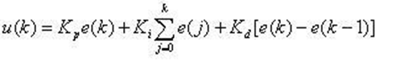
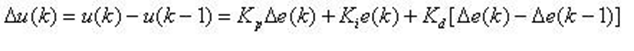
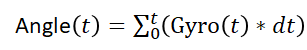

课设二的报告，一边做一边写吧！

<!--more-->

1. # 设计方案工作原理

   1. ## 系统总体介绍

      实现板球系统，在边长为65cm的正方形平板上均匀分布9个外径为3cm的圆形区域，设计一控制系统，通过控制平板的倾斜，使直 径不大于2.5cm的小球能够完成指定的动作： 

      - 平板上9个圆形区域中任意区域停留不少于5秒； 

      - 任意选定两个区域，从一个区域运动到另一个区域，并且在第二个区域停留不小于5秒； 

   2. ## 实现目标定位

      本次课设的主要目标如下：

      - 将前期在Basys3平台上的项目移植到PYNQ-Z2平台上，为系统的进一步拓展提供便利；
      - 优化系统的硬件结构；
      - 在PYNQ-Z2平台上学习并使用一款rtOS（ucOS），作为系统的软件控制部分；
      - 在ucOS上实现串级PID控制；

   3. ## 系统结构工作原理

      1. 系统框图：

         

         - 通过摄像头获取图像并且定位小球的位置；

         - 根据小球位置与目标位置之间的差值，控制舵机，使平板倾斜，从而让小球运动到目标位置；

      2. 串级PID原理：

         

         - 内环为角度环，对角度进行控制；
         - 外环为位置环，对位置进行控制。

      3. ucOS介绍：

         实时操作系统（RTOS）是指当外界事件或数据产生时，能够接受并以足够快的速度予以处理，其处理的结果又能在规定的时间之内来控制生产过程或对处理系统做出快速响应，调度一切可利用的资源完成实时任务，并控制所有实时任务协调一致运行的操作系统。

         常用的实时操作系统有VxWorks、QNX、ucos-III、Windows CE、FreeRTOS等。

         μcos-III是一个可以基于ROM运行的、可裁剪的、抢占式、实时多任务内核，具有高度可移植性，特别适合于微处理器和控制器，适合很多商业操作系统性能相当的实时操作系统(RTOS)。

         其特点是：公开源代码、可移植性、可固化、可裁剪、多任务、占先式。

         为了便于后期将本项目的控制算法移植到不同的平台上（如TI的TM4单片机），我们基于ucOS操作系统编写算法；

   4. ## 团队分工

      - zyq：整体系统的设计，底层IP核的驱动，三轴加速度计传感器算法移植；
      - zyf：串级PID算法的移植和调节；
      - ljc：与上位机的通信。

2. # 系统硬件设计

3. # 系统软件设计

   1. ## 串级PID

      1. 原理

         PID控制器（比例-积分-微分控制器），由比例单元(P)、积分单元(I)和微分单元(D)组成。透过Kp，Ki和Kd三个参数的设定。PID控制器主要适用于基本上线性，且动态特性不随时间变化的系统。

         单级PID原理图：

         

         PID控制的特点：

         - 稳定性（P和I降低系统稳定性，D提高系统稳定性）

           在平衡状态下，系统受到某个干扰后，经过一段时间其被控量可以达到某一稳定状态；

         - 准确性（P和I提高稳态精度，D无作用）

           系统处于稳态时，其稳态误差；

         - 快速性（P和D提高响应速度，I降低响应速度）

           系统对动态响应的要求。一般由过渡时间的长短来衡量。、

         - 动态特性（暂态特性，由于系统惯性引起）

           系统突加给定量（或者负载突然变化）时，其系统输出的动态响应曲线。延迟时间、上升时间、峰值时间、调节时间、超调量和振荡次数。

           在通常情况下,上升时间和峰值时间用来评价系统的响应速度；超调量用来评价系统的阻尼程度；调节时间同时反应响应速度和阻尼程度；

         - 稳态特性

           在参考信号输出下，经过无穷时间，其系统输出与参考信号的误差。影响因素：系统结构、参数和输入量的形式等；

         PID控制有两种形式：

         - 位置式PID：

           

           - 累加历史数据

           - 输出最终绝对加载量

         - 增量式PID:

           

           - 不累计历史数据，仅与最近三次采样值有关

           - 只输出控制增量

         为了保证系统的稳定性，在该系统里我们使用增量式PID。

      2. 具体实现

         1. 单级PID的实现

         2. 串级PID的实现

            

   2. ## 板倾斜角度的测量

      为了保证系统的控制效果，提高系统的稳定性，我们使用了串级PID，串级PID的内环为角度环，因此我们需要测量板子的倾斜角度，这里我们使用了MPU6500六轴（陀螺仪+加速度计）传感器进行测量。

      1. 倾角测量原理

         - 陀螺仪计算倾角

           陀螺仪可以测量角速度,具有高动态特性,是一个间接测量器件,它测量的是角度的导数：角速度。我们将角速度对时间积分可以得到角度，如下公式所示：

           

           由于是使用积分的方法获取角度，会存在积分误差，积分误差的来源主要有两个：

           - 积分时间，很难得到一个准确的时间，积分时间dt越小，输出角度越准；
           - 器件本身的误差，积分之后会累计。

           因此，使用陀螺仪测量角度，动态测量性能较好，但是有累计误差。

         - 加速度计计算倾角

           加速度计测量的是物体的加速度，重力加速度是一个物体受重力作用的情况下所具有的加速度。当物体处于静止状态时，加速度计测量出来的值就等于重力加速度1g, 约等于9.8 米每平方秒。重力加速度 g 的方向总是竖直向下的，通过获得重力加速度在其X轴，Y轴上的分量，我们可以计算出物体相对于水平面的倾斜角度。

           

           当系统在三维空间做变速运动时，它的输出为轴向的加速度和重力加速度的分量，这就不能准确用于计算物体的姿态和运动状态。

           静态时，加速度计计算的倾角比较准确；而动态时，倾角的误差就很大，跟随性也较差。

         - 在姿态计算中我们采用陀螺仪的动态数据为主体，而加速度计起到修正陀螺仪积分误差的作用。

      2. 姿态融合

         常用的mems传感器的陀螺仪和加速度计的噪声相对来说很大，以常见的陀螺仪为例进行积分1分钟会漂移2度左右。在这种前提下，如果没有磁场和重力来修正三轴陀螺仪的话，那么基本上3分钟以后物体的实际姿态和测量输出姿态就完全变样了。所以我们要使用数据融合的方法，来获取更加准确的倾角数据。

         常用的惯性传感器姿态融合算法有：互补滤波、Mahony滤波、扩展卡尔曼滤波等。我们选择Mahony滤波。

         Mahony互补滤波的核心思想：

         对于一个确定的向量，用不同的坐标系表示时，它们所表示的大小和方向一定是相同的。但是由于这两个坐标系的旋转矩阵存在误差，那么当一个向量经过这么一个有误差的旋转矩阵后，在另一个坐标系中肯定和理论值是有偏差的，当我们通过这个偏差来修正这个旋转矩阵，矩阵中的元素就可以表示姿态，姿态也就被修改了。

         核心步骤：

         1. 加速度数据归一化。
         2. 将加速度向量(0,0,1)从地理坐标系转换到载体坐标系得到预测向量。
         3. 将预测加速度向量与实际加速度向量做叉积得到误差（偏差角度的余弦）。
         4. 将误差做PI调节，补偿叠加到原始角速度数据向量上。
         5. 通过四元数微分方程，将补偿过的角速度向量转换为四元数向量。
         6. 将四元数转换为欧拉角。
         7. 新的四元数重新代入方向余弦矩阵，生产新的方向余弦矩阵，用于数据从地理坐标系到载体坐标系的转换。
         8. 直到误差为0，方向余弦矩阵正确，姿态数据正确。

   3. ## 与上位机通信

4. # 作品成效总结

5. # 参考资料及文献

6. # 附件