课设二的报告，一边做一边写吧！

<!--more-->

# 1. 设计方案工作原理

## 1.1 系统总体介绍

实现板球系统，在边长为65cm的正方形平板上均匀分布9个外径为3cm的圆形区域，设计一控制系统，通过控制平板的倾斜，使直 径不大于2.5cm的小球能够完成指定的动作： 

- 平板上9个圆形区域中任意区域停留不少于5秒； 
- 任意选定两个区域，从一个区域运动到另一个区域，并且在第二个区域停留不小于5秒； 

## 1.2 实现目标定位

本次课设的主要目标如下：

- 将前期在Basys3平台上的项目移植到PYNQ-Z2平台上，为系统的进一步拓展提供便利；
- 优化系统的硬件结构；
- 在PYNQ-Z2平台上学习并使用一款rtOS（μcOS），作为系统的软件控制部分；
- 在ucOS上实现串级PID控制；

## 1.3 系统结构工作原理

1. 系统框图：

   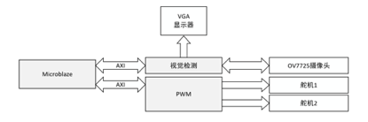

   - 通过摄像头获取图像并且定位小球的位置；

   - 根据小球位置与目标位置之间的差值，控制舵机，使平板倾斜，从而让小球运动到目标位置；

2. 串级PID原理：

   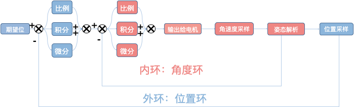

   - 内环为角度环，对角度进行控制；
   - 外环为位置环，对位置进行控制。

3. ucOS介绍：

   实时操作系统（RTOS）是指当外界事件或数据产生时，能够接受并以足够快的速度予以处理，其处理的结果又能在规定的时间之内来控制生产过程或对处理系统做出快速响应，调度一切可利用的资源完成实时任务，并控制所有实时任务协调一致运行的操作系统。

   常用的实时操作系统有VxWorks、QNX、ucos-III、Windows CE、FreeRTOS等。

   μcos-III是一个可以基于ROM运行的、可裁剪的、抢占式、实时多任务内核，具有高度可移植性，特别适合于微处理器和控制器，适合很多商业操作系统性能相当的实时操作系统(RTOS)。

   其特点是：公开源代码、可移植性、可固化、可裁剪、多任务、占先式。

   为了便于后期将本项目的控制算法移植到不同的平台上（如TI的TM4单片机），我们基于ucOS操作系统编写算法；

## 1.4 团队分工

- zyq：整体系统的设计，底层IP核的驱动，三轴加速度计传感器算法；
- zyf：串级PID算法的实现和调节；
- ljc：与上位机的通信。

# 2. 系统硬件设计

硬件部分在之前基本搭建完成，本次课设中涉及不多，因此简单叙述一下。

- 整体描述

  通过OV7725采集小球在平板上运动的图像，在FPGA处理后，控制平板下方成90度角排列的两个舵机的运动，是平板定向倾斜，进而控制小球运动到目标位置。

- 各模块介绍

  - OV7725摄像头

    OmniVision 公司生产的一款30W像素的摄像头，我们使用FPGA来驱动摄像头工作。

  - 舵机

    这里我们选用了 MG996R 舵机，工作电压 4.8V - 7.2V，在6V电压的驱动下，动力为11 kgf·cm ，运动速度为0.14 s/60º。用50Hz，高电平时间为0.5ms-2.5ms的方波作为控制信号。

  - MPU6500

    3轴加速度计、3轴陀螺仪传感器，采用IIC配置读取数据。

# 3. 系统软件设计

## 3.1 串级PID

1. 原理

   PID控制器（比例-积分-微分控制器），由比例单元(P)、积分单元(I)和微分单元(D)组成。透过Kp，Ki和Kd三个参数的设定。PID控制器主要适用于基本上线性，且动态特性不随时间变化的系统。

   单级PID原理图：

   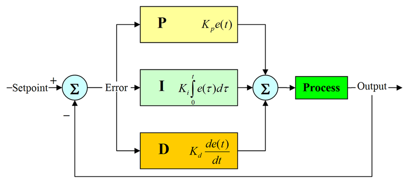

   PID控制的特点：

   - 稳定性（P和I降低系统稳定性，D提高系统稳定性）

      在平衡状态下，系统受到某个干扰后，经过一段时间其被控量可以达到某一稳定状态；

   - 准确性（P和I提高稳态精度，D无作用）

      系统处于稳态时，其稳态误差；

   - 快速性（P和D提高响应速度，I降低响应速度）

      系统对动态响应的要求。一般由过渡时间的长短来衡量。、

   - 动态特性（暂态特性，由于系统惯性引起）

      系统突加给定量（或者负载突然变化）时，其系统输出的动态响应曲线。延迟时间、上升时间、峰值时间、调节时间、超调量和振荡次数。

      在通常情况下,上升时间和峰值时间用来评价系统的响应速度；超调量用来评价系统的阻尼程度；调节时间同时反应响应速度和阻尼程度；

   - 稳态特性

      在参考信号输出下，经过无穷时间，其系统输出与参考信号的误差。影响因素：系统结构、参数和输入量的形式等；

   PID控制有两种形式：

   - 位置式PID：

      $$u(k) = K_pe(k) + K_i \Sigma ^k _{j = 0} e(j) + K_d[e(k) - e(k-1)]$$

      - 累加历史数据

      - 输出最终绝对加载量

   - 增量式PID:

      $$ \Delta u(k) = u(k) - u(k-1) = K_p \Delta e(k) + K_i e(k) + K_d [\Delta e(k) - \Delta e(k-1)] $$

      - 不累计历史数据，仅与最近三次采样值有关

      - 只输出控制增量

   为了保证系统的稳定性，在该系统里我们使用增量式PID。

2. 具体实现

   串级PID的实现：

   

## 3.2 板倾斜角度的测量

为了保证系统的控制效果，提高系统的稳定性，我们使用了串级PID，串级PID的内环为角度环，因此我们需要测量板子的倾斜角度，这里我们使用了MPU6500六轴（陀螺仪+加速度计）传感器进行测量。

1. 倾角测量原理

   - 陀螺仪计算倾角

      陀螺仪可以测量角速度,具有高动态特性,是一个间接测量器件,它测量的是角度的导数：角速度。我们将角速度对时间积分可以得到角度，如下公式所示：

      $$ Angle(t)  = \Sigma _0 ^t (Gyro(t) * dt) $$

      由于是使用积分的方法获取角度，会存在积分误差，积分误差的来源主要有两个：

      - 积分时间，很难得到一个准确的时间，积分时间dt越小，输出角度越准；
      - 器件本身的误差，积分之后会累计。

      因此，使用陀螺仪测量角度，动态测量性能较好，但是有累计误差。

   - 加速度计计算倾角

      加速度计测量的是物体的加速度，重力加速度是一个物体受重力作用的情况下所具有的加速度。当物体处于静止状态时，加速度计测量出来的值就等于重力加速度1g, 约等于9.8 米每平方秒。重力加速度 g 的方向总是竖直向下的，通过获得重力加速度在其X轴，Y轴上的分量，我们可以计算出物体相对于水平面的倾斜角度。

      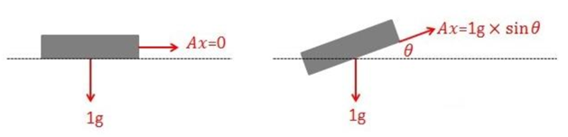

      当系统在三维空间做变速运动时，它的输出为轴向的加速度和重力加速度的分量，这就不能准确用于计算物体的姿态和运动状态。

      静态时，加速度计计算的倾角比较准确；而动态时，倾角的误差就很大，跟随性也较差。

   - 在姿态计算中我们采用陀螺仪的动态数据为主体，而加速度计起到修正陀螺仪积分误差的作用。

2. 姿态解算：欧拉角

   对于在三维空间里的一个参考系，任何坐标系的取向，都可以用三个欧拉角来表现。参考系又称为实验室参考系，是静止不动的。而坐标系则固定于刚体，随着刚体的旋转而旋转。

   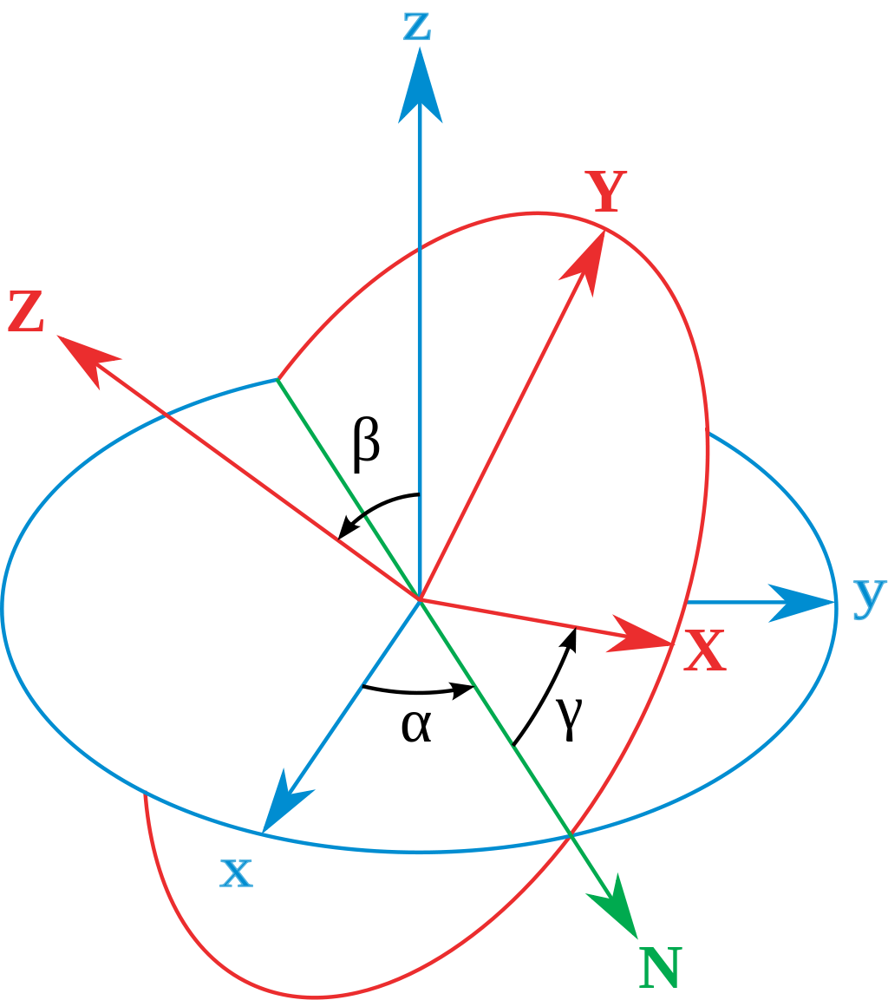

   参考上图。图中有两组坐标：

   - $xyz$ 为全局坐标，保持不动；
   - $XYZ$ 为局部坐标，随着物体一起运动；

   旋转步骤如下：

   - 物体绕**全局坐标**的 $z$ 轴旋转 $\alpha$ 角；
   - 继续绕**自己**的 $X$ 轴(也就是图中的$N$轴)旋转 $\beta$ 角；
   - 最后绕**自己**的 $Z$ 轴旋转 $\gamma$ 角。

   这个过程中新生成的坐标系 $\left( \begin{array}{ccc} X \\ Y \\ Z \end{array} \right)$ 可以通过运算由原坐标系 $\left( \begin{array}{ccc} X \\ Y \\ Z \end{array} \right)$ 得到:

   $$\left( \begin{matrix} X \\Y \\Z \end{matrix} \right) = M \left( \begin{matrix} x \\y \\z \end{matrix} \right)$$

   其中，矩阵M表示了上面三次旋转的总过程。我们可以推导一下：

   $$M = Rot(x,\alpha)\cdot Rot(x,\beta)\cdot Rot(z,\gamma) = \left( \begin{matrix}cos\gamma&sin\gamma&0\\-sin\gamma&cos\gamma&0 \\0&0&1\end{matrix}\right)\left(\begin{matrix}1&0&0\\0&cos\beta&sin\beta \\0&-sin\beta&cos\beta\end{matrix}\right)\left( \begin{matrix}cos\alpha&sin\alpha&0\\-sin\alpha&cos\alpha&0 \\0&0&1\end{matrix}\right)$$

   $$ M = \left( \begin{matrix} cos\alpha cos\gamma - sin\alpha cos\beta sin\gamma &sin\alpha cos\gamma + cos\alpha cos\beta sin\gamma & sin\beta sin\gamma \\-cos\alpha sin\gamma - sin\alpha cos\beta cos\gamma &-sin\alpha sin\gamma + cos\alpha cos\beta cos\gamma & sin\beta cos\gamma \\ sin\alpha sin\beta & -cos\alpha sin\beta & cos\beta \end{matrix} \right) $$

   记录这样一个变换，**至少需要三个角的sine和cosine值，也就是一共存储6个单位数据**。

3. 姿态融合

   常用的 $mems$ 传感器的陀螺仪和加速度计的噪声相对来说很大，以常见的陀螺仪为例进行积分1分钟会漂移2度左右。在这种前提下，如果没有磁场和重力来修正三轴陀螺仪的话，那么基本上3分钟以后物体的实际姿态和测量输出姿态就完全变样了。所以我们要使用数据融合的方法，来获取更加准确的倾角数据。

   常用的惯性传感器姿态融合算法有：互补滤波、Mahony互补滤波、扩展卡尔曼滤波等。我们选择Mahony滤波。

   - 互补滤波的思想

     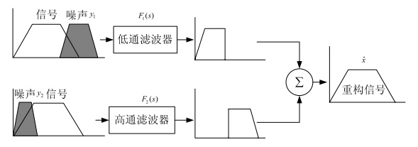

     假如我们对一个物理量有两种测量手段，一种呢容易受到高频噪声的干扰，实际的观感就是信号有很多的毛刺；另一种容易受到低频噪声的干扰，就是噪声会慢慢的变化。那么我们就可以设计互补的两个滤波器 $F_1$ 和 $F_2$ ，所谓互补就是 $F_1 + F_2 = 1$ ，它们一个是低通滤波器，可以滤除信号中的高频噪声，一个是高通滤波器，能够滤除信号中的低频变化。这样分别把相应测量中的噪声滤除，就可以得到更精确的对这个物理量的测量了。

     那么显然，互补滤波器的好坏，就取决于噪声滤除的干不干净。不幸的是，对实际实现的滤波器来说，噪声是不可能完全被滤除的。所以，互补滤波器并不是某种特定准则上的“最优”滤波器。

   - 基本的姿态互补滤波器

     要使用互补滤波器获得对物体姿态的更准确的测量，我们要找到两个对物体姿态的测量手段，在上文中我们知道，陀螺仪可以通过积分获得一组姿态，而加速度计也能够获得一组姿态，而且加速度计容易受到振动等高频噪声的干扰，陀螺仪容易受到漂移等低频噪声的干扰，因此我们可以使用互补滤波来获取更为准确的姿态。

     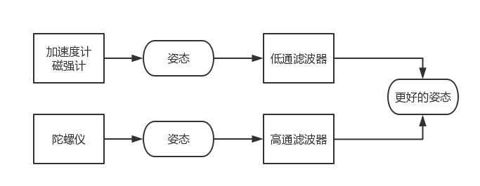

   - Mahony互补滤波的核心步骤：

     1. 加速度数据归一化。
     2. 将加速度向量(0,0,1)从地理坐标系转换到载体坐标系得到预测向量。
     3. 将预测加速度向量与实际加速度向量做叉积得到误差（偏差角度的余弦）。
     4. 将误差做PI调节，补偿叠加到原始角速度数据向量上。
     5. 通过四元数微分方程，将补偿过的角速度向量转换为四元数向量。
     6. 将四元数转换为欧拉角。
     7. 新的四元数重新代入方向余弦矩阵，生产新的方向余弦矩阵，用于数据从地理坐标系到载体坐标系的转换。
     8. 直到误差为0，方向余弦矩阵正确，姿态数据正确。

   - 姿态融合流程图：

     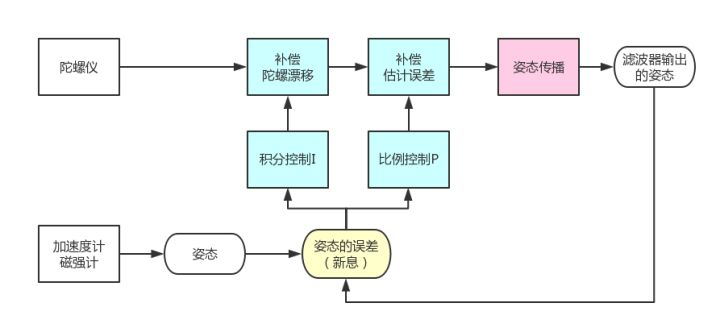

     1. 互补滤波器的整体框架是利用飞行器的旋转速度来更新飞行器的姿态，即图中的姿态传播，可以采用欧拉角、四元数、DCM等方法；
     2. 陀螺测量的飞行器旋转速度是不准确的，我们利用PI控制器去修正陀螺的测量，用反馈控制的思想可以理解为，加速度计和磁强计产生的是参考信号，是滤波器要去跟踪的，所以参考姿态和滤波器输出姿态之间的差异就构成了新息，我们对新息进行PI控制操作，其中P环节是为了补偿滤波器的估计误差，I环节是为了补偿陀螺仪的漂移。
     3. 可以这样理解这个互补滤波器，基本的框架是利用陀螺测量的旋转速度来计算姿态，但这样肯定将漂移和噪声引入到姿态中，所以我们希望陀螺更新的姿态能够向相对无偏移的加速度计姿态靠近，这样利用一个PI控制器来控制这个过程，这样一来，因为PI控制器不可能非常快速的把陀螺姿态控制到和加速度计姿态一致，所以我们能够避免加速度计姿态里面快速变化的部分，因为控制带宽不够跟踪不上。与此同时，陀螺姿态在不断试图跟踪加速度计姿态的过程中，也避免了漂移量带来的误差，实际上从控制的角度解释了“互补”的思想。
     4. 图中姿态传播框是滤波器的主体框架，在其之前的4个框是滤波器的“互补”的实现，图中姿态的误差框就是Mahony算法做出的贡献。

## 3.3 数据通信

- 与上位机通信

  以25Hz的频率，通过Uart1（115200波特率）发送IMU解算出来的板的姿态，小球的位置等信息。数据格式如下：

  | 0:包头 | 1：包头 | 2：数据号 |
  | ------ | ------- | --------- |
  | 0x55   | 0xaa    | 0x__      |

  | 3:float数据0 | 4    | 5    | 6    |
  | ------------ | ---- | ---- | ---- |
  |              |      |      |      |

  | 7:float数据1 | 8    | 9    | 10   |
  | ------------ | ---- | ---- | ---- |
  |              |      |      |      |

  | 11:float数据2 | 12   | 13   | 14   |
  | ------------- | ---- | ---- | ---- |
  |               |      |      |      |

  | 15：包尾  |
  | --------- |
  | $（0x24） |

  每个数据包为16Byte，其中前两个为包头，第三个为数据号，后面是3个float类型的数据（1位float转换为4位u8数据），最后是包尾。

- 与摄像头板通信

  由于摄像头与舵机之间的距离较长，用一块板子控制所有设备虽然资源足够，但需要很长的线来传输信号，容易受干扰，效果较差，因此我们用一块板子连接摄像头，来获取小球的位置信息，用另一块板子连接舵机，MPU6500等设备，控制板子的运动，两块板子之间通过uart通信。

  由于两块板子之间的距离较远，直接使用线传输效果不理想，我们使用两个蓝牙模块在透传模式下来传输数据。

## 3.4 程序的整体流程

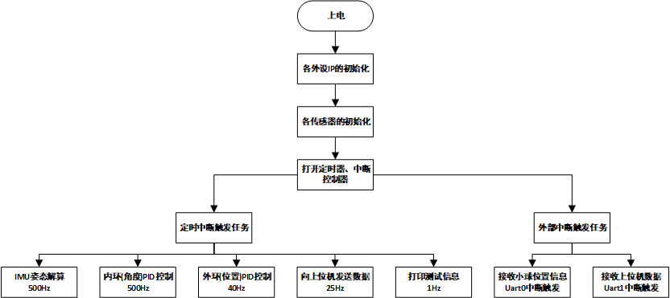

我们将整个程序划分为3部分：

- 系统初始化任务；
- 定时中断触发任务；
- 外部中断触发任务。

定时中断触发的任务中，姿态解算与内化PID控制任务以500Hz的频率运行，外环PID的任务以40Hz的频率运行，其他一些不重要的任务以较低的频率运行；

外部中断触发的主要有两个任务，一个是接收小球位置信息，这个由另一块板子获取小球的位置信息，然后以30Hz的频率发送。还有一个任务是接收上位机发来的数据，主要是PID参数，用来在线调参，避免了每改一次参数都要重新下载程序，大大提高了调参效率。

# 4. 作品成效总结

1. 3-2 能够针对特定指标需求，设计并实现功能完整的硬件和软件系统，包括整体架构设计、各模块交互和数据通信等（系统设计）。

   在本次课设中，我们将各模块功能合理划分，降低各模块之间的耦合度。由于摄像头与舵机之间的距离较长，用一块板子控制所有设备虽然资源足够，但需要很长的线来传输信号，容易受干扰，效果较差，因此我们用一块板子连接摄像头，来获取小球的位置信息，用另一块板子连接舵机，MPU6500等设备，控制板子的运动，两块板子之间通过uart通信。

   在使用蓝牙传输数据，波特率115200的情况下，数据传输错误较少，测试过程中大概传输100个数据包会出现1-2的接收错误，错误主要是数据包接收中出现少量的丢失，并没有出现数据传输的过程中数据的值发送变化。由于以30Hz的频率发送小球的位置信息，所以这个错误率可以接受，对控制结果影响不大。

2. 4-2 能够根据方案，运用实验工具、仪器，开展实验，对实验结果进行分析与解释，并通过信息综合得到合理有效的结论。

   在PID调参部分，为了提高调参效率，我们采用上位机在线调参，上位机通过uart与板子之间进行数据交互，上位机将PID参数发给主控板，主控板将平板的姿态等数据发给上位机，通过上位机可以观测到PID调参的响应曲线，提高了PID调参的准确性。目前完成了串级PID的内环调参，外环的参数还没调好。实现的效果是板子在收到外界的干扰下，可以保持水平，响应速度较快。

   在IMU姿态解算部分，在500Hz的运算频率下，通过MPU6500可以实时的获取板子的姿态信息，误差较小，相比于机械结构的误差，传感器测量产生的误差可以忽略。

3. 10-1 能够就电子信息工程领域的复杂工程问题撰写报告，设计文稿，并具有较好的语言表达和沟通能力，能够清晰陈述观点和回答问题。

   目前已按照课设要求，完成报告的撰写，合理地描述了本次课设中遇到的问题，并对其进行分析，给出相应的解决方案。

# 5. 参考资料及文献

[1] da Silveira Castro R, Flores J V, Salton A T, et al. A comparative analysis of repetitive and resonant controllers to a servo-vision ball and plate system[J]. IFAC Proceedings Volumes, 2014, 47(3): 1120-1125.

[2] Mahony R, Hamel T, Pflimlin J M. Nonlinear complementary filters on the special orthogonal group[J]. IEEE Transactions on automatic control, 2008, 53(5): 1203-1218.

[3] Goldstein H. Classical mechanics[M]. Pearson Education India, 2011.

[4] 黄真, 李艳文, 高峰. 空间运动构件姿态的欧拉角表示[J]. 燕山大学学报, 2002, 26(3): 189-192.

[5] 李跃军, 阎超. 飞行器姿态角解算的全角度双欧法[J]. 北京航空航天大学学报, 2007, 33(5): 505-508.

[6] 李俊, 李运堂. 四旋翼飞行器的动力学建模及 PID 控制[J]. 辽宁工程技术大学学报: 自然科学版, 2012 (1).

[7] 王赓, 孙政顺. 板球控制系统的 PD 型模糊控制算法研究[J]. 电气传动, 2004, 34(4): 23-25.

# 6. 附件

1. 获取小球位置信息的 vivado 工程的 Block Design 图

   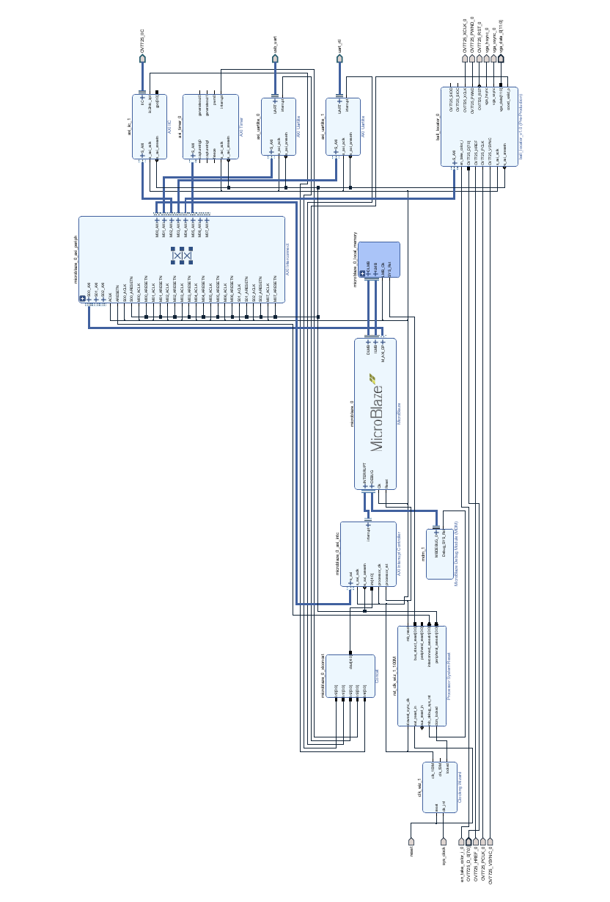

2. 图像处理的RTL图

   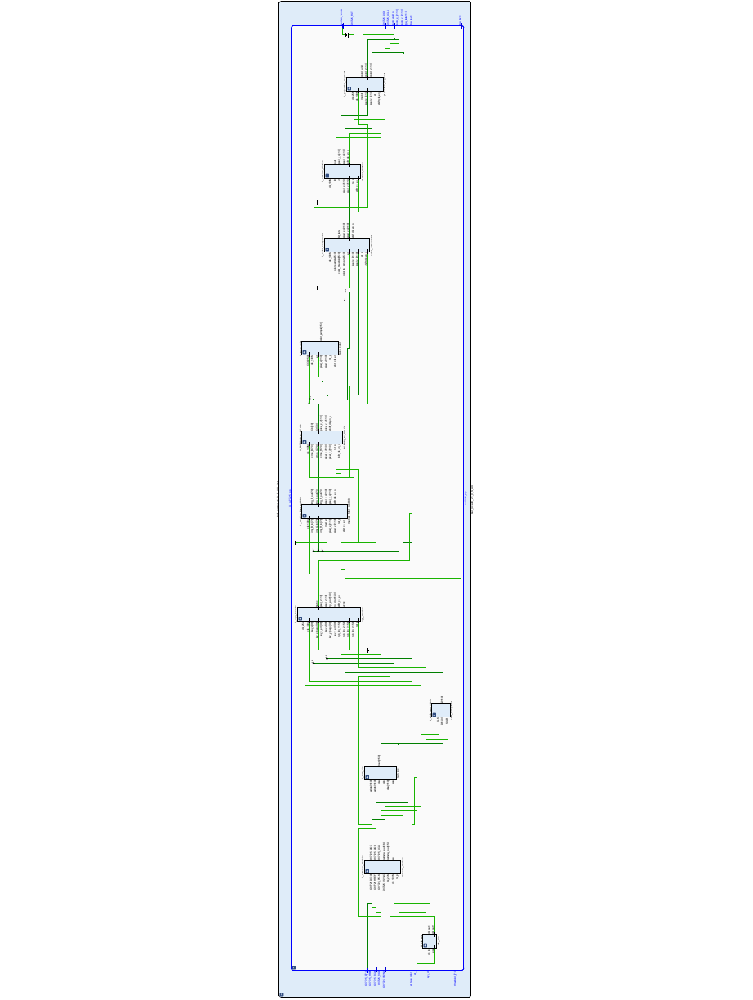

3. ZYNQ控制部分的 Block Design 图

   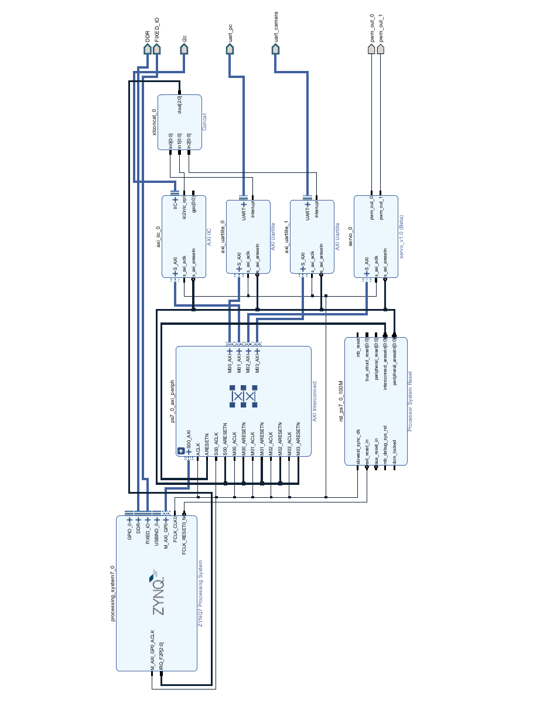