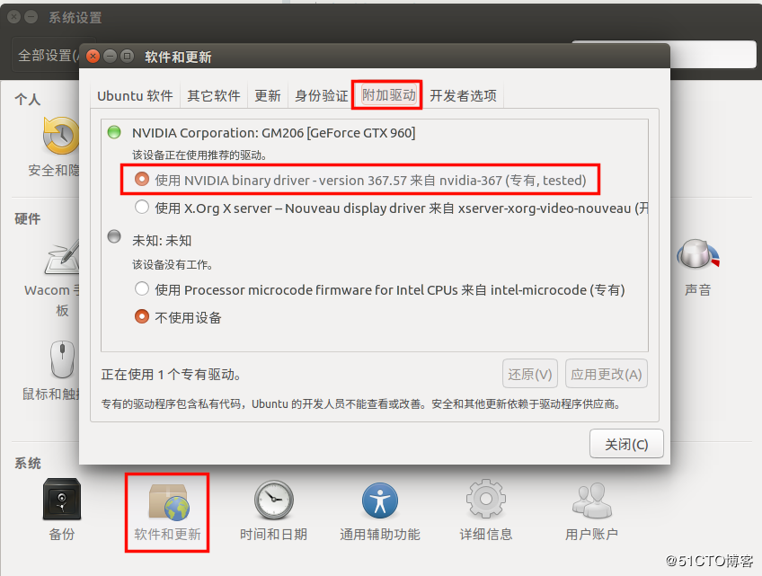

# 准备

## 安装tensorflow

参考[在 macOS 中安装 TensorFlow](https://tensorflow.juejin.im/install/install_mac.html)

## 安装OpenCV

1. Homebrew安装OpenCV

   ~~~bash
   brew install opencv
   ~~~

   最新版本的`opencv`已经不分`opencv3`了，而是在目录下分成`python2`和`python3`版本的文件夹。
   安装好的`opencv`库在`/usr/local/Cellar/opencv/`。

2. 将OpenCV链接到Python的site-packages目录下

   首先需要找到自己Python安装位置，可以用如下方法：

   ~~~python
   # 打开Python
   python3
   # 通过sys查看Python安装路径
   >>> import sys
   >>> print(sys.path)
   ['', '/Library/Frameworks/Python.framework/Versions/3.7/lib/python37.zip', '/Library/Frameworks/Python.framework/Versions/3.7/lib/python3.7', '/Library/Frameworks/Python.framework/Versions/3.7/lib/python3.7/lib-dynload', '/Library/Frameworks/Python.framework/Versions/3.7/lib/python3.7/site-packages']
   ~~~

   可以看到最后一行就是site-packages的路径。

   ~~~bash
   # 进入site-packages目录
   cd /Library/Frameworks/Python.framework/Versions/3.7/lib/python3.7/site-packages
   # 建立软链接
   sudo ln -s /usr/local/Cellar/opencv/4.2.0_1/lib/python3.7/site-packages/cv2/python-3.7/cv2.cpython-37m-darwin.so cv2.so
   ~~~

3. 依赖包

   我们这时测试一下OpenCV是否可用

   ~~~python
   >>> import cv2
   ModuleNotFoundError: No module named 'numpy'
   Traceback (most recent call last):
     File "<stdin>", line 1, in <module>
   ImportError: numpy.core.multiarray failed to import
   ~~~

   缺少numpy

   ~~~bash
   # 安装numpy
   pip3 install --upgrade numpy
   ~~~

   成功

   ~~~bash
   $ python3
   Python 3.7.4 (v3.7.4:e09359112e, Jul  8 2019, 14:54:52)
   [Clang 6.0 (clang-600.0.57)] on darwin
   Type "help", "copyright", "credits" or "license" for more information.
   >>> import cv2
   >>>
   ~~~

> 真不该手贱接下这个项目，完全没有头绪！

# 安装Tensorflow-gpu

使用的是普通的pip安装，系统 **Ubuntu18.04**

1. 安装 NVIDIA 显卡驱动

   在 Ubuntu 的软件中心里更改

   

   **完成后重启 !!!****

   输入 `nvidia-smi` 查看驱动安装是否成功

   

   **这个方法似乎有问题，最后我装的是430版本的驱动，安装前最好先把原来的显卡驱动都卸载了**

2. 安装 [CUDA](https://developer.nvidia.com/cuda-toolkit)

   **Tensorflow 与 CUDA 有对应关系**，可以参考[这里](https://www.tensorflow.org/install/source#gpu)，主要是因为 tensorflow 会调用 `usr/local/cuda/lib64` 目录下的 `.so` 文件，我尝试过了，`1.14`,`1.15` 版本的 tensorflow 调用的都是 `10.0` 的 cuda，装错版本会提示 `.so` 文件找不到

   
   
   我要装的是 Tensorflow-gpu 1.14.0，因此我安装 CUDA10.0 和 cuDNN7.4
   
   下载 CUDA https://developer.nvidia.com/cuda-toolkit-archive
   
   
   
   运行如下命令安装
   
   ~~~
   sudo sh cuda_<version>_linux.run
   ~~~
   
   安装过程中会有一些选项，**显卡驱动不要装 !!!** 因为之前已经装过了
   
   
   
   安装完成输出的 log 会有提示
   
   最后将cuda添加到系统环境中
   
   ~~~
   export LD_LIBRARY_PATH=$LD_LIBRARY_PATH:/usr/local/cuda/lib64
   export PATH=$PATH:/usr/local/cuda/bin
   export CUDA_HOME=$CUDA_HOME:/usr/local/cuda
   ~~~
   
   检查是否安装成功：
   
   ~~~
   nvcc -V
   ~~~
   
3. 安装 cudnn (version 7.4.2)

   下载 [Download cuDNN v7.4.2 (Dec 14, 2018), for CUDA 10.0](https://developer.nvidia.com/rdp/cudnn-archive#a-collapse742-10)

   解压后，会得到一个名为 `cuda` 的文件夹，将问价拷贝到 cuda 的安装目录下

   **注意：`cuda/lib64` 里的文件有链接的结构，如下，不能直接 cp，使用 `-a` 参数可以保持软链接结构**

   

   ~~~
   sudo cp -a cuda/lib64/libcudnn* /usr/local/cuda-10.0/lib64/
   sudo cp -a cudnn.h /usr/local/cuda-10.0/include/
   ~~~

4. 测试 CUDA 是否安装成功

   1. 切换到测试目录下：

      ~~~
      cd /usr/local/cuda-10.1/samples/1_Utilities/deviceQuery
      ~~~

   2. 编译

      ~~~
      sudo make
      ~~~

   3. 进行测试，运行文件

      ~~~
      ./deviceQuery
      ~~~

      会看到类似这种结果：

      

5. 安装多个版本的 cuda

   因为 cuda 安装目录下是用软链接的方式实现的，因此我们可以安装多个版本的 cuda，只要将软链接链接到对应的 cuda 就行，如下：

   

   使用命令：

   ~~~bash
   rm -rf cuda # 删除原来的软链接
   sudo ln -s /usr/local/cuda-<version> /usr/local/cuda # 建立新的软链接
   ~~~

   注意环境变量的修改，可以将 cuda-<version> 修改为 cuda 这种通用形式

   ~~~
   export LD_LIBRARY_PATH=$LD_LIBRARY_PATH:/usr/local/cuda/lib64
   export PATH=$PATH:/usr/local/cuda/bin
   export CUDA_HOME=$CUDA_HOME:/usr/local/cuda
   ~~~

   最后查看当前的 cuda 版本

   ~~~
   nvcc -V
   ~~~

   如果确实软链接修改成功了，环境变量也改好了，版本依旧没有切换，尝试**重启**一下

6. 安装 tensorflow

   ~~~
   pip3 install tensorflow==1.14
   ~~~

